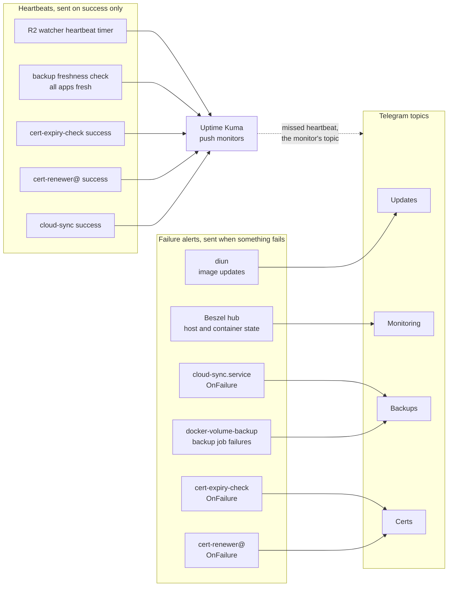

# Alerting and Heartbeat Flow

Where a failure alert or a missed-job heartbeat ends up — spans
[`telegram-notifications.md`](../topics/monitoring/telegram-notifications.md),
[`uptime-kuma.md`](../topics/monitoring/uptime-kuma.md) and [`beszel.md`](../topics/monitoring/beszel.md), none of which
shows both paths together. Two paths exist because they catch different things: a unit's `OnFailure=` reports
a failure when one happens, and a push monitor reports silence when nothing runs at all.

A skipped `cert-renewer@` run (certificate not yet due) is neither a failure nor a success, so it sends nothing on
either path; its heartbeat arrives about once per renewal. Shoutrrr senders (diun, Beszel,
`docker-volume-backup`) take `chat_id:topic_id` in one string; the systemd notifiers call Telegram's API with
separate `chat_id` and `message_thread_id`, as
[`telegram-notifications.md`](../topics/monitoring/telegram-notifications.md) explains.
