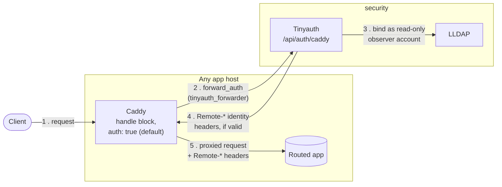

# Auth Flow

Tinyauth forward-auth + LLDAP, and the one host that skips it — spans
[`caddy.md`](../caddy.md) (the `tinyauth_forwarder` snippet every other
app imports) and [`lldap.md`](../lldap.md) (the identity store behind
it), neither of which shows the full request path on its own.

**The one exception:** a host that runs Tinyauth itself renders
Tinyauth's own domain block *outside* the wildcard vhost, with no
`tinyauth_forwarder` import — Tinyauth can't forward-auth a request to
check its own login page without deadlocking. Any app that sets
`auth: false` in its `caddy` route (e.g. Cobalt) is the same skip,
just by choice rather than necessity. See
[`caddy.md`](../caddy.md#caddyfile-generation) for both cases.

Tinyauth's `observer` bind is read-only — it can check credentials but
can't modify LLDAP. See
[`lldap.md`](../lldap.md#bootstrapping-the-observer-account) for how
that account itself gets created and kept in sync.
