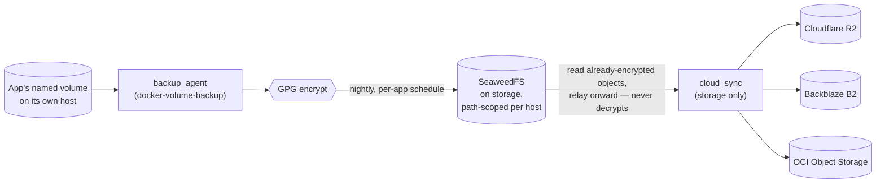
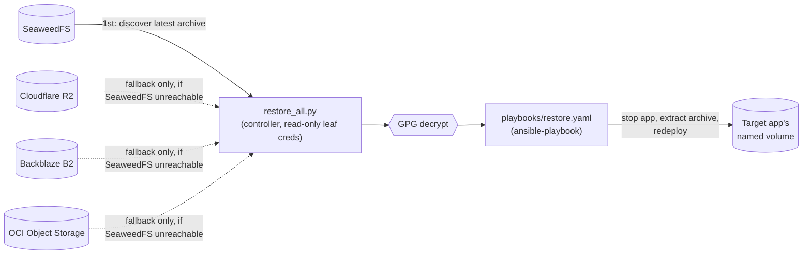

# Backup & Restore Data Flow

The one end-to-end view that spans three separate topic docs —
[`disaster-recovery.md`](../disaster-recovery.md) (the backup side),
[`cloud-sync.md`](../cloud-sync.md) (the offsite relay), and
[`restore.md`](../restore.md) (reversing the path) — none of which
shows the whole pipeline on one page.

## Backup: app host to offsite cloud

Every app host's `backup_agent` identity can write only its own
`homelab-backups/<hostname>-*` prefix; only `storage` ever holds a
cloud write credential. See
[`disaster-recovery.md`](../disaster-recovery.md#threat-model) for why.

## Restore: cloud/SeaweedFS back to an app host's volume

The controller never holds a write credential for SeaweedFS or any
cloud target — only the six read-leaf credentials from
[`cloud-credential-creation.md`](../cloud-credential-creation.md), and
only for the discovery/fallback step above. The actual extraction runs
through the same `restore` Ansible role either way, on the target app
host itself.
