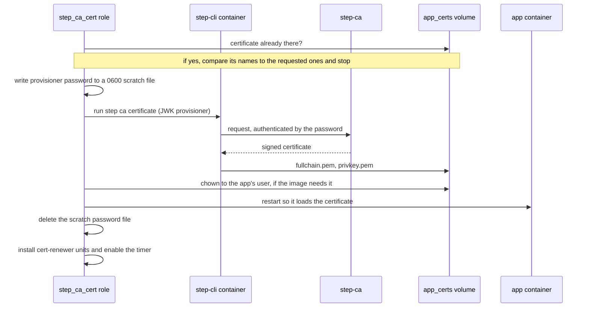
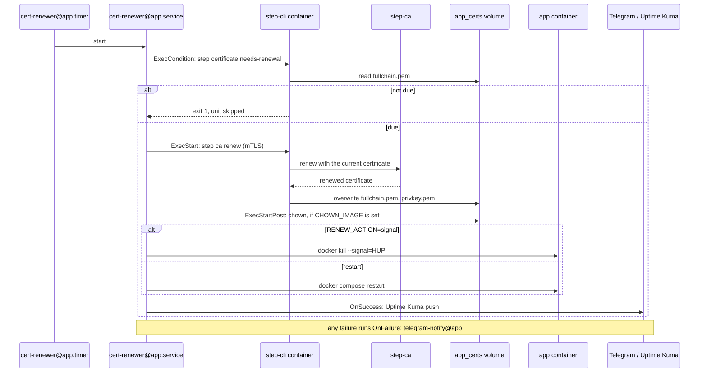

# Internal PKI: Issuance and Renewal

How an app's TLS certificate gets issued by step-ca once and renewed on a timer afterwards — spans
[`step-ca.md`](../topics/services/step-ca.md), [`lldap.md`](../topics/services/lldap.md) and
[`openbao.md`](../topics/secrets/openbao.md), which each use the same `step_ca_cert` role and differ only
in how the app picks up a renewed certificate.

## Issuance (once, in `deploy.yaml` Play 6)

Issuance needs the provisioner password, because there is no certificate yet to authenticate with.

## Renewal (every timer firing, on the host)

Renewal authenticates with the existing certificate over mTLS, so it never touches the provisioner password.

Which action an app uses is in its own `/etc/cert-renewer/<app>.env`: OpenBao sends `SIGHUP` so a renewal doesn't
reseal it ([`openbao.md`](../topics/secrets/openbao.md#cert-renewal-uses-sighup-not-a-restart)), and lldap restarts.
