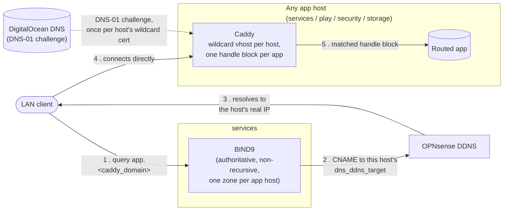

# Reverse Proxy & DNS

How a hostname actually resolves and reaches the right host — spans
[`caddy.md`](../caddy.md) (per-host reverse proxy, TLS) and
[`bind9.md`](../bind9.md) (the one shared internal DNS server), neither
of which shows the two working together end to end.

Every app host declares its own `dns_zones` in `host_vars` (usually
just its own `caddy_domain`); BIND9 only aggregates and serves what
each host already declared — see
[`bind9.md`](../bind9.md#how-zone-data-is-gathered). The CNAME in step
2 is auto-generated for every app with a `caddy` route, from the same
`host_vars` entry that gives it its Caddy routing rule — one place
to add an app gets it both. See
[`host-vars.md`](../host-vars.md#caddy_domain).
