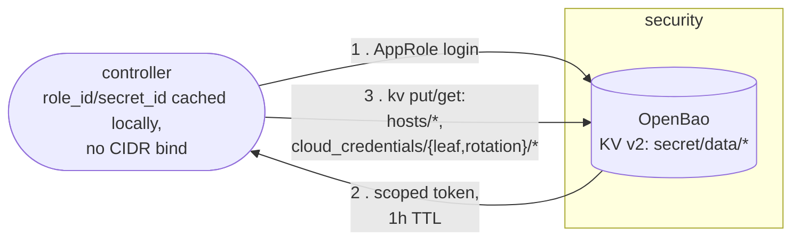
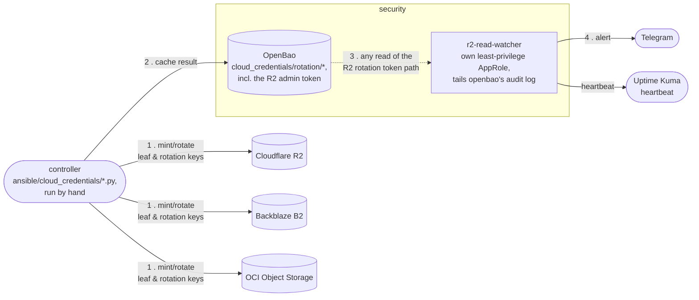

# Secrets & Credentials Flow

How `controller` reaches OpenBao day-to-day, and how cloud credential
rotation plus the R2 per-read watcher fit together — spans
[`openbao-auth.md`](../openbao-auth.md) (`controller`'s AppRole),
[`cloud-credential-creation.md`](../cloud-credential-creation.md)
(minting/rotating R2/B2/OCI credentials), and
[`openbao-r2-read-watcher.md`](../openbao-r2-read-watcher.md) (the
per-read alert on the R2 admin token), none of which shows the whole
picture on one page.

## Day-to-day secrets fetch

Every `ansible-playbook deploy.yaml` run and every
`ansible/cloud_credentials/*.py` invocation authenticates this way.
`controller`'s AppRole has no CIDR bind — a laptop has no stable
address to bind to
([ADR 0020](../decisions/0020-controller-single-broad-approle-not-split-by-consumer.md)).

## Cloud credential rotation & the R2 read-watcher

The R2 admin token is the one rotation credential accepted as
master-equivalent rather than narrowly scoped — Cloudflare's API can't
mint a scoped delegate for it
([ADR 0014](../decisions/0014-r2-rotation-token-accepted-as-master-equivalent.md)).
The read-watcher's per-read alert on that one path is the compensating
control, running its own least-privilege AppRole
([ADR 0026](../decisions/0026-openbao-audit-device-and-r2-per-read-watcher.md))
rather than reusing `controller`'s broader one — a compromised
`controller` AppRole still can't read that path silently.
