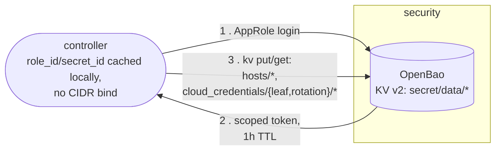
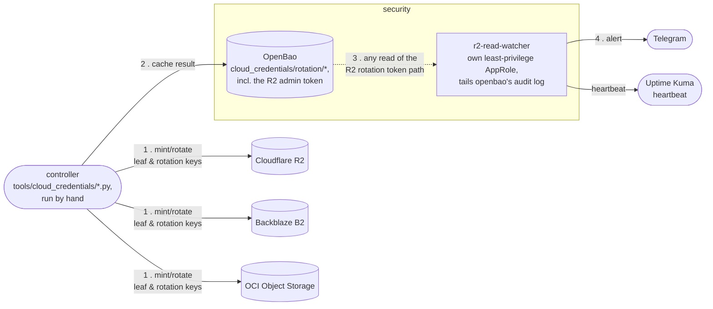
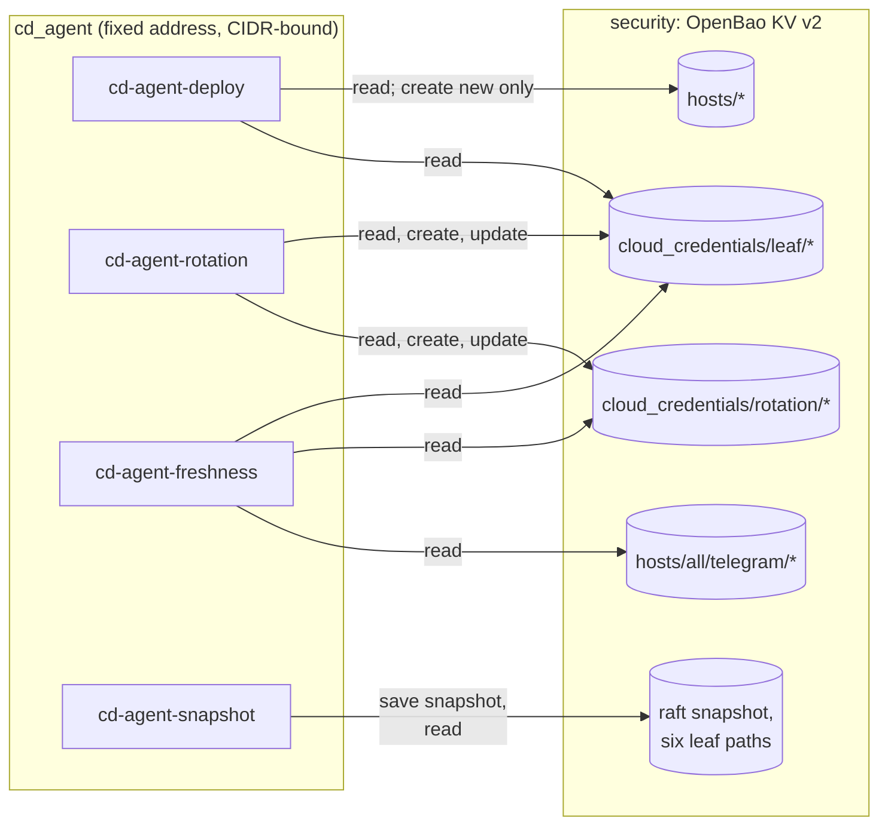

# Secrets & Credentials Flow

How `controller` reaches OpenBao day-to-day, and how cloud credential
rotation plus the R2 per-read watcher fit together — spans
[`openbao-auth.md`](../topics/secrets/openbao-auth.md) (`controller`'s AppRole),
[`cloud-credentials/creation.md`](../topics/secrets/cloud-credentials/creation.md) and
[`cloud-credentials/rotation.md`](../topics/secrets/cloud-credentials/rotation.md)
(minting and rotating R2/B2/OCI credentials), and
[`openbao-r2-read-watcher.md`](../topics/secrets/openbao-r2-read-watcher.md) (the
per-read alert on the R2 admin token), none of which shows the whole
picture on one page.

## Day-to-day secrets fetch

```mermaid
flowchart LR
    controller(["controller<br/>role_id/secret_id cached locally,<br/>no CIDR bind"])

    subgraph security["security"]
        openbao[("OpenBao<br/>KV v2: secret/data/*")]
    end

    controller -- "1 . AppRole login" --> openbao
    openbao -- "2 . scoped token,<br/>1h TTL" --> controller
    controller -- "3 . kv put/get:<br/>hosts/*,<br/>cloud_credentials/{leaf,rotation}/*" --> openbao
```

Every `ansible-playbook deploy.yaml` run and every
`tools/cloud_credentials/*.py` invocation authenticates this way.
`controller`'s AppRole has no CIDR bind — a laptop has no stable
address to bind to
([ADR 0020 (Automation identity scope)](../decisions/0020-automation-identity-and-access-scope/revision-000.md)).

## Cloud credential rotation & the R2 read-watcher

```mermaid
flowchart LR
    controller(["controller<br/>tools/cloud_credentials/*.py,<br/>run by hand"])
    r2[("Cloudflare R2")]
    b2[("Backblaze B2")]
    oci[("OCI Object Storage")]

    subgraph security["security"]
        openbao[("OpenBao<br/>cloud_credentials/rotation/*,<br/>incl. the R2 admin token")]
        watcher["r2-read-watcher<br/>own least-privilege AppRole,<br/>tails openbao's audit log"]
    end

    telegram(["Telegram"])
    kuma(["Uptime Kuma<br/>heartbeat"])

    controller -- "1 . mint/rotate<br/>leaf & rotation keys" --> r2 & b2 & oci
    controller -- "2 . cache result" --> openbao
    openbao -. "3 . any read of the<br/>R2 rotation token path" .-> watcher
    watcher -- "4 . alert" --> telegram
    watcher -- "heartbeat" --> kuma
```

The R2 admin token is the one rotation credential accepted as
master-equivalent rather than narrowly scoped — Cloudflare's API can't
mint a scoped delegate for it
([ADR 0014 (R2 rotation credential)](../decisions/0014-r2-rotation-credential-cannot-be-narrowed/revision-000.md)).
The read-watcher's per-read alert on that one path is the compensating
control, running its own least-privilege AppRole
([ADR 0026 (High-value secret read alerts)](../decisions/0026-detecting-reads-of-high-value-secrets/revision-000.md))
rather than reusing `controller`'s broader one — a compromised
`controller` AppRole still can't read that path silently.

## CD agent AppRoles

```mermaid
flowchart LR
    subgraph cd["cd_agent (fixed address, CIDR-bound)"]
        deploy["cd-agent-deploy"]
        rotation["cd-agent-rotation"]
        freshness["cd-agent-freshness"]
        snapshot["cd-agent-snapshot"]
    end

    subgraph security["security: OpenBao KV v2"]
        hosts[("hosts/*")]
        telegram[("hosts/all/telegram/*")]
        leaf[("cloud_credentials/leaf/*")]
        rot[("cloud_credentials/rotation/*")]
        snap[("raft snapshot,<br/>six leaf paths")]
    end

    deploy -- "read; create new only" --> hosts
    deploy -- "read" --> leaf
    rotation -- "read, create, update" --> leaf & rot
    freshness -- "read" --> leaf & rot & telegram
    snapshot -- "save snapshot,<br/>read" --> snap
```

Four roles, one per kind of unattended job, each bound to the host's
address. A role can reach only the paths drawn: none of the four can
delete, and only `cd-agent-rotation` can update. Policies and the
creation steps are in
[`openbao-cd-agent-approles.md`](../topics/secrets/openbao-cd-agent-approles.md).
