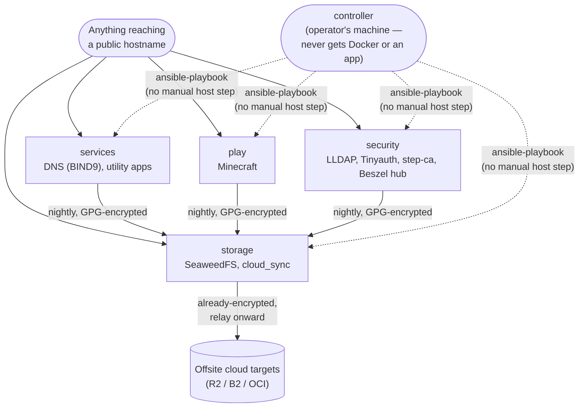

# System Overview

The current fleet, at a glance: four `managed_hosts` plus the
operator's own machine as `controller`. This is deliberately a 10,000-ft
view — for the actual components on each host and how they talk to
each other, see the low-level diagrams below.

## Low-level diagrams

| Diagram | Covers |
| :--- | :--- |
| [`reverse-proxy-and-dns.md`](reverse-proxy-and-dns.md) | How a hostname resolves and reaches the right host's Caddy, per-host wildcard TLS via DNS-01. |
| [`auth-flow.md`](auth-flow.md) | Tinyauth forward-auth + LLDAP, and the one host that skips it. |
| [`backup-and-restore-data-flow.md`](backup-and-restore-data-flow.md) | Backup path in full (app host to SeaweedFS to cloud) and restore reversing it. |

`deployment-flow.md`'s own play-order diagram covers how `controller`
actually converges every host — not repeated here since it's one
diagram illustrating that one doc.

## What this deliberately leaves out

- Per-app compose services within a host — that's
  [`adding-an-app.md`](../adding-an-app.md) and each app's own doc under
  "Per-app infra" in the main README.
- The credential-scoping detail behind each arrow into SeaweedFS/cloud —
  see [`disaster-recovery.md`](../disaster-recovery.md#threat-model) and
  [`cloud-credential-creation.md`](../cloud-credential-creation.md).
- Anything from the planned OpenTofu/Proxmox work — that's
  [`vm-provisioning.md`](../vm-provisioning.md), and nothing in it is
  running yet.
