# CI: PR Checks

`.github/workflows/pr-checks.yml` runs on every PR. Which jobs actually
block a merge is configured in GitHub's branch protection / repository
rulesets (Settings > Branches on GitHub, not anything in this repo) —
see [Requiring checks before merge](#requiring-checks-before-merge)
below for which check names to select. This pipeline isn't a substitute
for [Molecule](molecule-testing.md): Molecule tests one role in
isolation, this pipeline tests the parts Molecule can't (linting the
whole tree, a real compose stack booting, and the actual
`deploy.yaml`/`restore.yaml` ordering).

## Change-scoped, not a full sweep

`detect-changes` diffs the PR's base/head and feeds most other jobs a
scoped input, so a docs-only PR doesn't trigger Molecule or boot-tests.
`pre-commit-checks` is the exception — it runs unconditionally on every
PR regardless of what changed, since its hooks span nearly every file
type in the repo:

- `roles` — any `ansible/roles/<role>/` touched maps to that role, except
  three repo-wide cases that map to *every* role instead, because
  nothing in them maps cleanly to a single consumer:
  `ansible/requirements.yml` (a Galaxy collection bump), any file under
  `ansible/roles/molecule_helpers/` (see
  [`#molecule_helpers-is-repo-wide`](#molecule_helpers-is-repo-wide)),
  and `pyproject.toml`/`uv.lock` (pins the `ansible-core` version every
  role's Molecule run actually executes under).
- `compose_apps` — any `docker/<app>/compose.yaml` touched, minus the
  exclusion list (below).
- `deploy_ordering` — `ansible/inventory/**`, `ansible/playbooks/**`,
  `ansible/roles/secrets/**`, `ansible/roles/restore/**`.
- `uv_lock` — `pyproject.toml`/`uv.lock` changed.
- `python_unit_tests` — `ansible/scripts/*.py`, `tools/cloud_credentials/**`,
  `tools/openbao_utils/**`, `tools/utils/**`,
  `ansible/molecule-coverage/molecule_cov/**`,
  `ansible/molecule-coverage/callback_plugins/**`, `ansible/tests/**`,
  `tools/tests/**`, `docker/openbao/watcher/r2_read_watcher.py`,
  `pyproject.toml`/`uv.lock`. This is all plain controller-side Python,
  not Ansible roles, so it's covered by `ansible/tests/`'s and
  `tools/tests/`'s `pytest` suites instead of Molecule — including
  `r2_read_watcher.py`, the one file outside either tree that
  `ansible/tests/` still imports directly via `sys.path`.

### `molecule_helpers` is repo-wide

`ansible/roles/molecule_helpers/` isn't a normal role — it has no
`molecule/` scenario of its own, so nothing under it is ever "the role
that changed." Every scenario's base config
(`.config/molecule/config.yml`, deep-merged into every DinD scenario)
resolves its Galaxy dependencies from `molecule_helpers/`'s
`role-requirements.yml`/`requirements.yml` unconditionally, and several
scenarios' `converge.yml` additionally `include_role` specific task
files from it directly (`bootstrap_docker.yaml`,
`start_seaweedfs_test_target.yaml`, etc.) — see each role's own
`converge.yml` for which. No single file in `molecule_helpers/` maps
cleanly to one consumer, so the `roles` filter treats any change under
it the same as a top-level `ansible/requirements.yml` bump: every role
with a `molecule/` scenario gets queued.

Concretely, this is what makes the `seaweedfs`
`compose-boot-test-exclusions.txt` entry below correct — see there for
the SeaweedFS-specific case this generalizes from.

## Jobs

| Job | Runs when | What it does |
| :--- | :--- | :--- |
| `warm-uv-cache` | always | Populates the shared uv package cache. See [Cache warming](#cache-warming). |
| `warm-galaxy-cache` | always | Populates the shared Ansible Galaxy collections cache. See [Cache warming](#cache-warming). |
| `warm-pre-commit-cache` | always | Populates the shared pre-commit hook-environment cache. See [Cache warming](#cache-warming). |
| `pre-commit-checks` | always | Every commit-stage hook (all of `.config/.pre-commit-config.yaml` except `ansible-lint`) against every file. |
| `project-scope` | always | A PR that touches a project doc stays inside that project's `allowed_paths`, read from the base branch — see [Project scope check](#project-scope-check). |
| `project-close` | always | A PR that deletes a project doc leaves its `decision:` revision `accepted` or still named by another project — see [Project close check](#project-close-check). |
| `ansible-lint` | `ansible/**`/`.config/.ansible-lint`/`.config/.pre-commit-config.yaml` changed | The one push-stage hook — always lints the whole `ansible/` tree when it runs, not just what changed, so it's pinned to push time and scoped to this same file set locally too, via `.config/.pre-commit-config.yaml`'s own `files:`/`always_run: false` override (needed since upstream's manifest defaults to `always_run: true`). |
| `uv-lock` | `pyproject.toml`/`uv.lock` changed | `uv sync --locked` — catches an unregenerated lockfile or a resolvable-but-broken dependency combination. |
| `python-unit-tests` | `tools/cloud_credentials/**`/`tools/openbao_utils/**`/`tools/utils/**`/`ansible/molecule-coverage/molecule_cov/**`/`ansible/tests/**`/`tools/tests/**`/`.github/scripts/*.py`/`pyproject.toml`/`uv.lock` changed | `pytest` over `ansible/tests/` and `tools/tests/` — every provider HTTP call and `rclone` invocation mocked; `tools/tests/doc_scripts/` covers the doc-index generator and drift checker. |
| `deploy-ordering-check` | inventory/playbooks/secrets/restore/`pyproject.toml`/`uv.lock` changed | See below. |
| `molecule` | any role touched | One matrix job per changed role, running `./scripts/molecule-test-all.sh <role>`. Also generates and gates on that role's [coverage report](#molecule-coverage-gate). See [`molecule-testing.md`](molecule-testing.md). |
| `compose-boot-test` | any non-excluded compose file touched | Seeds and boots each changed app for real. See below. |
| `compose-syntax-check` | any compose file touched, fallback | `docker compose config --quiet` on whatever `compose-boot-test` excludes. |
| `matrix-jobs-gate` | always | Aggregates `molecule`/`compose-boot-test`'s results into one fixed check name — see below. |

```mermaid
flowchart TD
    detect["detect-changes<br/>(always runs first)"]
    warmuv["warm-uv-cache<br/>(always)"]
    warmgalaxy["warm-galaxy-cache<br/>(always)"]
    warmprecommit["warm-pre-commit-cache<br/>(always)"]
    precommit["pre-commit-checks<br/>(always)"]
    scope["project-scope<br/>(always)"]
    close["project-close<br/>(always)"]
    trivy["trivy-scan<br/>(always — internally<br/>gates its own Ansible check)"]
    lint["ansible-lint<br/>(ansible/** or lint config changed)"]
    uvlock["uv-lock<br/>(pyproject.toml/uv.lock changed)"]
    pytest["python-unit-tests<br/>(controller-side Python changed)"]
    deployorder["deploy-ordering-check<br/>(inventory/playbooks/secrets/restore changed)"]
    molecule["molecule<br/>(any role touched — matrix)"]
    boottest["compose-boot-test<br/>(non-excluded compose file touched)"]
    synchk["compose-syntax-check<br/>(any compose file touched, fallback)"]
    gate["matrix-jobs-gate<br/>(always)"]

    detect --> lint & uvlock & pytest & deployorder & molecule & boottest & synchk
    detect --> trivy
    warmuv --> precommit & scope & close & lint & uvlock & pytest & deployorder & molecule & boottest
    warmgalaxy --> deployorder & molecule & boottest
    warmprecommit --> precommit & lint
    molecule --> gate
    boottest --> gate

    style precommit stroke-dasharray: 5 5
    style scope stroke-dasharray: 5 5
    style close stroke-dasharray: 5 5
    style trivy stroke-dasharray: 5 5
    style warmuv stroke-dasharray: 5 5
    style warmgalaxy stroke-dasharray: 5 5
    style warmprecommit stroke-dasharray: 5 5
```

`pre-commit-checks`, `project-scope`, and `project-close` run unconditionally and independently of
`detect-changes` (dashed above) — its hooks span nearly every file
type in the repo, so scoping it would defeat the point. `trivy-scan`
also always runs as a job, but reads `detect-changes`' output to decide
internally whether to run its Ansible-misconfig sub-check — see
[security-scanning.md](security-scanning.md). `warm-uv-cache`,
`warm-galaxy-cache`, and `warm-pre-commit-cache` are dashed for the
same reason: unconditional, independent of `detect-changes`, so a cold
or evicted cache self-heals on any PR rather than only ones the diff
happens to flag. See [Cache warming](#cache-warming).

## Cache warming

`warm-uv-cache`, `warm-galaxy-cache`, and `warm-pre-commit-cache` exist
to give each of the three shared caches below exactly one job that's
allowed to write to it, no matter how many other jobs in the run need
what it holds.

All three caches are keyed on a hash of whatever file determines what
needs installing (`uv.lock`/`pyproject.toml` for uv's own cache, inside
`astral-sh/setup-uv`; `ansible/requirements.yml` +
`ansible/roles/molecule_helpers/role-requirements.yml` for the Ansible
Galaxy collections cache; `.config/.pre-commit-config.yaml` — which
pins every hook's own version — for pre-commit's hook-environment
cache; the latter two inside `setup-uv-ansible`) — so the key already
changes correctly whenever a dependency changes, Renovate bump or not.
That was never the gap. The gap is that on a run where the key *is*
new — most often a Renovate PR, since bumping a dependency (or, for
pre-commit's cache, a hook version — Renovate's `pre-commit` manager
bumps exactly this file) is the whole point of one — every job that
consumes that cache misses at the same time and, before this, every
one of them then tried to save the same new entry. `actions/cache`
treats a losing save as a soft warning (cache key already exists), not
a job failure, so this was never a correctness bug; it was a burst of
simultaneous writers against GitHub's cache API, worst on exactly the
PRs Renovate opens several of at once, and occasionally surfaced as
connection resets rather than the expected warning.

`setup-uv-ansible`'s `save-uv-cache`/`save-galaxy-cache`/
`save-precommit-cache` inputs (all default `"false"`) gate saving
only — every job still restores a cache that exists, regardless of
these flags, so nothing here weakens the cache for jobs that don't
populate it. Within `pr-checks.yml`, only `warm-uv-cache` sets
`save-uv-cache: "true"`, only `warm-galaxy-cache` sets
`save-galaxy-cache: "true"`, and only `warm-pre-commit-cache` sets
`save-precommit-cache: "true"` ([Base-branch
warming](#base-branch-warming) covers the one other writer, on
`main`); every other cache-consuming job below depends on the
relevant warm job(s)
(`needs:`) and leaves all three at their default, so it only ever
restores.

All three warm jobs run unconditionally — no `if:`, no dependency on
`detect-changes` — so a cold or evicted cache self-heals on any PR,
not only ones a diff happens to flag as touching the dependency files.
They run independently of each other, too: neither `warm-galaxy-cache`
nor `warm-pre-commit-cache`'s own `uv sync` waits on `warm-uv-cache`
finishing, so on a fully cold run all three may resolve uv's packages
in parallel rather than serializing behind one another — a little
redundant work, once, is cheaper than adding a hop to the critical
path every PR pays. `warm-pre-commit-cache` only runs `pre-commit
install-hooks`, never `pre-commit run` — building every hook's
environment is the entire point, and it needs nothing (Docker
included) that actually running a hook would.

`warm-uv-cache` deliberately runs an unlocked `uv sync` (`locked` left
at its default `"false"`), not `--locked`. This job exists only to
populate the shared package cache — lockfile strictness is `uv-lock`'s
job, separately, and needs to keep failing (or not) on its own merits.
If `warm-uv-cache` used `--locked`, a genuinely stale lockfile would
fail *this* job instead, and every job below it (`needs:
warm-uv-cache`) would report `skipped` rather than run — burying
`uv-lock`'s specific diagnostic under a wall of unrelated skips on the
exact PRs (lockfile changes) where it matters most.

### Base-branch warming

The three warm jobs above run on `pull_request`, and GitHub scopes a
cache saved by a pull-request run to that PR's merge ref
(`refs/pull/<n>/merge`): only re-runs of the same PR can restore it.
A second PR — even with byte-identical dependency files — never sees
it, misses, and rebuilds all three caches from scratch. A run can
restore entries saved on the PR's base branch, so `main` has to hold
them ([GitHub's cache access
rules](https://docs.github.com/en/actions/reference/workflows-and-actions/dependency-caching#restrictions-for-accessing-a-cache)).

`.github/workflows/warm-caches.yml` runs `setup-uv-ansible` with all
three save flags on `main`, in one job (the three keys are distinct,
so there is no same-key race to split writers over). Its triggers:

- `push` to `main` — a merge that changes a cache key (a Renovate
  bump) writes the new entry immediately. No `paths:` filter: the key
  inputs already live in `setup-uv-ansible`'s `hashFiles(...)` calls,
  and a second copy of that list here could drift from it. On a hit
  the run restores and does no-op installs.
- `schedule` (Sunday and Wednesday, 20:00 UTC) — GitHub evicts entries
  not accessed in 7 days, and the longest gap between runs is 4 days.
  A restore hit counts as access, so the run keeps entries alive
  without re-saving them.
- `workflow_dispatch` — rebuild by hand after an eviction.

The PR-side warm jobs stay: a PR that changes a key is still the first
writer of that entry and its own jobs need it before merge. The entry
is visible to that PR alone until the merge re-warms it on `main`.

## Requiring checks before merge

Not configured in this repo — GitHub only blocks merges via branch
protection rules or repository rulesets (Settings > Branches), which
reference jobs by their check-run name (`<workflow name> / <job name>`,
e.g. `PR checks / pre-commit-checks`).

`warm-uv-cache`, `warm-galaxy-cache`, `warm-pre-commit-cache`,
`pre-commit-checks`, `project-scope`, `project-close`,
`ansible-lint`, `uv-lock`, `python-unit-tests`,
`deploy-ordering-check`, and `compose-syntax-check` are all safe to
mark required directly: each
is gated by a job-level `if:` inside a workflow that always triggers on
`pull_request`, not by a path filter on the trigger itself — a required
check accepts a `skipped` conclusion, so an unrelated PR (e.g.
docs-only) won't get stuck waiting on a `deploy-ordering-check` run that
never needed to happen. The unsafe pattern (never used here) would be
`paths-ignore`/`paths:` on the workflow's own `on:` trigger, which
leaves the check permanently "Pending" instead of reporting `skipped`.

**`molecule` and `compose-boot-test` are the exception** — don't require
them directly. Both use a matrix (one entry per changed role/app), and
when the matrix actually runs, each entry posts its own check name (e.g.
`molecule (apt)`), which varies by PR. There's no single name that's
guaranteed to post for every PR: the base job name (`molecule`) only
appears when the job is skipped entirely, never when it actually ran.
Require `matrix-jobs-gate` instead — it depends on both, runs
regardless of whether they were skipped (`if: always()`), and fails
only if either genuinely failed (not skipped). One fixed name, correct
for every PR shape.

## Deploy-ordering-check

Regression coverage for an incident where `ansible_host` (`inventory.yaml`)
was wired to resolve through a role-generated fact
(`secrets_generated`) without anything in CI ever exercising that chain
— every other check either bypasses `ansible_host` resolution entirely
or tests the `secrets` role against a synthetic inventory that never
touches the real one.

Runs the **real** `deploy.yaml` (not a copy) against
`inventory/ci-deploy-ordering-inventory.yaml`, a purpose-built inventory
that mirrors `inventory.yaml`'s `ansible_host` → `ddns_domain` →
`main_domain` → `secrets_generated` chain and its
`managed_hosts`/`controller` group split, while staying CI-safe:
`ansible_connection: local` everywhere, and `--tags` matching nothing
real so provisioning never runs — only secrets generation/propagation
and the `ansible_host` resolution it gates.

`ansible/inventory/**` in the trigger list covers `inventory.yaml` itself
plus `group_vars/all/main.yaml`/`secrets_registry.yaml` — deliberately
broad, since either is the shape of change that caused the original
regression. `pyproject.toml`/`uv.lock` are in the trigger list too: this
job runs the real playbooks through the uv-managed `ansible-core`, so an
`ansible-core` bump is exercised here as well as by
[Molecule](#molecule_helpers-is-repo-wide).

`restore.yaml` gets a second, separate step: it can't import
`bootstrap-secrets.yaml` as a leading play the way `deploy.yaml` does
(see [`restore.md`](restore.md)), so this
step is the regression check for that two-file invocation pattern
specifically — not for `restore`'s own validation logic, which
[Molecule](molecule-testing.md) already covers. It deliberately points
at a nonexistent archive and asserts the failure is the expected
archive-not-found message, not an `ansible_host`/`secrets_generated`
resolution failure (that signature means the regression is back).

Manual secrets are pre-seeded as plain files under
`ansible/files/secrets/`, mirroring what `openbao_utils/bootstrap.py` produces
— throwaway CI values, same non-secret status as
`ci-inventory/group_vars/all/ci_dummy_vars.yaml`.

## Doc index generation

`.github/scripts/generate-doc-indexes.py`, wired into
`.config/.pre-commit-config.yaml` as a local hook, positioned before
markdownlint/`check-doc-drift` below — it needs to run first so a bad
generation gets caught by the checks that follow, the same way a bad
hand-edit already is. Reads every `docs/projects/*.md` and every decision revision's
frontmatter and regenerates `docs/projects/README.md`'s Index and By
initiative tables and `docs/decisions/README.md`'s Lineages index in
place, validating each doc's frontmatter as it goes. Same
auto-fix pattern as `ruff --fix`/`dclint-docker` above: a stale table
fails the commit and shows the regenerated diff, rather than silently
passing.

## Docs drift check

`.github/scripts/check-doc-drift.py`, wired into `.config/.pre-commit-config.yaml`
as a local hook — no separate job of its own, it rides along inside
`pre-commit-checks` above like every other commit-stage hook. Checks
these narrow, structural things:

- Every doc directly under `docs/` is linked somewhere in
  `docs/README.md` (both directions — a link to a deleted file fails
  too). The same check applies one level down for `docs/decisions/`,
  `docs/architecture/`, and `docs/projects/`, each against its own
  `README.md` index.
- `docs/ansible.md`'s Playbooks and Roles tables list exactly the files
  under `ansible/playbooks/*.yaml` and directories under
  `ansible/roles/*/`.
- `docs/molecule-testing.md`'s Scenario matrix table lists exactly the
  scenario directories that exist under `ansible/roles/*/molecule/*/`.
- `docs/deployment-flow.md` has one `## Play N` heading per play in
  `deploy.yaml`, numbered sequentially — title *wording* isn't compared,
  only count and sequence, so a heading paraphrasing a play's name isn't
  flagged as drift.
- This file's own Jobs table lists every `pr-checks.yml` job id, except
  `detect-changes` (internal plumbing) and `trivy-scan` (documented in
  [`security-scanning.md`](security-scanning.md) instead).
- Every cross-file `#anchor` reference anywhere in the repo (not just
  `.md` files — YAML/Python comments too) resolves to a real file with
  a heading that actually slugs to that anchor; same for same-file
  `#anchor` links. Catches the class of bug a file move/rename/split
  leaves behind.
- Every path under `docs/decisions/` or `docs/projects/` ending in `.md`
  that is written in any docs, code, or config file (`.md`, `.py`,
  `.yaml`, `.sh`, `.toml`, …) exists — comments included. This is what
  catches a renamed ADR mentioned in a comment, which the anchor check
  can't see because such a path carries no `#anchor`, and it fails a
  comment that points at a project doc the day that project is deleted.
  A path containing `NNN` is a placeholder; a deleted file is referred to
  by name, not by path.
- Every ADR linked from
  [`nist-800-53-alignment.md`](nist-800-53-alignment.md) isn't
  `status: superseded` — the one state transition the anchor check
  above can't catch, since a superseded ADR's file doesn't move or
  break any link. Doesn't check whether an *accepted* ADR's reasoning
  drifted, or whether a new ADR should be added there — that's still
  on whoever's making the change, per that page's own notes.
- Decision lineages (`docs/decisions/NNNN-slug/revision-NNN.md`):
  generations (`revision-NNN`) run 000..NNN with no gaps; competing
  candidates in one generation are lettered a, b, c… with none missing,
  and once one is `approved` or beyond the rest are `abandoned`; at most one revision is
  `accepted`; a `superseded` revision names a later `accepted` (or
  itself superseded) successor that declares `supersedes` back;
  `title` and `topic` are identical across a lineage's revisions;
  `narrows`, `related`, and `former_ids` reference real lineages, and a
  `former_ids` entry is never a live lineage. Each lineage directory is
  linked from `decisions/README.md`. An `approved` or `accepted`
  revision has no open `Assumptions` entry — the hard gate in
  [`decisions/README.md#assumptions`](decisions/README.md#assumptions).
  Presence-of-a-bullet only, not whether the claim is genuinely
  resolved; that judgment call is still on whoever sets the status.
- A project's `decision:` revision must be in the state its status
  requires: `not-started` → `working` or `approved`, `de-risking` →
  `working`, `building` → `approved`, `done` → `accepted`. A revision
  dropping back to `working` therefore fails the check for any project
  that is `building` on it. Projects without a `decision:` are never
  gated. `depends_on` entries name existing project docs, never
  themselves, and form no cycle.
- Relative links (`./`, `../`) from a `.md` file to a config, script, or
  data file (`.yaml`, `.hcl`, `.py`, …) resolve to a real file, the same
  way `.md` links do.

Deliberately presence/shape checks, not content review — it can't tell
you a description is *wrong*, only that something's missing or a
documented thing no longer exists.

## Project scope check

`.github/scripts/check-project-scope.py` enforces the optional
`allowed_paths` field on project docs (see
[`projects/README.md#scope`](projects/README.md#scope) for what it means
and why). It runs in two places:

- **CI** — the `project-scope` job, on every pull request: the diff from
  the merge-base of the PR's base and head to its head. The merge-base,
  not the base tip, so a branch that is behind doesn't see main's newer
  commits as its own changes. The repo's other diff-based jobs diff
  `$BASE $HEAD` directly; this one deliberately doesn't.
- **pre-commit** — the `check-project-scope` hook, on what is staged,
  against `HEAD`. It sees only the current commit, so it is early
  feedback; CI is the authority, since it sees the whole PR. Under
  `pre-commit-checks`' `--all-files` run nothing is staged and it passes
  trivially.

In both, a project's scope is read from the doc **as it stands on the
base**, so a change can't widen its own scope and then use it. A project
doc that is new in the change has no scope yet. Renames and deletions
count as touching both paths. Path-level only: it can't tell whether an
edit inside an allowed file is the permitted one, and a change that never
touches its project doc isn't bounded.

## Project close check

`.github/scripts/check-project-close.py` enforces the closing rule in
[ADR 0037 revision 2](decisions/0037-decision-and-project-documentation-workflow/revision-002.md):
deleting a finished project's doc must not leave the revision its
`decision:` names `approved` with no project naming it. A deleted doc
passes when that revision is `accepted` afterwards, or another project doc
that remains still names it in `decision:` (`also_implements:` doesn't
count, since it gates nothing). So the last project to close either
accepts the revision or leaves a `not-started` successor naming it for
whatever is unfinished. A change that deletes no project doc isn't
checked.

It runs in the same two places as the scope check, with the same
merge-base diff and the same staged-changes behavior:

- **CI** — the `project-close` job, on every pull request, judging the
  PR's head.
- **pre-commit** — the `check-project-close` hook, judging the index
  against `HEAD`. It is early feedback; CI is the authority. Under
  `pre-commit-checks`' `--all-files` run nothing is staged and it passes
  trivially.

Unlike the scope check, it reads the docs as they stand **after** the
change, since it has to see what the change leaves behind; the base
supplies only the deleted doc's own `decision:`. A doc that doesn't parse
after the change fails the check rather than being skipped, and
`check-doc-drift.py` names it. A rename counts as a deletion plus an
addition, so a renamed project doc keeps its revision named.

Two PRs that each leave the other's project in place can both pass and
together leave a revision `approved` with no project. The generated
[Decisions awaiting a project](project-planning.md#decisions-awaiting-a-project)
view lists it, so the gap is visible but not blocked.

## Molecule coverage gate

Each `molecule` matrix job regenerates that role's task inventory
(`molecule_cov.cli inventory` - its output is gitignored, tied to the
checkout's absolute paths, so not committed) and runs
`molecule_cov.cli report --thresholds-file thresholds.yaml`, both against
the coverage data that role's own `molecule test` run just produced.
Per-role, not one global number, since roles aren't structurally
comparable - see
[`molecule-coverage/README.md`](../ansible/molecule-coverage/README.md)
for what the report actually measures.

A role with no entry in `thresholds.yaml` fails the check (exit 2, not a
silent pass) - a new role needs a deliberate floor, not an inherited
default. Every floor is hand-verified against a real run, not a guess -
the below-100% floors are legitimate, understood gaps rather than
untested code (see [`thresholds.yaml`](../ansible/molecule-coverage/thresholds.yaml)
for the current values):

- `apt` - the reboot-if-required task needs rebooting the test
  container itself to exercise.
- `bind9` - the resolv.conf-upstream task needs a pre-existing
  non-upstream resolv.conf to be worth simulating.
- `restore` - the interactive confirmation prompt is bypassed on
  purpose in every scenario, to test the rest of the role
  non-interactively.
- `secrets` - the Vault CAS re-read-after-losing-a-create-race task
  needs a genuine concurrent write conflict to trigger, which no single
  Molecule scenario can engineer deliberately.

## Compose boot-test

Shared logic lives in `_compose-boot-test.yml` (`workflow_call`), used
by both `pr-checks.yml` (changed apps only) and `boot-test-all.yml`
(every app, `workflow_dispatch` only — a manual "test everything" run).

Per app: seeds it via the real `compose` role
(`ansible/playbooks/ci_boot_test.yaml`, against `ci-inventory/` rather
than the real `inventory.yaml`, since the latter's `all:vars` assumes a
real remote host), brings the stack up with `docker compose`, waits for
a healthy state (or that it stayed running, if no healthcheck is
defined), dumps logs on failure, then tears down.

**Excluded** (`.github/compose-boot-test-exclusions.txt`, shared by both
workflows and `pr-checks.yml`'s `compose-syntax-check` fallback):

- `bind9`, `seaweedfs`, `caddy` — covered by Molecule with stronger,
  real-protocol assertions than a healthcheck poll would add:
  `bind9`/`caddy` by their own role's scenario, `seaweedfs` by
  `seaweedfs_bucket`'s and `backup_agent`'s (see
  [`#molecule_helpers-is-repo-wide`](#molecule_helpers-is-repo-wide)).
- `tinyauth` — same category: `tinyauth/molecule/default` stands up a
  real, throwaway lldap target, runs `lldap_bootstrap` against it (see
  [`lldap.md`](lldap.md#bootstrapping-the-observer-account)), then
  deploys tinyauth pointed at it and confirms it reaches a healthy,
  LDAP-bound state — the dependency chain compose-boot-test's per-app
  isolation can never provide, since no `lldap` host exists to resolve
  in that model.
- `molecule-dind` — not a deployed compose app at all, so there's
  nothing for `docker compose up` to run against: it's CI scaffolding,
  a Dockerfile built and pushed to `ghcr.io/wenenhoe/molecule-dind` for
  Molecule's DinD scenarios (`build-molecule-dind-image.yml`), with no
  `compose.yaml`/`.j2` of its own.

`lldap` is no longer in that list: `_compose-boot-test.yml` issues a real
cert for it from a throwaway `smallstep/step-ca` container (the official
image, driven by its own stock `DOCKER_STEPCA_INIT_*` auto-init — not
`docker/step-ca`'s own compose stack, which this CA only needs to
outlive a single job step, not persist), using the same `step ca
certificate` call `step_ca_cert`'s real Ansible task runs — see
[`seed-lldap-ci-cert.sh`](../.github/scripts/seed-lldap-ci-cert.sh). This
exercises the real issuance path end to end rather than a parallel,
independently-authored openssl fixture, and needs no real DigitalOcean
credential or step-ca password — the throwaway CA and its password exist
only for this job's lifetime.

Excluded apps still get `compose-syntax-check`'s weaker
`docker compose config --quiet` validation, so nothing goes fully
unchecked.

## Trivy security scans

Report-only Ansible-misconfig and secret scanning, separate from the
correctness/linting jobs above — see
[`security-scanning.md`](security-scanning.md).
