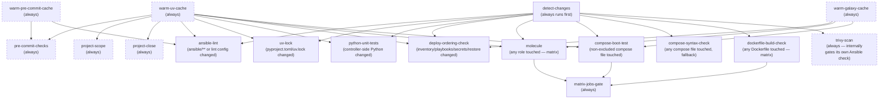

# CI: PR Checks

`.github/workflows/pr-checks.yml` runs on every PR. Which jobs actually
block a merge is configured in GitHub's branch protection / repository
rulesets (Settings > Branches on GitHub, not anything in this repo) —
see [Requiring checks before merge](#requiring-checks-before-merge)
below for which check names to select. This pipeline isn't a substitute
for [Molecule](molecule-testing.md): Molecule tests one role in
isolation, this pipeline tests the parts Molecule can't (linting the
whole tree, a real compose stack booting, and the actual
`deploy.yaml`/`restore.yaml` ordering).

## Where the CI logic lives

Anything with a pass/fail rule or a decision in it is Python under
`tools/`, unit-tested in `tools/tests/`, and workflows and pre-commit only
call it as `python -m <package>.<module>` from `tools/`
([ADR 0064](decisions/0064-where-the-code-behind-ci-and-documentation-checks-lives/revision-000.md)).
`tools/ci/` is what the workflows run:

- `ci.scope` — what a PR's diff needs run: the Molecule watch sets,
  no-op filtering, the compose-app and Dockerfile lists.
- `ci.gates` — checks with their own verdicts: the deploy-ordering
  regression check, the compose health wait, the Renovate window, and
  `matrix-jobs-gate`.
- `ci.images` — the image registry and the CI image builds.
- `ci.scan` — setup for the security scans (the Trivy config).
- `ci.fixtures` — data a job seeds before a real run, derived from the repo
  (the deploy-ordering check's secrets).

`tools/doc_scripts/` is the documentation-workflow checks and generators
of [ADR 0037](decisions/0037-decision-and-project-documentation-workflow/revision-002.md):
`generate_doc_indexes`, `check_doc_drift`, `check_project_scope` and
`check_project_close`, with the helpers they share (`doc_frontmatter`,
`doc_graph`, `doc_scope`, `doc_close`, `doc_git`). The pre-commit hooks run
them as `bash -c 'cd tools && python3 -m doc_scripts.<module>'`, in the
hook's own environment with PyYAML, and the `project-scope` and
`project-close` jobs run them through `uv run`. They read `docs/` from the
repository root, not the working directory.

What stays in workflow YAML or `.github/scripts/` is what needs Actions
(`uses:` steps, caches, registry login) or is a plain command sequence
(`docker` orchestration such as `seed-lldap-ci-cert.sh`, image smoke
tests, `pre-commit`, `pytest`, `molecule test`). `.github/scripts/` holds
no Python, and `tools/tests/ci/test_layout.py` enforces that.

The modules jobs run on the runner's own `python3` (`ci.images.*`, `ci.json5`,
`ci.gates.compose_health`, `ci.gates.renovate_window`,
`ci.gates.matrix_gate`, `ci.scan.*`, `ci.output`, `ci.proc`) are
standard-library only, so those jobs install nothing;
`tools/tests/ci/test_stdlib_only.py` enforces it, including that they still
parse on an older Python than the repo's own. The rest run through
`uv run`.

## Change-scoped, not a full sweep

`detect-changes` diffs the PR's base/head and feeds most other jobs a
scoped input, so a docs-only PR doesn't trigger Molecule or boot-tests.
`pre-commit-checks` is the exception — it runs unconditionally on every
PR regardless of what changed, since its hooks span nearly every file
type in the repo:

- `roles` — each role with a `molecule/` scenario is queued when a
  changed file sits in that role's *watch set*: its own directory, plus
  everything its scenarios read from outside it. Derived from the tree
  on every run, so it can't drift — see
  [`#molecule-watch-sets`](#molecule-watch-sets). A few paths still map
  to *every* role: `ansible/requirements.yml` (a Galaxy collection
  bump), `pyproject.toml`/`uv.lock` (pins the `ansible-core` version every
  role's Molecule run actually executes under), `.config/molecule/`, and
  everything that base config points every scenario at: `molecule_helpers/`'s
  two requirements files, `ansible/ansible.cfg` and the coverage callback
  plugin under `ansible/molecule-coverage/callback_plugins/`. The last
  group is read from the config, not listed (see
  [Molecule watch sets](#molecule-watch-sets)).
- `compose_apps` — any `docker/<app>/compose.yaml` or `compose.yaml.j2`,
  its `Dockerfile`, or any file under `docker/<app>/configs/` or
  `docker/<app>/scripts/`, touched, minus the exclusion list (below).
  A directory with no compose file isn't an app. All of it is
  [`tools/ci/scope/compose_apps.py`](../tools/ci/scope/compose_apps.py),
  the one reader of the exclusion list (see
  [Compose boot-test](#compose-boot-test)). The `compose` role renders and stages `configs/` and `scripts/` before
  the stack boots, and `compose-boot-test` builds the `Dockerfile` in
  place of the published image, so a change to any of them alters what
  it actually exercises.
- `dockerfiles` — any `docker/<app>/Dockerfile` touched, excluded apps
  included. See [Dockerfile changes](#dockerfile-changes).
- `deploy_ordering` — `ansible/inventory/**`, `ansible/playbooks/**`,
  `ansible/roles/secrets/**`, `ansible/roles/restore/**`,
  `tools/ci/gates/deploy_ordering.py`, `tools/ci/fixtures/**`,
  `pyproject.toml`/`uv.lock`.
- `uv_lock` — `pyproject.toml`/`uv.lock` changed.
- `python_unit_tests` — `ansible/scripts/*.py`,
  `tools/cloud_credentials/**`,
  `tools/openbao_utils/**`, `tools/utils/**`, `tools/ci/**`,
  `tools/doc_scripts/**`,
  `ansible/molecule-coverage/molecule_cov/**`,
  `ansible/molecule-coverage/callback_plugins/**`, `ansible/tests/**`,
  `tools/tests/**`, `docker/openbao/watcher/r2_read_watcher.py`,
  `pyproject.toml`/`uv.lock`. This is all plain controller-side Python,
  not Ansible roles, so it's covered by `ansible/tests/`'s and
  `tools/tests/`'s `pytest` suites instead of Molecule — including
  `r2_read_watcher.py`, the one file outside either tree that
  `ansible/tests/` still imports directly via `sys.path`.

### Molecule watch sets

`tools/ci/scope/molecule_scope.py` (run by `detect-changes`, tested in
`tools/tests/ci/scope/`) builds each role's watch set from what its
scenarios actually reference, then queues a role when a changed file
falls inside it:

- the role's own directory;
- every role it runs: `include_role`/`import_role` names, play `roles:`
  entries and `meta` dependencies in the scenario's playbooks, the
  role's own tasks/handlers/meta, and each included role's in turn. The
  whole included role's directory is watched, so a change to `compose`
  queues every role whose Molecule run exercises it, not just
  `compose`'s own scenarios. A role with no scenario of its own (like
  `molecule_helpers`, or a shared role nothing tests directly) is
  watched but never queued;
- each `molecule_helpers` task file a scenario pulls in with
  `include_role: {name: molecule_helpers, tasks_from: ...}`, followed
  through the helper playbooks and task files that include further
  helper task files or roles (`resolve_compose_apps.yaml` runs
  `compose`'s `preinit.yaml`, so its consumers watch `compose` too);
- each `${MOLECULE_PROJECT_DIRECTORY}/...` path in a scenario's
  `molecule.yml` (the shared `prepare` playbooks);
- the target of every symlink under `molecule/`. Scenarios link the
  real `docker/<app>/` files and `molecule_helpers/fixtures/` into
  their own `files/`, and git reports the target path, not the link;
- files read by a path built from `playbook_dir`, which is the
  scenario directory under Molecule: `playbook_dir ~ '/../x'`,
  `{{ playbook_dir }}/../x`, and the same through any variable a
  scenario defines as `{{ playbook_dir }}` or
  `{{ (playbook_dir ~ '...') | realpath }}` (`project_root`,
  `repo_root`), whether the path is written in the scenario or in the
  role's own tasks and templates. The target need not exist: deleting a file
  a scenario reads still queues that scenario. A variable used only as a base
  directory (`project_root ~ '/ansible/files/key.asc'`) contributes the files
  it is joined to, not the directory its definition names, so a role that
  defines one doesn't end up watching everything under it. This is how
  `inventory/group_vars/all/app_registry.yaml`, `ansible/scripts/restore_all.py`,
  `docker/openbao/policies/controller.hcl` and
  `docker/seaweedfs/configs/s3-identity.json.j2` reach the scenarios
  that read them.

### Comments and formatting don't queue Molecule

Before any of that matching, `detect-changes` drops a changed file whose
*parsed* content is identical in base and head
(`tools/ci/scope/semantic_diff.py`). A comment added, edited or
removed, or a reformat (indentation, quoting, blank lines), queues no
role, and doesn't trip the repo-wide or `molecule_helpers` fail-safes
either. The log line says `comments/formatting only -> ignored`.

The same rule gates three of the path-filter outputs
(`tools/ci/scope/effective_changes.py`): `uv_lock`, `deploy_ordering`
and `python_unit_tests` are true only if at least one file the filter
matched changed for real. The filter step lists its matched files
(`list-files: json`), and the `effective` step checks each one. So a
comment in a test, or an edit to `[tool.ruff]`, no longer starts
`python-unit-tests`, `uv-lock` or `deploy-ordering-check`. `ansible_lint`,
`trivy_ansible` and `any_compose` are never gated, and the script
refuses to: ansible-lint honours `# noqa`, Trivy honours
`#trivy:ignore`, and compose files are never a no-op.

It compares what the parser produces, not the text, so a `#` line
inside a YAML block scalar (a script or config written into a file) is
data and counts as a real change. Only files whose parser is the
consumer are eligible:

- YAML that Ansible, `ansible-galaxy` or Molecule loads: a role's
  `tasks/`, `handlers/`, `defaults/`, `vars/`, `meta/`; a scenario's
  own playbooks, `molecule.yml` and `host_vars/`/`group_vars/`;
  `molecule_helpers`' playbooks and requirements files;
  `ansible/requirements.yml`; `ansible/playbooks/`, `inventory/` and
  `ci-inventory/`; `.config/molecule/`. YAML shipped as content (a
  compose fixture, a file copied to a host) is not, since a comment
  there can mean something to whatever reads it (`#cloud-config`).
- Python, compared as its AST plus the shebang and any `coding:` line,
  which the interpreter reads. A docstring is code.
- `pyproject.toml` and `uv.lock`, compared as parsed TOML.
  `pyproject.toml` is compared without `[tool.ruff]`, which only
  configures a linter `pre-commit-checks` runs over every file anyway.
  Every other table counts, including one added later, so an unknown
  table errs toward running the checks.

Anything else (`.j2` templates, shell, compose files), a file added or
deleted, a file that doesn't parse on either side, and a mode-only
change are real changes. Everything not named above keeps its path-based trigger, so
`ansible-lint`, `trivy-scan` and `pre-commit-checks` still see a
comment-only change (a comment can be a `# noqa`, `# yamllint disable`
or `#trivy:ignore`).

`ansible/roles/molecule_helpers/` isn't a normal role — it has no
`molecule/` scenario of its own — so a change there queues only the
roles whose watch set contains that file. Two fail-safes always queue
*more*: a changed file under `molecule_helpers/` that no scenario
references queues every role (a *deleted* one queues nothing: no scenario
names it, or the scan would have failed, and a reference removed in the same
change is in a scenario file that changed with it), as does any repo-wide path: `GLOBAL_PATHS`
plus every path in `.config/molecule/config.yml`, the base config deep-merged
into every scenario, written as `${MOLECULE_PROJECT_DIRECTORY}/...`. Those
are resolved from the config on each run (`base_config_paths`), so pointing
`ANSIBLE_CONFIG` or `ANSIBLE_CALLBACK_PLUGINS` somewhere else moves the
trigger with it. Left out: the roles directory (the per-role watch sets
already cover it) and the gitignored coverage output directory. The
coverage thresholds file and the `molecule_cov` gate package are read after
the scenarios run, by the gate, so they don't queue any role; `pytest` covers
`molecule_cov`. A reference the scanner can't resolve (a templated `include_role` name, a
role that isn't a directory under `ansible/roles/`, a dangling symlink,
a `tasks_from` naming no file) fails `detect-changes` rather than being
skipped. Each queued role's log line in `detect-changes` names the
changed file and why it matched.

Not modelled: paths built any other way (a variable not defined as
above, or a literal continued with `~`), which are ignored, as are
computed paths that leave the repo or are the role's own directory or an
ancestor of it. Roles are watched whole-directory
rather than by `tasks_from`, so a change to any file in an included
role queues its consumers.

Because a scenario that links `docker/seaweedfs/` files is queued when
they change, the `seaweedfs` `compose-boot-test-exclusions.txt` entry
below stays correct — see there for the SeaweedFS-specific case.

`detect-changes` runs the scanner with `uv run python -m ci.scope.molecule_scope` from `tools/`, so it sets up uv
(no `needs:` on `warm-uv-cache`, and unlocked, for the reasons under
[Cache warming](#cache-warming)).

## Jobs

| Job | Runs when | What it does |
| :--- | :--- | :--- |
| `warm-uv-cache` | always | Populates the shared uv package cache. See [Cache warming](#cache-warming). |
| `warm-galaxy-cache` | always | Populates the shared Ansible Galaxy collections cache. See [Cache warming](#cache-warming). |
| `warm-pre-commit-cache` | always | Populates the shared pre-commit hook-environment cache. See [Cache warming](#cache-warming). |
| `pre-commit-checks` | always | Every commit-stage hook (all of `.config/.pre-commit-config.yaml` except `ansible-lint`) against every file. |
| `project-scope` | always | A PR that touches a project doc stays inside that project's `allowed_paths`, read from the base branch — see [Project scope check](#project-scope-check). |
| `project-close` | always | A PR that deletes a project doc leaves its `decision:` revision `accepted` or still named by another project — see [Project close check](#project-close-check). |
| `ansible-lint` | `ansible/**`/`.config/.ansible-lint`/`.config/.pre-commit-config.yaml` changed | The one push-stage hook — always lints the whole `ansible/` tree when it runs, not just what changed, so it's pinned to push time and scoped to this same file set locally too, via `.config/.pre-commit-config.yaml`'s own `files:`/`always_run: false` override (needed since upstream's manifest defaults to `always_run: true`). |
| `uv-lock` | `pyproject.toml`/`uv.lock` changed | `uv sync --locked` — catches an unregenerated lockfile or a resolvable-but-broken dependency combination. |
| `python-unit-tests` | `tools/cloud_credentials/**`/`tools/openbao_utils/**`/`tools/utils/**`/`tools/ci/**`/`tools/doc_scripts/**`/`ansible/molecule-coverage/molecule_cov/**`/`ansible/tests/**`/`tools/tests/**`/`pyproject.toml`/`uv.lock` changed | `pytest` over `ansible/tests/` and `tools/tests/` — every provider HTTP call and `rclone` invocation mocked; `tools/tests/doc_scripts/` covers the doc-index generator and drift checker. |
| `deploy-ordering-check` | inventory/playbooks/secrets/restore/`tools/ci/gates/deploy_ordering.py`/`tools/ci/fixtures/**`/`pyproject.toml`/`uv.lock` changed | See below. |
| `molecule` | any role touched | One matrix job per changed role, running `./scripts/molecule-test-all.sh <role>`. Also generates and gates on that role's [coverage report](#molecule-coverage-gate). See [`molecule-testing.md`](molecule-testing.md). |
| `compose-boot-test` | any non-excluded compose file, `Dockerfile`, `configs/` or `scripts/` touched | Seeds and boots each changed app for real, running this checkout's `Dockerfile` where the app has one. See below. |
| `dockerfile-build-check` | any `docker/<app>/Dockerfile` touched | One matrix job per changed Dockerfile: builds it without pushing and runs that image's smoke test. See [Dockerfile changes](#dockerfile-changes). |
| `compose-syntax-check` | any compose file touched, fallback | `docker compose config --quiet` on whatever `compose-boot-test` excludes. |
| `matrix-jobs-gate` | always | Aggregates `molecule`/`compose-boot-test`/`dockerfile-build-check`'s results, and requires `detect-changes` and the cache-warming jobs to succeed, into one fixed check name — see below. |

```mermaid
flowchart TD
    detect["detect-changes<br/>(always runs first)"]
    warmuv["warm-uv-cache<br/>(always)"]
    warmgalaxy["warm-galaxy-cache<br/>(always)"]
    warmprecommit["warm-pre-commit-cache<br/>(always)"]
    precommit["pre-commit-checks<br/>(always)"]
    scope["project-scope<br/>(always)"]
    close["project-close<br/>(always)"]
    trivy["trivy-scan<br/>(always — internally<br/>gates its own Ansible check)"]
    lint["ansible-lint<br/>(ansible/** or lint config changed)"]
    uvlock["uv-lock<br/>(pyproject.toml/uv.lock changed)"]
    pytest["python-unit-tests<br/>(controller-side Python changed)"]
    deployorder["deploy-ordering-check<br/>(inventory/playbooks/secrets/restore changed)"]
    molecule["molecule<br/>(any role touched — matrix)"]
    boottest["compose-boot-test<br/>(non-excluded compose file touched)"]
    synchk["compose-syntax-check<br/>(any compose file touched, fallback)"]
    dockerbuild["dockerfile-build-check<br/>(any Dockerfile touched — matrix)"]
    gate["matrix-jobs-gate<br/>(always)"]

    detect --> lint & uvlock & pytest & deployorder & molecule & boottest & synchk & dockerbuild
    detect --> trivy
    warmuv --> precommit & scope & close & lint & uvlock & pytest & deployorder & molecule & boottest
    warmgalaxy --> deployorder & molecule & boottest
    warmprecommit --> precommit & lint
    molecule --> gate
    boottest --> gate
    dockerbuild --> gate

    style precommit stroke-dasharray: 5 5
    style scope stroke-dasharray: 5 5
    style close stroke-dasharray: 5 5
    style trivy stroke-dasharray: 5 5
    style warmuv stroke-dasharray: 5 5
    style warmgalaxy stroke-dasharray: 5 5
    style warmprecommit stroke-dasharray: 5 5
```

`pre-commit-checks`, `project-scope`, and `project-close` run unconditionally and independently of
`detect-changes` (dashed above) — its hooks span nearly every file
type in the repo, so scoping it would defeat the point. `trivy-scan`
also always runs as a job, but reads `detect-changes`' output to decide
internally whether to run its Ansible-misconfig sub-check — see
[security-scanning.md](security-scanning.md). `warm-uv-cache`,
`warm-galaxy-cache`, and `warm-pre-commit-cache` are dashed for the
same reason: unconditional, independent of `detect-changes`, so a cold
or evicted cache self-heals on any PR rather than only ones the diff
happens to flag. See [Cache warming](#cache-warming).

## Cache warming

`warm-uv-cache`, `warm-galaxy-cache`, and `warm-pre-commit-cache` exist
to give each of the three shared caches below exactly one job that's
allowed to write to it, no matter how many other jobs in the run need
what it holds.

All three caches are keyed on a hash of whatever file determines what
needs installing (`uv.lock`/`pyproject.toml` for uv's own cache, inside
`astral-sh/setup-uv`; `ansible/requirements.yml` +
`ansible/roles/molecule_helpers/role-requirements.yml` for the Ansible
Galaxy collections cache; `.config/.pre-commit-config.yaml` — which
pins every hook's own version — for pre-commit's hook-environment
cache; the latter two inside `setup-uv-ansible`) — so the key already
changes correctly whenever a dependency changes, Renovate bump or not.
That was never the gap. The gap is that on a run where the key *is*
new — most often a Renovate PR, since bumping a dependency (or, for
pre-commit's cache, a hook version — Renovate's `pre-commit` manager
bumps exactly this file) is the whole point of one — every job that
consumes that cache misses at the same time and, before this, every
one of them then tried to save the same new entry. `actions/cache`
treats a losing save as a soft warning (cache key already exists), not
a job failure, so this was never a correctness bug; it was a burst of
simultaneous writers against GitHub's cache API, worst on exactly the
PRs Renovate opens several of at once, and occasionally surfaced as
connection resets rather than the expected warning.

`setup-uv-ansible`'s `save-uv-cache`/`save-galaxy-cache`/
`save-precommit-cache` inputs (all default `"false"`) gate saving
only — every job still restores a cache that exists, regardless of
these flags, so nothing here weakens the cache for jobs that don't
populate it. Within `pr-checks.yml`, only `warm-uv-cache` sets
`save-uv-cache: "true"`, only `warm-galaxy-cache` sets
`save-galaxy-cache: "true"`, and only `warm-pre-commit-cache` sets
`save-precommit-cache: "true"` ([Base-branch
warming](#base-branch-warming) covers the one other writer, on
`main`); every other cache-consuming job below depends on the
relevant warm job(s)
(`needs:`) and leaves all three at their default, so it only ever
restores.

All three warm jobs run unconditionally — no `if:`, no dependency on
`detect-changes` — so a cold or evicted cache self-heals on any PR,
not only ones a diff happens to flag as touching the dependency files.
They run independently of each other, too: neither `warm-galaxy-cache`
nor `warm-pre-commit-cache`'s own `uv sync` waits on `warm-uv-cache`
finishing, so on a fully cold run all three may resolve uv's packages
in parallel rather than serializing behind one another — a little
redundant work, once, is cheaper than adding a hop to the critical
path every PR pays. `warm-pre-commit-cache` only runs `pre-commit
install-hooks`, never `pre-commit run` — building every hook's
environment is the entire point, and it needs nothing (Docker
included) that actually running a hook would.

`warm-uv-cache` deliberately runs an unlocked `uv sync` (`locked` left
at its default `"false"`), not `--locked`. This job exists only to
populate the shared package cache — lockfile strictness is `uv-lock`'s
job, separately, and needs to keep failing (or not) on its own merits.
If `warm-uv-cache` used `--locked`, a genuinely stale lockfile would
fail *this* job instead, and every job below it (`needs:
warm-uv-cache`) would report `skipped` rather than run — burying
`uv-lock`'s specific diagnostic under a wall of unrelated skips on the
exact PRs (lockfile changes) where it matters most.

### Base-branch warming

The three warm jobs above run on `pull_request`, and GitHub scopes a
cache saved by a pull-request run to that PR's merge ref
(`refs/pull/<n>/merge`): only re-runs of the same PR can restore it.
A second PR — even with byte-identical dependency files — never sees
it, misses, and rebuilds all three caches from scratch. A run can
restore entries saved on the PR's base branch, so `main` has to hold
them ([GitHub's cache access
rules](https://docs.github.com/en/actions/reference/workflows-and-actions/dependency-caching#restrictions-for-accessing-a-cache)).

`.github/workflows/warm-caches.yml` runs `setup-uv-ansible` with all
three save flags on `main`, in one job (the three keys are distinct,
so there is no same-key race to split writers over). Its triggers:

- `push` to `main` — a merge that changes a cache key (a Renovate
  bump) writes the new entry immediately. No `paths:` filter: the key
  inputs already live in `setup-uv-ansible`'s `hashFiles(...)` calls,
  and a second copy of that list here could drift from it. On a hit
  the run restores and does no-op installs.
- `schedule` (Sunday and Wednesday, 20:00 UTC) — GitHub evicts entries
  not accessed in 7 days, and the longest gap between runs is 4 days.
  A restore hit counts as access, so the run keeps entries alive
  without re-saving them.
- `workflow_dispatch` — rebuild by hand after an eviction.

The PR-side warm jobs stay: a PR that changes a key is still the first
writer of that entry and its own jobs need it before merge. The entry
is visible to that PR alone until the merge re-warms it on `main`.

## Requiring checks before merge

Not configured in this repo — GitHub only blocks merges via branch
protection rules or repository rulesets (Settings > Branches), which
reference jobs by their check-run name (`<workflow name> / <job name>`,
e.g. `PR checks / pre-commit-checks`).

`warm-uv-cache`, `warm-galaxy-cache`, `warm-pre-commit-cache`,
`pre-commit-checks`, `project-scope`, `project-close`,
`ansible-lint`, `uv-lock`, `python-unit-tests`,
`deploy-ordering-check`, and `compose-syntax-check` are all safe to
mark required directly: each
is gated by a job-level `if:` inside a workflow that always triggers on
`pull_request`, not by a path filter on the trigger itself — a required
check accepts a `skipped` conclusion, so an unrelated PR (e.g.
docs-only) won't get stuck waiting on a `deploy-ordering-check` run that
never needed to happen. The unsafe pattern (never used here) would be
`paths-ignore`/`paths:` on the workflow's own `on:` trigger, which
leaves the check permanently "Pending" instead of reporting `skipped`.

**`molecule`, `compose-boot-test` and `dockerfile-build-check` are the
exception** — don't require them directly. All three use a matrix (one
entry per changed role/app/Dockerfile), and
when the matrix actually runs, each entry posts its own check name (e.g.
`molecule (apt)`), which varies by PR. There's no single name that's
guaranteed to post for every PR: the base job name (`molecule`) only
appears when the job is skipped entirely, never when it actually ran.
Require `matrix-jobs-gate` instead — it depends on all three, runs
regardless of whether they were skipped (`if: always()`), and fails
if any genuinely failed (not skipped). It also depends on
`detect-changes`, `warm-uv-cache` and `warm-galaxy-cache` and requires
each to succeed: a failure there makes the matrix jobs report
`skipped`, which would otherwise pass. One fixed name, correct for every
PR shape.

The verdict is [`tools/ci/gates/matrix_gate.py`](../tools/ci/gates/matrix_gate.py),
given the whole `needs` context (`toJSON(needs)`) and the matrix jobs'
names (`MATRIX_JOBS`). Matrix jobs pass on `success` or `skipped`; every
other job in `needs` must be exactly `success`; any other value, including
one the check has never seen, fails. It lists every failing job by name
rather than stopping at the first, and a matrix job named but missing from
`needs` is an error. `tools/tests/ci/gates/` parses the real workflow to
keep the two lists honest: every job that uses a matrix (directly, or
through a reusable workflow that does) must be in the gate's `needs` and in
`MATRIX_JOBS`, and nothing else may be in `MATRIX_JOBS`. So adding a matrix
job means adding it to both, and forgetting fails a test rather than
weakening the gate.

The gate job checks out only `tools/ci` (`sparse-checkout`) and runs the
module on the runner's `python3`, so it needs no uv and no dependencies. A
checkout that fails fails the gate, and the merge stays blocked. Like every
job in this workflow it runs the PR's own code; a PR that edits the gate
also edits what checks it.

## Deploy-ordering-check

Regression coverage for an incident where `ansible_host` (`inventory.yaml`)
was wired to resolve through a role-generated fact
(`secrets_generated`) without anything in CI ever exercising that chain
— every other check either bypasses `ansible_host` resolution entirely
or tests the `secrets` role against a synthetic inventory that never
touches the real one.

Runs the **real** `deploy.yaml` (not a copy) against
`inventory/ci-deploy-ordering-inventory.yaml`, a purpose-built inventory
that mirrors `inventory.yaml`'s `ansible_host` → `ddns_domain` →
`main_domain` → `secrets_generated` chain and its
`managed_hosts`/`controller` group split, while staying CI-safe:
`ansible_connection: local` everywhere, and `--tags` matching nothing
real so provisioning never runs — only secrets generation/propagation
and the `ansible_host` resolution it gates.

`ansible/inventory/**` in the trigger list covers `inventory.yaml` itself
plus `group_vars/all/main.yaml`/`secrets_registry.yaml` — deliberately
broad, since either is the shape of change that caused the original
regression. `pyproject.toml`/`uv.lock` are in the trigger list too: this
job runs the real playbooks through the uv-managed `ansible-core`, so an
`ansible-core` bump is exercised here as well as by
[Molecule](#molecule-watch-sets).

Both runs and the verdict on the second are
[`tools/ci/gates/deploy_ordering.py`](../tools/ci/gates/deploy_ordering.py),
run as `python -m ci.gates.deploy_ordering deploy|restore` from `tools/`;
`tools/tests/ci/gates/` tests the verdict against sample logs and checks
that the expected failure message is still the `restore` role's own.

`restore.yaml` gets a second, separate step: it can't import
`bootstrap-secrets.yaml` as a leading play the way `deploy.yaml` does
(see [`restore.md`](restore.md)), so this
step is the regression check for that two-file invocation pattern
specifically — not for `restore`'s own validation logic, which
[Molecule](molecule-testing.md) already covers. It deliberately points
at a nonexistent archive and asserts the failure is the expected
archive-not-found message, not an `ansible_host`/`secrets_generated`
resolution failure (that signature means the regression is back).

Two fixtures run first, both in
[`tools/ci/fixtures/`](../tools/ci/fixtures/) and both read from the real
`secrets_registry.yaml` at run time, so neither can drift from it:

- `preseed_manual_secrets` writes every manual-format secret as a plain file
  under `ansible/files/secrets/`, mirroring what `openbao_utils/bootstrap.py`
  produces — an empty file for an `allow_blank` entry, `ci-dummy-<key>`
  otherwise. Throwaway CI values, same non-secret status as
  `ci-inventory/group_vars/all/ci_dummy_vars.yaml`. A registry key that isn't
  a plain file name is refused, since it becomes a path.
- `strip_vault_scope` writes a copy of the registry without `vault_scope`
  to `/tmp/ci-secrets-registry-no-vault.json`, which both playbook runs load
  with `-e @`. This job has no OpenBao or step-ca target, so a scoped entry
  would make `vault_login.yaml` run and fail; Vault reachability is
  Molecule's job (`vault_backed`, `rotate_secret`). The output path is fixed
  in the workflow step and in `deploy_ordering.py`, and a test holds the two
  equal.

`tools/tests/ci/fixtures/` covers both, including a run over the real
registry, and checks the job's steps run them before the playbooks.

## Doc index generation

[`tools/doc_scripts/generate_doc_indexes.py`](../tools/doc_scripts/generate_doc_indexes.py),
wired into `.config/.pre-commit-config.yaml` as a local hook, positioned before
markdownlint/`check-doc-drift` below — it needs to run first so a bad
generation gets caught by the checks that follow, the same way a bad
hand-edit already is. Reads every `docs/projects/*.md` and every decision revision's
frontmatter and regenerates `docs/projects/README.md`'s Index and By
initiative tables and `docs/decisions/README.md`'s Lineages index in
place, validating each doc's frontmatter as it goes. Same
auto-fix pattern as `ruff --fix`/`dclint-docker` above: a stale table
fails the commit and shows the regenerated diff, rather than silently
passing.

## Docs drift check

[`tools/doc_scripts/check_doc_drift.py`](../tools/doc_scripts/check_doc_drift.py), wired into
`.config/.pre-commit-config.yaml` as a local hook — no separate job of its own, it rides along inside
`pre-commit-checks` above like every other commit-stage hook. Checks
these narrow, structural things:

- Every doc directly under `docs/` is linked somewhere in
  `docs/README.md` (both directions — a link to a deleted file fails
  too). The same check applies one level down for `docs/decisions/`,
  `docs/architecture/`, and `docs/projects/`, each against its own
  `README.md` index.
- `docs/ansible.md`'s Playbooks and Roles tables list exactly the files
  under `ansible/playbooks/*.yaml` and directories under
  `ansible/roles/*/`.
- `docs/molecule-testing.md`'s Scenario matrix table lists exactly the
  scenario directories that exist under `ansible/roles/*/molecule/*/`.
- `docs/deployment-flow.md` has one `## Play N` heading per play in
  `deploy.yaml`, numbered sequentially — title *wording* isn't compared,
  only count and sequence, so a heading paraphrasing a play's name isn't
  flagged as drift.
- This file's own Jobs table lists every `pr-checks.yml` job id, except
  `detect-changes` (internal plumbing) and `trivy-scan` (documented in
  [`security-scanning.md`](security-scanning.md) instead).
- Every cross-file `#anchor` reference anywhere in the repo (not just
  `.md` files — YAML/Python comments too) resolves to a real file with
  a heading that actually slugs to that anchor; same for same-file
  `#anchor` links. Catches the class of bug a file move/rename/split
  leaves behind.
- Every path under `docs/decisions/` or `docs/projects/` ending in `.md`
  that is written in any docs, code, or config file (`.md`, `.py`,
  `.yaml`, `.sh`, `.toml`, …) exists — comments included. This is what
  catches a renamed ADR mentioned in a comment, which the anchor check
  can't see because such a path carries no `#anchor`, and it fails a
  comment that points at a project doc the day that project is deleted.
  A path containing `NNN` is a placeholder; a deleted file is referred to
  by name, not by path.
- Every ADR linked from
  [`nist-800-53-alignment.md`](nist-800-53-alignment.md) isn't
  `status: superseded` — the one state transition the anchor check
  above can't catch, since a superseded ADR's file doesn't move or
  break any link. Doesn't check whether an *accepted* ADR's reasoning
  drifted, or whether a new ADR should be added there — that's still
  on whoever's making the change, per that page's own notes.
- Decision lineages (`docs/decisions/NNNN-slug/revision-NNN.md`):
  generations (`revision-NNN`) run 000..NNN with no gaps; competing
  candidates in one generation are lettered a, b, c… with none missing,
  and once one is `approved` or beyond the rest are `abandoned`; at most one revision is
  `accepted`; a `superseded` revision names a later `accepted` (or
  itself superseded) successor that declares `supersedes` back;
  `title` and `topic` are identical across a lineage's revisions;
  `narrows`, `related`, and `former_ids` reference real lineages, and a
  `former_ids` entry is never a live lineage. Each lineage directory is
  linked from `decisions/README.md`. An `approved` or `accepted`
  revision has no open `Assumptions` entry — the hard gate in
  [`decisions/README.md#assumptions`](decisions/README.md#assumptions).
  Presence-of-a-bullet only, not whether the claim is genuinely
  resolved; that judgment call is still on whoever sets the status.
- A project's `decision:` revision must be in the state its status
  requires: `not-started` → `working` or `approved`, `de-risking` →
  `working`, `building` → `approved`, `done` → `accepted`. A revision
  dropping back to `working` therefore fails the check for any project
  that is `building` on it. Projects without a `decision:` are never
  gated. `depends_on` entries name existing project docs, never
  themselves, and form no cycle.
- Relative links (`./`, `../`) from a `.md` file to a config, script, or
  data file (`.yaml`, `.hcl`, `.py`, …) resolve to a real file, the same
  way `.md` links do.

Deliberately presence/shape checks, not content review — it can't tell
you a description is *wrong*, only that something's missing or a
documented thing no longer exists.

## Project scope check

[`tools/doc_scripts/check_project_scope.py`](../tools/doc_scripts/check_project_scope.py) enforces the optional
`allowed_paths` field on project docs (see
[`projects/README.md#scope`](projects/README.md#scope) for what it means
and why). It runs in two places:

- **CI** — the `project-scope` job, on every pull request: the diff from
  the merge-base of the PR's base and head to its head. The merge-base,
  not the base tip, so a branch that is behind doesn't see main's newer
  commits as its own changes. The repo's other diff-based jobs diff
  `$BASE $HEAD` directly; this one deliberately doesn't.
- **pre-commit** — the `check-project-scope` hook, on what is staged,
  against `HEAD`. It sees only the current commit, so it is early
  feedback; CI is the authority, since it sees the whole PR. Under
  `pre-commit-checks`' `--all-files` run nothing is staged and it passes
  trivially.

In both, a project's scope is read from the doc **as it stands on the
base**, so a change can't widen its own scope and then use it. A project
doc that is new in the change has no scope yet. Renames and deletions
count as touching both paths. Path-level only: it can't tell whether an
edit inside an allowed file is the permitted one, and a change that never
touches its project doc isn't bounded.

## Project close check

[`tools/doc_scripts/check_project_close.py`](../tools/doc_scripts/check_project_close.py) enforces the closing rule in
[ADR 0037 revision 2](decisions/0037-decision-and-project-documentation-workflow/revision-002.md):
deleting a finished project's doc must not leave the revision its
`decision:` names `approved` with no project naming it. A deleted doc
passes when that revision is `accepted` afterwards, or another project doc
that remains still names it in `decision:` (`also_implements:` doesn't
count, since it gates nothing). So the last project to close either
accepts the revision or leaves a `not-started` successor naming it for
whatever is unfinished. A change that deletes no project doc isn't
checked.

It runs in the same two places as the scope check, with the same
merge-base diff and the same staged-changes behavior:

- **CI** — the `project-close` job, on every pull request, judging the
  PR's head.
- **pre-commit** — the `check-project-close` hook, judging the index
  against `HEAD`. It is early feedback; CI is the authority. Under
  `pre-commit-checks`' `--all-files` run nothing is staged and it passes
  trivially.

Unlike the scope check, it reads the docs as they stand **after** the
change, since it has to see what the change leaves behind; the base
supplies only the deleted doc's own `decision:`. A doc that doesn't parse
after the change fails the check rather than being skipped, and
`check_doc_drift.py` names it. A rename counts as a deletion plus an
addition, so a renamed project doc keeps its revision named.

Two PRs that each leave the other's project in place can both pass and
together leave a revision `approved` with no project. The generated
[Decisions awaiting a project](project-planning.md#decisions-awaiting-a-project)
view lists it, so the gap is visible but not blocked.

## Molecule coverage gate

Each `molecule` matrix job regenerates that role's task inventory
(`molecule_cov.cli inventory` - its output is gitignored, tied to the
checkout's absolute paths, so not committed) and runs
`molecule_cov.cli report --thresholds-file thresholds.yaml`, both against
the coverage data that role's own `molecule test` run just produced.
Per-role, not one global number, since roles aren't structurally
comparable - see
[`molecule-coverage/README.md`](../ansible/molecule-coverage/README.md)
for what the report actually measures.

A role with no entry in `thresholds.yaml` fails the check (exit 2, not a
silent pass) - a new role needs a deliberate floor, not an inherited
default. Every floor is hand-verified against a real run, not a guess -
the below-100% floors are legitimate, understood gaps rather than
untested code (see [`thresholds.yaml`](../ansible/molecule-coverage/thresholds.yaml)
for the current values):

- `apt` - the reboot-if-required task is untested by design, not just by
  omission: `/var/run/reboot-required` never appears in the container
  fixture used here (confirmed explicitly in that scenario's own
  verify.yml, not left incidental), and a separate scenario that
  actually triggers `ansible.builtin.reboot` isn't a safe way to close
  that gap - a privileged container's `reboot` syscall isn't scoped to
  the container, it reboots the underlying Docker host's own kernel
  (confirmed against a real, reported case:
  moby/moby issue #21929), a hazard to whoever runs
  `molecule test` for it. Closing this properly needs isolation this
  project's Docker-based Molecule tooling doesn't provide (a real VM,
  say), which is out of scope here.
- `bind9` - the resolv.conf-upstream task needs a pre-existing
  non-upstream resolv.conf to be worth simulating.
- `restore` - the interactive confirmation prompt is bypassed on
  purpose in every scenario, to test the rest of the role
  non-interactively.
- `secrets` - the Vault CAS re-read-after-losing-a-create-race task
  needs a genuine concurrent write conflict to trigger, which no single
  Molecule scenario can engineer deliberately.

## Compose boot-test

Shared logic lives in `_compose-boot-test.yml` (`workflow_call`), used
by both `pr-checks.yml` (changed apps only) and `boot-test-all.yml`
(every app, `workflow_dispatch` only — a manual "test everything" run).

Per app: seeds it via the real `compose` role
(`ansible/playbooks/ci_boot_test.yaml`, against `ci-inventory/` rather
than the real `inventory.yaml`, since the latter's `all:vars` assumes a
real remote host), builds the app's `Dockerfile` if it has one (see
[Dockerfile changes](#dockerfile-changes)), brings the stack up with
`docker compose`, waits for
a healthy state (or that it stayed running, if no healthcheck is
defined), dumps logs on failure, then tears down. The wait is
[`tools/ci/gates/compose_health.py`](../tools/ci/gates/compose_health.py):
per service, in order, it polls a defined healthcheck (30 checks, 2s
apart; `unhealthy` fails at once) or, with none, waits a 10s grace period
and requires the container still be running. Every failure prints that
container's logs, and each container of a scaled service is checked.
`tools/tests/ci/gates/` drives it against a fake `docker`.

**Excluded** (`.github/compose-boot-test-exclusions.txt`, shared by both
workflows and `pr-checks.yml`'s `compose-syntax-check` fallback):

- `bind9`, `seaweedfs`, `caddy` — covered by Molecule with stronger,
  real-protocol assertions than a healthcheck poll would add:
  `bind9`/`caddy` by their own role's scenario, `seaweedfs` by
  `seaweedfs_bucket`'s and `backup_agent`'s (see
  [`#molecule-watch-sets`](#molecule-watch-sets)).
- `tinyauth` — same category: `tinyauth/molecule/default` stands up a
  real, throwaway lldap target, runs `lldap_bootstrap` against it (see
  [`lldap.md`](lldap.md#bootstrapping-the-observer-account)), then
  deploys tinyauth pointed at it and confirms it reaches a healthy,
  LDAP-bound state — the dependency chain compose-boot-test's per-app
  isolation can never provide, since no `lldap` host exists to resolve
  in that model.
- `molecule-dind` — not a deployed compose app at all, so there's
  nothing for `docker compose up` to run against: it's CI scaffolding,
  a Dockerfile built and pushed to `ghcr.io/wenenhoe/molecule-dind` for
  Molecule's DinD scenarios (`build-molecule-dind-image.yml`), with no
  `compose.yaml`/`.j2` of its own.

`lldap` is no longer in that list: `_compose-boot-test.yml` issues a real
cert for it from a throwaway `smallstep/step-ca` container (the official
image, driven by its own stock `DOCKER_STEPCA_INIT_*` auto-init — not
`docker/step-ca`'s own compose stack, which this CA only needs to
outlive a single job step, not persist), using the same `step ca
certificate` call `step_ca_cert`'s real Ansible task runs — see
[`seed-lldap-ci-cert.sh`](../.github/scripts/seed-lldap-ci-cert.sh). This
exercises the real issuance path end to end rather than a parallel,
independently-authored openssl fixture, and needs no real DigitalOcean
credential or step-ca password — the throwaway CA and its password exist
only for this job's lifetime.

Excluded apps still get `compose-syntax-check`'s weaker
`docker compose config --quiet` validation, so nothing goes fully
unchecked. That job checks each changed `compose*.yaml` under an excluded
app (not the `.j2` templates, which aren't valid compose until rendered),
runs every file even after one fails, and stubs an empty `.env` where an
explicit `env_file:` needs one.

`tools/ci/scope/compose_apps.py` is the only code that reads the exclusion
list, for three callers: `detect-changes` (`changed`, which also produces
the Dockerfile list), `boot-test-all.yml` (`all`) and `compose-syntax-check`
(`syntax-check`). Names are matched exactly, and
`tools/tests/ci/scope/` asserts that every exclusion names a real
`docker/` directory and that every directory is either a compose app or
excluded.

## Dockerfile changes

The images built from `docker/<app>/Dockerfile` are published only after
merge (`build-caddy-image.yml`, `build-wastebin-image.yml`,
`build-molecule-dind-image.yml`), and compose files pin the published
tag. Before this, a PR that changed a Dockerfile was never built, and
`compose-boot-test` booted the published image regardless: a Dockerfile
edit that kept the same tag tested the old image, and a version bump
pinned a tag that doesn't exist in `ghcr.io` until after merge.

Three pieces close that gap. All of them are stdlib-only Python that
runs on the runner's own `python3` (a test enforces that), so the jobs
that use them install nothing — notably the `build-*-image.yml` jobs,
which hold a package-write token.

- **The image registry**, `tools/ci/images/registry.py`, is the one place
  each image's published name and tag rule are written down: `caddy` is
  published as `caddy-digitalocean` and tagged with the final stage's
  Caddy version, `wastebin` with the upstream wastebin version,
  `molecule-dind` as `latest`, `coderabbit-review` with its
  `CODERABBIT_VERSION` plus `latest`. The four `build-*-image.yml`
  workflows ask it for their `tags:` (`python3 -m ci.images.registry tags
  <image>`) instead of grepping the Dockerfile themselves. Unlike the
  greps it replaced, it fails unless the Dockerfile has exactly one
  match and the tag looks like a version. `check-pins` (the
  `check-image-pins` pre-commit hook, so it runs in `pre-commit-checks`
  on every PR) fails when a compose file pins a `ghcr.io/wenenhoe` tag
  other than the one the Dockerfile will publish, a Molecule scenario
  names an unpublished tag, an image has no entry, or a
  `docker/<app>/Dockerfile` has none. A Renovate bump to a Dockerfile's
  version therefore has to move the compose pin in the same change.
- **`dockerfile-build-check`** (`ci.images.build build-check`, keyed off
  `ci.scope.compose_apps`'s `dockerfiles` output) builds each changed
  Dockerfile with `docker build`, without pushing, tagged
  `local/<app>:pr-check`, then runs
  `.github/image-smoke-tests/<app>.sh <image>`. Every Dockerfile needs
  a smoke test there — a new one without it fails the job — and
  `tools/tests/ci/images/` asserts the two sets match. The smoke test
  checks what the image exists to add: `caddy` the DigitalOcean DNS
  module and `curl`; `molecule-dind` Docker Engine,
  `python3-requests`, `fuse-overlayfs` and its `daemon.json` default;
  `wastebin` only that the build produced an image, since
  `compose-boot-test` boots it for real. This covers the Dockerfiles
  `compose-boot-test` excludes (`caddy`, `molecule-dind`).
- **Shadow-tagging** in `_compose-boot-test.yml`
  (`ci.images.build shadow-tag`, and a `Dockerfile` change queues the
  app): for an app with a `Dockerfile`, it reads the images the deployed
  compose file pins (`docker compose config --images`), builds the
  Dockerfile and tags the result as the `ghcr.io/wenenhoe/<image>`
  references among them, where the image name comes from the registry.
  Compose's default `pull_policy` (`missing`) uses a local image when the
  tag exists, so the boot test runs this checkout's Dockerfile with no
  change to the compose file. An app with no Dockerfile, or a compose
  file pinning none of its image, is left alone; a Dockerfile with no
  registry entry fails. The reusable workflow's `build-dockerfiles` input
  (default on) gates this step, so it's on for a PR. `boot-test-all.yml`
  passes `false`: a full sweep boots the **published** images, which is
  what a deploy pulls, so it also fails when a compose pin's tag was never
  published. That run is manual (`workflow_dispatch`); nothing schedules it.

Not covered: Molecule scenarios that pull a published image
(`caddy`'s scenarios pull `caddy-digitalocean`, and every DinD scenario
pulls `molecule-dind:latest`) still run the published one, so a
Dockerfile change reaches them only after merge and the next build.
`check-pins` reads the Dockerfile and compose text; it doesn't check the
registry itself, so a pin that agrees with a tag that was never pushed
passes it, and a PR can't tell either, since its boot test builds the
Dockerfile locally. Two checks do fail on a tag that isn't in the registry:
the manual `boot-test-all.yml` sweep, which boots the published images, and
the weekly [image tag existence check](#image-tag-existence-check), which
asks every registry about every pinned image.

## Image tag existence check

`check-image-tags.yml` runs once a week (Sunday, 02:23 UTC) and on demand.
Renovate only ever proposes tags that exist, so a tag an upstream later
removes or renames goes unnoticed until a deploy fails to pull it;
[`tools/ci/images/remote.py`](../tools/ci/images/remote.py) asks each
registry whether every image this repo pins is still there. Unlike
`check-pins`, it covers **every** image, not only the ones built here.

Nothing is listed by hand. It collects references from:

- `image:` lines in compose files and in Ansible YAML and templates: the
  `docker/` stacks, Molecule scenarios and fixtures, and task arguments;
- `FROM` and `COPY --from=<image>` in Dockerfiles, skipping build stages;
- every `customManagers` entry in `.github/renovate.json5` whose datasource is
  `docker`, applied to the files it names. These are the pins Renovate
  tracks outside compose: an rclone image in a systemd unit and a shell
  script, step-cli and step-ca in variable defaults and a CI script, the
  OpenBao image, and the Renovate execution image. A manager that no longer
  matches any file, or a file that no longer matches its manager, fails the
  run: the pin moved, and this check would otherwise stop seeing it silently.

Skipped, and listed in the output: a reference containing a template or
variable, `scratch`, and a `:local` tag (built on the host, never pushed;
today that is `buildapp:local`). A test fails if the skip list changes, so a
new one is a deliberate decision.

It uses the standard registry API with the standard library, so Docker
Hub, `ghcr.io` and any other v2 registry share one path: a HEAD request per
distinct image, and the anonymous token endpoint taken from the registry's
own 401 challenge. A HEAD request doesn't download the image.

**Rate limiting** is the risk this is built around:

- one request at a time, with a half-second pause between requests. Each
  image costs at most two HEADs plus, once per repository, a token request:
  43 images in 37 repositories on two registries (`ghcr.io` and Docker Hub) is
  at most about 120 requests, a minute or so, once a week;
- a token cached per repository, and reused across its tags;
- a 429 or 5xx is retried up to five times, waiting as long as `Retry-After`
  says (capped at a minute) or backing off 2, 4, 8, 16 seconds;
- whatever is still unanswered gets one more pass after a minute's cooldown;
- an image whose registry never answered is a **warning**, not a failure: it
  shows in the log and the run summary as not checked this run. Only a tag
  the registry says isn't there (a 404, or a 401/403 even with a token: gone,
  renamed or private) fails the run. A registry outage doesn't turn a weekly
  run red, and it can't hide a removed tag from the next week's.

Docker Hub's anonymous pull limit counts manifest GETs, and to my knowledge a
HEAD isn't one; I couldn't check that from here. If it ever were, the retry
and warning paths above are what a limit would meet, and a weekly run this
small is unlikely to reach one either way. The run needs no
credentials and runs with read-only permissions. GitHub emails the
workflow's failure to the person who last changed the schedule.

The tests speak real HTTP to a local server that implements the token flow
and can answer 429 and 5xx; **they don't reach a real registry**, so the
first `workflow_dispatch` run against `ghcr.io` and Docker Hub is the live
check. `python -m ci.images.remote list` (from `tools/`) prints every
reference and the files naming it without making a request.

## Renovate schedule window

`renovate.json5`'s `schedule` only lets Renovate open new branches and PRs
inside a window, in its `timezone`. GitHub starts a scheduled run some
unpredictable time after its cron tick (1h44m to 2h20m observed here), so a
run can land after the window closed and open nothing while still
succeeding. `renovate.yml`'s last step,
[`tools/ci/gates/renovate_window.py`](../tools/ci/gates/renovate_window.py),
turns that into a failure, which GitHub's failed-workflow notification then
surfaces.

The timezone and every `schedule:` array are read from `renovate.json5`, so
editing the window there changes what the check enforces. A run fails when
it started on a day the schedule has a window but outside that window's
hours; on any other day nothing is expected of it. It runs only for
`schedule` events (a manual `workflow_dispatch` isn't waiting on a cron
tick) and under `if: always()`, so it stays distinct from a Renovate
failure. Cron fields support `*`, ranges, lists and steps; minutes must be
`*`, as Renovate requires, and day names aren't supported.

## Trivy security scans

Report-only Ansible-misconfig and secret scanning, separate from the
correctness/linting jobs above — see
[`security-scanning.md`](security-scanning.md).
