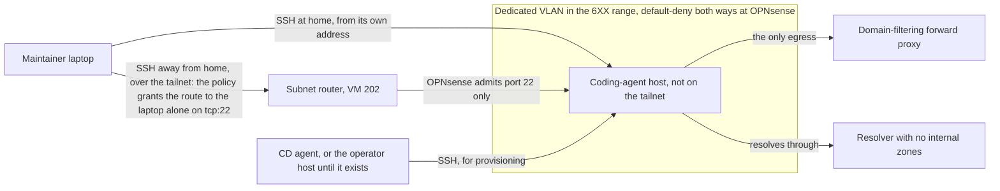

# 0053. Network reach of the coding-agent host

## Problem

A compromised agent session on the coding-agent host has no network path to the secrets store, the CD agent, the operator host, the managed hosts, the Proxmox node, or the maintainer's workstation. The boundary is enforced outside the host, so it holds whatever runs on it.

## Context

[`vm-provisioning.md`](../../topics/infra/vm-provisioning.md) maps each VMID-hundred range to a VLAN by `vlan_id = (vmid // 100) * 10`, with `.1` reserved for OPNsense's sub-interface. The 6XX–8XX ranges are unassigned. Every VM attaches to one VLAN-aware bridge on the node.

[ADR 0020 (Automation identity scope)](../0020-automation-identity-and-access-scope/revision-001.md) binds AppRoles by source CIDR, so subnet boundaries are also an authentication factor. OPNsense rules are hand-maintained today; the Tofu project that would manage them ([`tofu-opnsense-day-2.md`](../../projects/tofu-opnsense-day-2.md)) waits behind the migration.

The maintainer also needs the host away from home. Tailscale subnet routers source-NAT forwarded traffic by default, so over the tailnet the client reaches the VLAN with the subnet router's address, not the laptop's, and the tailnet policy is what limits that route to the laptop.

Claude Code needs `api.anthropic.com`, `claude.ai` and `platform.claude.com` for sign-in and token refresh, and `downloads.claude.ai` for its native installer and updater. The repo's own tooling fetches from PyPI, Ansible Galaxy, GitHub, `ghcr.io`, Docker Hub, and Ubuntu mirrors.

**Threat model.** The adversary is a compromised agent session. The assets are the secrets store, the CD agent, and hosts reachable from it. An allowlist limits lateral reach and drive-by fetches. It cannot stop the agent leaking what it can read (the workspace, its Claude token) through an allowed destination such as GitHub.

## Decision

This diagram shows what can reach the coding-agent host and what it can reach as this revision decided it, not what runs now.

- **Zone.** A dedicated VLAN in the 6XX range (VMID 601 gives VLAN 60, `192.168.60.0/24`), default-deny in both directions at OPNsense.
- **Inbound.** SSH only, from two sources: the maintainer client ([ADR 0055 (Coding-agent client access)](../0055-maintainer-client-access-to-the-coding-agent-host/revision-000.md)) and, for provisioning, the CD agent or, until it exists, the operator host ([ADR 0054 (Untrusted host management)](../0054-managing-an-untrusted-host-from-the-cd-agent/revision-000.md), [ADR 0058 (Operator work host)](../0058-where-operator-work-runs/revision-000.md)). Each is source-restricted, with sshd enforcing the pairing per account. The maintainer client arrives from the laptop's own address at home and from the subnet router's address over the tailnet, so sshd's pairing cannot tell the laptop from another tailnet node; the tailnet policy carries that restriction.
- **Outbound.** Only through a domain-filtering forward proxy whose allowlist is derived from what Claude Code and the repo's tooling actually fetch. Direct egress is denied. The same proxy serves VLAN 30 under its own allowlist ([ADR 0058 (Operator work host)](../0058-where-operator-work-runs/revision-000.md)).
- **DNS.** The host resolves through a resolver that serves no internal zones.
- **Tailnet.** The host does not join Tailscale. The subnet router (VM 202) advertises the VLAN's route so the maintainer can reach the host away from home, the tailnet policy grants that route to the laptop alone on `tcp:22`, and `tests` assert that no other node has it. OPNsense admits the subnet router to the VLAN on port 22 only.
- **Rules.** Hand-built and documented in a topic doc first; moved into Tofu when the OPNsense day-2 project lands.

## Alternatives considered

- **Per-host firewall only.** Root on the host can rewrite it. Rejected as the authoritative layer.
- **Domain-named firewall aliases instead of a proxy.** Registries and GitHub sit behind shared CDN addresses, so IP-resolved aliases are broad and drift. Kept as a fallback if a proxy is not viable.
- **A shared services VLAN.** Puts the untrusted host on a subnet that AppRole CIDRs and other hosts already trust.
- **Home access only, with no route on the tailnet.** Keeps the VLAN off the tailnet entirely, but leaves the host unreachable when the maintainer is away. Rejected.

## Assumptions

- **Claim:** a domain-filtering forward proxy can run on OPNsense or a small dedicated VM at acceptable cost against the node's headroom.
  **Breaks if wrong:** egress falls back to domain-named aliases, with the drift described above.
  **Checked by:** a spike on a scratch VLAN, measuring resources and filtering by host name.
- **Claim:** a guest on the shared VLAN-aware bridge cannot send tagged frames into another VLAN and cannot reach the Proxmox management address.
  **Breaks if wrong:** the VLAN is not a boundary and a per-VM Proxmox firewall becomes mandatory.
  **Checked by:** probes from a scratch VM in the new VLAN.
- **Claim:** VLAN 60 clients can use a resolver that serves no internal zones while the maintainer and CD agent still reach the host by address.
  **Breaks if wrong:** the resolver design interacts with [ADR 0040 (Tofu VM DNS)](../0040-dns-for-tofu-provisioned-vms/revision-000.md) and needs its own decision.
  **Checked by:** reading how 0040's second BIND9 is planned, then a scratch-VLAN test.

## Consequences

- Allowed destinations remain an exfiltration channel for anything the agent can read. This is accepted.
- The allowlist needs upkeep as the repo's tooling changes.
- The first rules are hand-maintained, which is drift-prone until they move into Tofu.
- The subnet router can reach the host's SSH port, so a compromised router gains a path to an untrusted host, not out of it.

## Invariants

- No flow from the VLAN to any other internal VLAN, OpenBao, the CD agent, the operator host, the workstation, or the Proxmox management address.
- Inbound sessions are stateful and source-restricted; nothing is initiated from the VLAN into another zone.
- The VLAN's subnet is inside no AppRole CIDR binding, and its tailnet route is granted to the laptop alone.

## Non-goals

- Preventing exfiltration through allowed destinations.
- TLS inspection ([ADR 0039 (Intrusion detection scope)](../0039-intrusion-detection-scope/revision-000.md) keeps the lab's TLS uninspected). The proxy filters on the requested host name only.

## Validation

Probes run from a canary VM in the same VLAN under the same rules, outside the coding-agent host, since a compromised host cannot be trusted to report on itself. The exported rule set is compared against the topic doc, and a probe from a tailnet node other than the laptop confirms it cannot reach the VLAN's SSH port.
