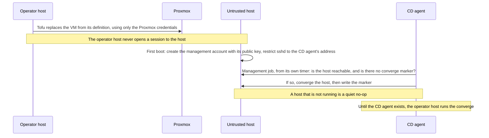

# 0054. Managing an untrusted host from the CD agent

## Problem

A host that runs untrusted code is built and patched by automation that also holds production credentials. The host gains none of that authority, and the automation does not trust what the host reports back.

## Context

`inventory.yaml` sets one `ansible_ssh_private_key_file` under `all.vars`, so every host, including any added later, inherits the shared infrastructure key unless a narrower value overrides it. [`cd-agent.md`](../../projects/cd-agent.md) already records that this key is shared and unsplit.

`managed_hosts` receives Docker, Caddy, and compose apps from `deploy.yaml`; `patched_hosts` receives `maintenance.yaml`. The `network_infra` group shows the pattern for a host that should receive neither deploys nor the general key.

The CD agent ([ADR 0044](../0044-prod-automation-trigger-and-execution/revision-000-c.md)) does not exist yet. Until it does, provisioning is run from the operator host ([ADR 0058](../0058-where-operator-work-runs/revision-000.md)), which becomes the controller for every host. The CD agent runs each job as its own unprivileged user holding only that job's credentials, so a job that holds only this host's key is possible.

Converging in place does not remove an implant, and a controller running against a compromised host ingests its facts and task results. Provisioning a VM from the Tofu definition ([`vm-provisioning.md`](../../topics/infra/vm-provisioning.md)) is repeatable and starts from a known image: Tofu builds a cloud-init Ubuntu template itself and clones each VM from it, so a regularly rebuilt template gives every clone a current base.

The host runs on demand, started when the maintainer wants the agent and stopped afterwards, so it need not exist between sessions.

The host's configuration (agent and management accounts, Claude Code, sandbox settings, `sshd` restrictions) is an Ansible role with its own Molecule scenario ([`coding-agent-host.md`](../../projects/coding-agent-host.md)), and a clone's first-boot configuration today carries only its network. Only the operator host holds Tofu credentials ([ADR 0058](../0058-where-operator-work-runs/revision-000.md)), the CD agent runs no Tofu job, and the CD agent starts jobs from timers alone ([ADR 0044](../0044-prod-automation-trigger-and-execution/revision-000-c.md)). So a start that ends in a converge needs a division of work that keeps the operator host, which holds production credentials, out of any session with the untrusted host.

**Threat model.** The adversary controls the target host. The asset is the controller's credentials and its other targets. The attack path is the management connection and the data returned over it.

## Decision

This diagram shows who does what when the untrusted host is started, as this revision decided it, not what runs now.

- **Rebuild first.** The host is replaced from the Tofu definition each time it is started, and on suspicion of compromise. While it runs it patches itself with unattended security updates ([ADR 0043](../0043-host-os-hardening-baseline/revision-000.md)'s first area), so Ansible reaches it only in the converge that follows a start, or a deliberate re-converge.
- **Who does what at a start.** The operator host runs Tofu and nothing else: it replaces the VM, using only the Proxmox credentials, and never opens a session to it. The clone's first-boot configuration creates the management account with its public key and restricts `sshd` to the CD agent's address, and does nothing more. The CD agent's management job runs from its own timer and checks that the host is reachable and has no converge marker; if so it converges the host and writes the marker. The exit status of those checks is all it reads before converging. A host that is not running is a quiet no-op, since the host is meant to be off between sessions. Until the CD agent exists, the operator host runs the converge.
- **Own inventory group.** The host is in none of `managed_hosts`, `app_hosts`, or `patched_hosts`, so no existing play or job reaches it with a shared key.
- **Own key and account.** A dedicated SSH key for a management account named per the repo's `<x>admin` convention, overriding the `all.vars` key at group level. The account is root-equivalent on the host by design; the control is the direction of trust, not narrow sudo.
- **Own execution identity.** The CD agent's job for this host runs as its own user holding only that key: no OpenBao token and no other host's key. Plays against it use no `fetch` or `synchronize`, and treat facts and registered results as untrusted input.
- **Source-restricted.** The management account is accepted only from the CD agent's address, or the operator host's until the CD agent exists ([ADR 0053](../0053-network-reach-of-the-coding-agent-host/revision-000.md)).

## Alternatives considered

- **Periodic in-place convergence.** Cannot evict a persistent implant, and keeps a live privileged session into an untrusted host. Kept only for deliberate re-converges.
- **`ansible-pull` on the host.** Runs repository content as root on the untrusted host itself. Rejected.
- **Manual maintenance.** Drifts and does not scale to rebuild-first.
- **Net-booting a stateless image that is rebuilt regularly.** It would take the OS install out of every start. It needs a boot server, a boot path in the host's VLAN, and an image build pipeline, none of which exist, and it has not been compared with cloning from a regularly rebuilt template, which reuses what Tofu already builds. Not chosen yet; see the reconsideration triggers.

## Consequences

- Each start ends with one interactive Claude `/login`, and work not fetched before the next start is gone ([ADR 0050](../0050-agent-authored-changes-reaching-production/revision-000.md)).
- A start takes a clone, a first boot, the CD agent's next poll, and a converge, and the host is not usable until that converge finishes.
- Rebuild-first depends on the Tofu Ubuntu module ([`tofu-vm-provisioning.md`](../../projects/tofu-vm-provisioning.md)); until it lands the VM is built by hand.

## Invariants

- The host holds no credential that authenticates it to the CD agent or to any host the CD agent manages.
- No job that holds production credentials also holds the host's management key.
- The SSH key the inventory resolves for the host is never the shared one.
- Once the CD agent exists, no host that holds Tofu credentials holds the host's management key.

## Non-goals

- Splitting the shared key for the other managed hosts (tracked in [`cd-agent.md`](../../projects/cd-agent.md)).
- The host's OS hardening baseline ([ADR 0043](../0043-host-os-hardening-baseline/revision-000.md)), which it inherits.

## Validation

A CI check that the host's group resolves to its own key and to no shared key. A rebuild exercised end to end: replaced from the operator host, then converged by the CD agent's job with no operator-host session to the host.

## Reconsideration triggers

- Clone, first boot, poll and converge make a start too slow, or the template and its first-boot configuration become more to maintain than a boot image would be: compare net-booting a stateless image.
