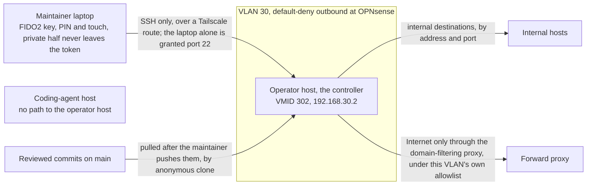

# 0058. Where operator work runs

## Problem

Ansible, Tofu, the `tools/` utilities, and break-glass access to infrastructure run on a host that holds the infrastructure credentials and does not handle untrusted content or interactive desktop work.

## Context

The controller is VM 401 today, a desktop ([`tofu-vm-provisioning.md`](../../projects/tofu-vm-provisioning.md)). [ADR 0056 (Workstation credentials)](../0056-credentials-held-by-the-maintainer-workstation/revision-000.md) moves every infrastructure credential off it.

The credentials to place: the file cache (`main-domain` and the AppRole pair), the shared SSH key, Tofu's Proxmox, OPNsense, and state credentials, on-demand OpenBao admin access through the native `bao` binary ([ADR 0034 (Operator bao CLI access)](../0034-operator-access-to-the-openbao-cli/revision-000.md)), and the backup GPG private key. That key is offline and is imported on the controller only for a restore ([`backup.md`](../../topics/disaster-recovery/backup.md)).

The controller reaches managed hosts over SSH, OpenBao's API, Proxmox and OPNsense APIs, and the Tofu state bucket on `storage`. Its Internet destinations are package and release hosts, the cloud providers' APIs, and Telegram. Every one of these flows is outbound: Ansible pushes over SSH, and no host or service filters by the controller's address or calls back to it. The repo is public, so it pulls `main` without a credential. [`operator-host.md`](../../projects/operator-host.md) lists the flows.

The CD agent absorbs deploy, maintenance, rotation, and freshness ([`cd-agent.md`](../../projects/cd-agent.md)) but not Tofu or break-glass access, and it accepts SSH only from the operator host ([ADR 0044 (CD agent trigger)](../0044-prod-automation-trigger-and-execution/revision-000-c.md)).

The 3XX range, VLAN 30, is reserved and unused ([`vm-provisioning.md`](../../topics/infra/vm-provisioning.md)). The Tailscale subnet router advertises only VLAN 20 today, and the design already expects VLANs 30 and 40 routes to be added under Tailscale ACLs ([`tofu-vm-provisioning.md`](../../projects/tofu-vm-provisioning.md)). The tailnet's policy is the default allow-all grant, so every node reaches every advertised route. Tailscale denies by default once a policy lists specific grants, accepts a subnet CIDR as a destination, and rejects a policy save when a `tests` assertion fails. The controller AppRole is unbound by CIDR because the controller has had no fixed address ([`openbao-auth.md`](../../topics/secrets/openbao-auth.md)).

**Threat model.** The adversary is a compromised session on the maintainer's laptop, which is the workstation ([ADR 0056 (Workstation credentials)](../0056-credentials-held-by-the-maintainer-workstation/revision-000.md)), or a compromised agent host. The asset is the infrastructure credentials. The attack path is any network path to this host, or content merged into `main` that it later runs. The second path is the review gate in [ADR 0050 (Agent changes to production)](../0050-agent-authored-changes-reaching-production/revision-000.md). A third is a compromised dependency or tool on the host itself sending credentials out; the outbound allowlist below limits where, and cannot stop exfiltration through an allowed destination. A fourth is the laptop's own key to this host: a hardware-backed key cannot be copied or used silently by a compromised session, and cannot protect a session the maintainer opens from a compromised client.

## Decision

A small dedicated headless VM in VLAN 30 (VMID 302, `192.168.30.2`, sized like the default Ubuntu VM in [`vm-provisioning.md`](../../topics/infra/vm-provisioning.md)) becomes the `controller`.

This diagram shows how the operator host is reached and what it reaches, as this revision decided it, not what runs now.

- **Access.** SSH only, from the maintainer's laptop, over a Tailscale route to VLAN 30. The laptop authenticates with a dedicated hardware-backed FIDO2 key (PIN and touch required) whose private half never leaves the token. The tailnet policy replaces its allow-all grant with explicit grants: the laptop reaches VLAN 30 on port 22, no other source has a grant for that route, existing access the maintainer needs is re-granted explicitly, and `tests` assert both. The coding-agent host has no path to it.
- **Tokens.** Both of the maintainer's tokens have a key registered on the host, and one is kept offline as the spare. Losing both leaves recovery through the Proxmox node: the VM's console, or re-provisioning with a new key.
- **Outbound.** Default-deny at OPNsense. Internal destinations are allowed by address and port; Internet destinations only through the domain-filtering proxy of [ADR 0053 (Coding-agent network reach)](../0053-network-reach-of-the-coding-agent-host/revision-000.md), under an allowlist for this VLAN that is separate from the coding-agent VLAN's.
- **Contents.** The toolchain (`uv`, Ansible, OpenTofu, `bao`, git) and the credentials above. No desktop, browser, editor beyond a terminal one, or software that handles untrusted content. It clones the public repo anonymously and holds no push credential.
- **Flow.** Changes reach it only as reviewed commits on `main`, pulled after the maintainer pushes them.
- **Own configuration.** Applied to itself over a local connection, like the `controller` group today. It patches itself with unattended security updates.
- **Shrinks over time.** Credentials leave it as the CD agent takes over their jobs; nothing new is added.

## Alternatives considered

- **Keep the controller on the workstation.** Leaves every infrastructure credential in the account that handles untrusted content. Rejected ([ADR 0056 (Workstation credentials)](../0056-credentials-held-by-the-maintainer-workstation/revision-000.md)).
- **WSL2 on the laptop.** Puts the infrastructure credentials on the maintainer's general-purpose machine. Rejected; the laptop holds only the hardware-backed key.
- **A separate workstation, so the laptop holds no key to this host.** The earlier design: a workstation VM with no path here. Costs a VM's memory on a node with limited headroom and a remote-access path to reach it, and the laptop would still be the only device that can open this host. Rejected for the hardware-backed key.
- **The CD agent.** Zero inbound ports and pollers only; interactive operator access does not fit. Rejected.
- **Wait for the CD agent.** Does not cover Tofu or break-glass, and is blocked on [ADR 0044 (CD agent trigger)](../0044-prod-automation-trigger-and-execution/revision-000-c.md). Rejected.

## Assumptions

- **Claim:** the proxy of [ADR 0053 (Coding-agent network reach)](../0053-network-reach-of-the-coding-agent-host/revision-000.md) can serve this VLAN's Internet destinations under its own allowlist, including the cloud providers' regional endpoints and GitHub release assets.
  **Breaks if wrong:** the allowlist falls back to domain-named aliases with the drift ADR 0053 describes, or the host is granted broader egress.
  **Checked by:** the same spike as ADR 0053's proxy assumption, run with this VLAN's destinations.
- **Claim:** Windows 11's OpenSSH client on the laptop authenticates to this host with a FIDO2 `ed25519-sk` key that requires PIN and touch, with a key on each of the two tokens.
  **Breaks if wrong:** the key falls back to a PIV or smartcard key, or SSH runs from WSL2 with USB passthrough, and the laptop-side setup changes.
  **Checked by:** a throwaway spike: generate a key on each token and log in to a scratch VM from the laptop, using the client Windows ships and, if that fails, the current Win32-OpenSSH release.

## Consequences

- One more VM on a node with limited headroom, and one more host to patch.
- The laptop is the workstation and holds the key to this host, so a compromised laptop session is the main path to it. The hardware-backed key stops silent copying and use of the key, not a session the maintainer opens from a compromised client. This residual risk is accepted.
- The host has a fixed address, so the interim controller AppRole can be bound to its CIDR until the retirement project deletes it.
- Deploys, Tofu applies, and break-glass work become SSH sessions from the laptop.
- The tailnet policy becomes a maintained artifact. A wrong edit can lock out existing access, so it changes with tests and a preview, and a copy of the current policy is kept.
- The outbound allowlist needs upkeep as tooling changes.

## Invariants

- No network path from the coding-agent host to this host.
- SSH is accepted only from the laptop's route, with dedicated hardware-backed keys that have no software copy.
- Outbound is default-deny.
- The host runs no software that handles untrusted content and holds no push credential.

## Non-goals

- Shrinking the credentials it holds, which the CD agent and retirement projects own.
- Preventing exfiltration through allowed destinations.

## Validation

Probes from a scratch VM in the coding-agent VLAN and a tailnet node other than the laptop confirm SSH to this host fails, as does a login from the laptop with no token present; a probe from the host to an unlisted destination fails. An audit of credential-shaped paths confirms it holds the controller credentials and the laptop holds none beyond [ADR 0056 (Workstation credentials)](../0056-credentials-held-by-the-maintainer-workstation/revision-000.md)'s list.

## Reconsideration triggers

- The CD agent takes on Tofu and break-glass, making a separate operator host unnecessary.
- The residual risk of a compromised laptop session is judged unacceptable, and a separate workstation machine is reconsidered.
