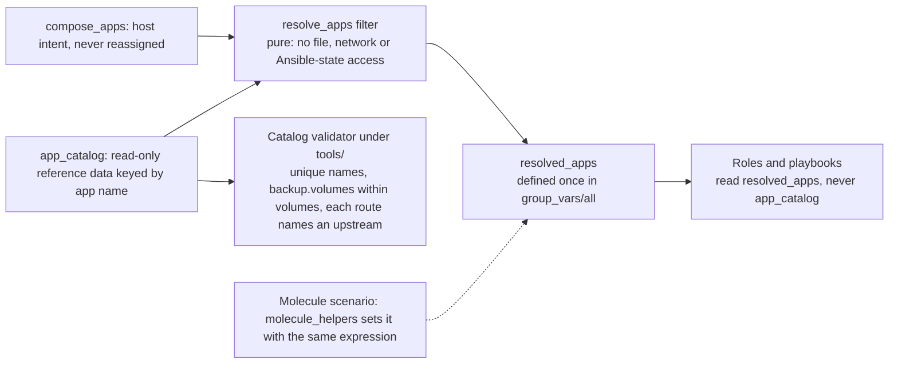

# 0065. Where app defaults and host intent are merged

## Problem

An app's definition has two owners. What does not vary by host (volumes,
configs, backup scope, routes) belongs to the app; which host runs it and
under what hostname belongs to that host. Every role that acts on an app
needs the combination. It must be produced in one place, readable for any
host's apps regardless of which plays have run, and testable without
Docker.

## Context

- `compose/tasks/preinit.yaml` merges `app_registry[name]` under each
  host's `compose_apps` entry with `combine(recursive=True)` (dicts merge,
  lists are replaced) and then reassigns `compose_apps` with `set_fact`. In
  `deploy.yaml` it runs in Play 1 on each host. `caddy`, `bind9`,
  `backup_agent`, `caddy_cert_expiry` and `compose_app` read the reassigned
  value.
- The same variable therefore means "host intent" before that task and
  "resolved definition" after it. Every entry point that needs the resolved
  form has to remember to include `preinit.yaml`: `ci_boot_test.yaml`,
  `volume-reset.yaml`, the second play of `cleanup.yaml`, and
  `molecule_helpers/tasks/resolve_compose_apps.yaml`, which 26 Molecule
  scenario files reference.
- `cloud_sync` and `restore_discovery` need other hosts' apps, so they read
  `hostvars[host].compose_apps`. For a host whose Play 1 has not run, that
  is the raw inventory value. They therefore skip the resolved form and look
  each app up in `app_registry` directly. `restore_discovery` runs on the
  controller only, where no host play has run.
- Both of those roles also spell out the same defaulting rule for
  `backup.extra_cloud_targets`, each in its own Jinja.
- Ansible variables in `group_vars/all` are templated lazily per host, and a
  filter plugin is plain Python that can be unit tested with pytest.
  `cron_period_hours` is the existing example. It used to sit in
  `roles/backup_agent/filter_plugins/`, so it loaded only when that role was
  in the play and had no pytest test; it now lives in `ansible/filter_plugins/`
  with one.
- A plugin directory that `ansible.cfg` names loads for `ansible-playbook`
  run from `ansible/`, as CI does, and for every Molecule scenario, because
  `.config/molecule/config.yml` sets `ANSIBLE_CONFIG` to that file. From a
  scenario directory without it, Ansible finds no config and no filter:
  `cron_period_hours` fails with "No filter named".
- `hostvars[h].resolved_apps`, defined in `group_vars/all` as a filter over
  `compose_apps`, evaluates for every managed host from a controller-only
  play in which no host play has run.
- `combine(recursive=True)` over the same inputs gives the same result
  whether it runs as `preinit.yaml`'s `set_fact` loop or inside a filter:
  identical for every app on every managed host in the inventory.

## Decision

This diagram shows how an app's host intent and its catalog entry become what roles read, as this revision decided it, not what runs now.

- `app_registry` is renamed `app_catalog`. "Registry" suggests entries
  register themselves at run time; this is read-only reference data keyed
  by app name. Its per-app `caddy:` key is renamed `routes:`. It is a dict
  keyed by route id that `caddy`, `bind9` and `caddy_cert_expiry` all read,
  and the new name does not tie the data to one proxy.
- `compose_apps` keeps its meaning, host intent, and is never reassigned.
- A filter `resolve_apps(compose_apps, app_catalog)` returns the merged
  list, with the merge semantics above. It is pure: no file, network or
  Ansible-state access.
- `resolved_apps` is defined once in `group_vars/all` as
  `"{{ compose_apps | resolve_apps(app_catalog) }}"`. Any host's value is
  reachable through `hostvars` with no play having run.
- A Molecule scenario declares its own inventory and does not load
  `group_vars/all`. `molecule_helpers` sets `resolved_apps` there from the
  scenario's own `compose_apps` and catalog with the same expression, and a
  scenario that builds other hosts with `add_host` gives each one its
  `resolved_apps` the same way. A test keeps these equal to the definition in
  `group_vars/all`.
- Roles and playbooks read `resolved_apps` and never `app_catalog`. The only
  readers of the catalog are the resolver's call sites: the definition in
  `group_vars/all` and the Molecule stand-ins above.
- The filter lives in one repo-level plugin directory, `ansible/filter_plugins/`,
  that `ansible.cfg` names, so it loads for playbooks, roles and Molecule
  scenarios alike. Its unit tests live under `ansible/tests/`, beside the other
  tests of Ansible-side Python: ADR 0064's `tools/` layout covers the code CI
  and documentation checks run, not code Ansible loads.
- A catalog validator, under `tools/`, checks the invariants a merge
  cannot: app names are unique, `backup.volumes` are a subset of `volumes`,
  and each route names an upstream.

## Alternatives considered

- **Keep the `set_fact` in `preinit.yaml`.** Cannot serve other hosts'
  apps before their plays have run, which is the case `cloud_sync` and
  `restore_discovery` are in, and it keeps one variable with two meanings.
- **Have each consumer include `preinit.yaml` per host.** Runs the merge for
  every host on the controller and repeats the include at every entry
  point, the situation the four call sites above are already in.
- **A custom module.** A module acts on a managed resource. This is
  configuration data with no remote state to inspect or change.
- **A lookup plugin.** Hides a dictionary read behind a name that reads
  like an external source.
- **Define `resolved_apps` once in a vars file every scenario loads.** One
  definition, but every scenario's setup changes to load it, and an edit to
  the file queues every scenario. The filter named in the helper queues only
  the scenarios that call it, which the Molecule scope check already derives.
- **Leave the two catalog readers as they are.** They keep re-implementing
  defaults the resolver would hand them, including the duplicated
  cloud-target rule.

## Consequences

- One variable name, one meaning. `resolved_apps` can be printed to
  debug a deploy, and downstream roles can be tested against fixed
  `resolved_apps` fixtures.
- The rename touches 88 files that mention `app_registry`, every
  `caddy:` route entry, `AGENTS.md`, and `docs/topics/deploy/adding-an-app.md`. It ships
  as its own mechanical changes after the resolver exists.
- Docs that describe the resolve step (`docs/topics/deploy/deployment-flow.md`,
  `docs/topics/deploy/adding-an-app.md`) change in the pull requests that change the
  behaviour.

## Invariants

- Only a resolver call site reads `app_catalog`: the `group_vars/all` definition or its Molecule stand-in.
- `compose_apps` is never reassigned.
- The resolver is pure and unit tested.

## Non-goals

- Changing what any catalog entry says.
- Renaming `compose_apps` or moving host intent out of `host_vars`.
- Where a cloud target's default comes from. Whether it joins the resolver
  is an open item in the project that implements this revision.

## Validation

A pytest suite for the filter and the validator, a test that fails if any
role, playbook or template names `app_catalog`, and a test that fails if a
Molecule stand-in differs from the `group_vars/all` definition.
