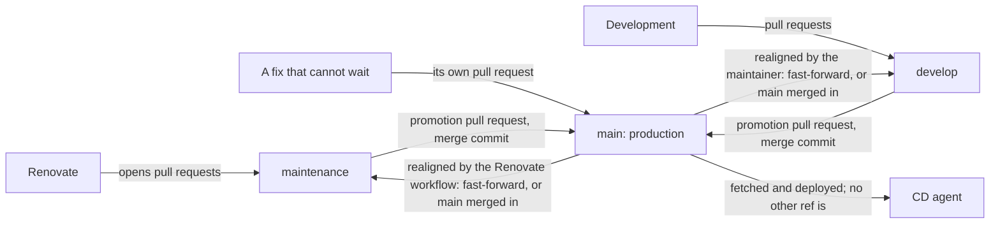

# 0076. Keeping what production runs apart from work in progress

## Problem

`main` is both the state production deploys and the place every change lands first. Two things follow that the maintainer does not want. Merging a series of Renovate pull requests is a series of deploys, one per merge, whatever state the series is in. And unfinished development cannot sit anywhere but a pull request, so a dependency update that is ready has no way to reach production without it or after it.

What has to be true: `main` moves only when the maintainer decides it should; a batch of dependency updates can be released without unfinished development; every check that runs today runs on a change before it can reach `main`; and the person promoting a change can see what that promotion requires them to run.

## Context

[ADR 0044 revision 0-c](../0044-prod-automation-trigger-and-execution/revision-000-c.md)'s deploy job fetches `origin/main` every few minutes and runs when the commit differs from the last one it deployed. `tools/cd_agent/run_job.py` names the branch once, as `BRANCH = "main"`. Merging to `main` is therefore a deploy within the poll interval, and nothing else in the repository is deployed from any other ref.

Renovate runs daily and opens pull requests against the default branch, in the Monday and Thursday window of `renovate.json5`'s `schedule`. A review of several is several merges.

Where `main` is named in CI: `pr-checks.yml` runs for pull requests into `main`; `warm-caches.yml` and the `build-*-image.yml` workflows run on pushes to `main`. The Python behind the checks takes the pull request's base and head commits from the event (`check_project_scope` and `check_project_close` are called with `--base` and `--head`), so it does not name a branch. [`docs/projects/README.md`](../../projects/README.md) states that topic docs describe `main` at every commit.

The repository merges pull requests with merge commits. A promotion by merge commit leaves every promoted commit an ancestor of `main`; a squash merge leaves the content in `main` and the commits off it.

An image this repository builds is published only after the merge that publishes it, and compose files pin its tag ([`gates.md`](../../topics/engineering/ci/gates.md#dockerfile-changes)). A Dockerfile edit that keeps its version tag changes the image behind that tag.

A Renovate branch is cut on top of the commits `maintenance` holds that `main` does not. Renovate marks a pull request edited when any commit between its base branch and its branch has an author or committer other than its own, and then neither rebases nor updates it, whatever `rebaseWhen` says. Rewriting `maintenance` therefore leaves old copies of those commits in every open Renovate branch, committed by whoever ran the rewrite, and blocks every one of those pull requests. Merging `main` into `maintenance` leaves them as they are: Renovate rebases its own branches onto the merged tip under `rebaseWhen: behind-base-branch`, without marking them edited. A plain `git rebase` also drops merge commits, so a replayed branch can lose the promotions on it.

A ruleset can require a pull request and passing checks on a branch and still let a named actor push to it, listing the bypassed rules in the push output; that actor can be allowed to force-push `maintenance` and `develop` and refused on `main`. The job token a workflow gets by default is refused on all three, so the Renovate workflow pushes with the maintainer's token. Caches saved on `main` restore in pull requests into the other branches.

A deploy whose command fails is not recorded, so the CD agent runs it again on its next poll. A compose pin that reaches `main` before its image is published therefore fails and retries until the image exists.

**Threat model.** The adversary can merge or push to a branch other than `main`, or is a dependency source that sends a malicious update. The asset is what the CD agent deploys. If any ref but `main` could be deployed, a merge there would act on production as a merge to `main` does now, with none of the promotion review. If images were published from branches other than `main`, an unpromoted Dockerfile change could replace the image behind a version tag that production pulls.

## Decision

This diagram shows where changes land, how they are promoted and how the branches are realigned as this revision decided it, not what runs now.

- **Branches.** `main` is production. `maintenance` collects dependency updates. `develop` collects development. All three are long-lived. Only `main` is deployed: the CD agent, its jobs and ADR 0044 are unchanged, and no other ref is fetched by it.
- **Where changes land.** Renovate targets `maintenance` (`baseBranchPatterns`). Development pull requests target `develop`. A fix that cannot wait goes to `main` in its own pull request, and both other branches are then realigned.
- **Promotion.** A pull request from `maintenance` or `develop` into `main`, merged by the maintainer with a merge commit. The two promote independently, so a batch of dependency updates does not wait for development.
- **Realignment never rewrites a branch.** After `main` moves, a branch that is an ancestor of `main` is fast-forwarded to it, which a promotion by merge commit makes `maintenance` and `develop`. A branch with commits not yet promoted has `main` merged into it with a plain merge commit. Both are pushed without force. A merge that conflicts is aborted, leaving the branch as it was.
- **`maintenance` is realigned before each Renovate run.** The first step of the Renovate workflow realigns `maintenance` as above, so Renovate reads the repository, its configuration included, as `main` has it plus the dependency updates still waiting. Renovate runs with `rebaseWhen: behind-base-branch` so its open branches follow. A merge that conflicts fails the workflow before Renovate runs. The logic is stdlib-only Python under `tools/ci` with unit tests ([ADR 0064](../0064-where-the-code-behind-ci-and-documentation-checks-lives/revision-000.md)). `develop` is realigned by the maintainer, as it holds work in progress that nothing else may touch.
- **Checks.** Every pull request runs the checks it runs today, whichever of the three branches it targets. A ruleset on each branch requires them; `main` accepts only pull requests and refuses force pushes; `maintenance` and `develop` accept pushes without a pull request from the maintainer alone, which includes the token the Renovate workflow runs with; no branch is force-pushed in normal use.
- **Promotion checklist.** A workflow on pull requests into `main` computes, from the diff between `main` and the pull request's head, what has to be run once it merges, and writes it into the pull request description between markers, leaving the maintainer's own text alone. Each rule names a path pattern and the command it asks for. The mapping is stdlib-only Python under `tools/ci` with unit tests ([ADR 0064](../0064-where-the-code-behind-ci-and-documentation-checks-lives/revision-000.md)). The checklist is advisory and never gates a merge.
- **Images.** Built and published from `main` only, as now.
- **Docs.** A topic doc describes the branch it is on. The docs on `main` describe what runs.

## Alternatives considered

- **One integration branch beside `main`.** Dependency updates and development would share it, so releasing the updates would release whatever development was on it. The separation the maintainer wants is between those two, not only between them and `main`.
- **A settle delay in the CD agent.** It would hold a deploy until `main` has been quiet for a while. It changes ADR 0044's trigger, still deploys once a review pauses, and does nothing for development.
- **Realigning only by hand, after a promotion.** It leaves `maintenance` behind `main` whenever `main` moves some other way, such as a fix straight to `main` or a promotion of `develop`, and Renovate then proposes updates against files `main` has since changed.
- **Rebasing or resetting `maintenance` onto `main`.** It keeps history linear, but it blocks every open Renovate pull request, and a plain rebase drops promotion merge commits.
- **A staging branch the CD agent also follows.** There is no second environment to deploy it to.
- **Publishing images from `maintenance` and `develop`.** It would have a promoted pin's image exist before `main` moves, but an unpromoted Dockerfile change could replace the image behind a version tag that production pulls.
- **Grouping Renovate pull requests harder.** It lowers the number of merges, not the fact that each is a deploy.

## Consequences

- `develop` is realigned by hand after every promotion and fix to `main`. `maintenance` is realigned by the Renovate workflow.
- Each realignment of a branch with unpromoted commits leaves a merge commit on it.
- A merge that conflicts holds back that day's Renovate run until the maintainer resolves it.
- Renovate rebases its own open pull requests onto the realigned `maintenance`. A pull request closed unmerged is not reopened for the same version.
- A pull request into `develop` needs no rebase after a realignment, since the branch is never rewritten.
- A dependency update reaches production only when the maintainer promotes `maintenance`, so a security update waits for a promotion, or goes straight to `main`.
- The checklist stays only until the CD agent applies every kind of change itself.
- [`cd-agent-runner.md`](../../topics/deploy/cd-agent-runner.md) still describes the deploy job accurately; [`pipeline.md`](../../topics/engineering/ci/pipeline.md) and [`gates.md`](../../topics/engineering/ci/gates.md) change with the triggers.

## Invariants

- The CD agent fetches `main` and no other ref.
- No change reaches `main` without a pull request that passed the checks.
- No force push reaches `main`.
- No image is published from a branch other than `main`.
- No branch is rewritten, and no realignment pushes with force.
- A realignment never changes `main`.
- Renovate does not run against a `maintenance` that failed to realign.

## Non-goals

- A second environment, or a deploy from `maintenance` or `develop`.
- Automating the realignment of `develop`.
- A promotion checklist that applies changes.
- Changing how Renovate groups or schedules its pull requests.

## Validation

- The checklist rules are unit-tested against diffs of the paths they name.
- Realignment is tested on temporary repositories: a branch that is an ancestor of `main` is fast-forwarded, one with extra commits gets `main` merged in with those commits intact, and a conflicting one is left unchanged with a failure.
- A test over the workflow triggers asserts that the checks which run on a pull request into `main` also run on one into `maintenance` or `develop`.

## Reconsideration triggers

- A second environment to deploy to.
- Promotions routinely needing both branches at once.
- The CD agent applying every kind of change itself, which retires the checklist.
