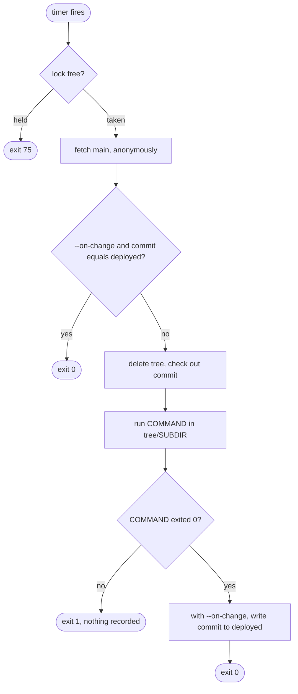

# CD Agent: Job Runner

[`tools/cd_agent/run_job.py`](../../../tools/cd_agent/run_job.py) is the poll, decide and run step of [ADR 0044 revision 0-c (CD agent trigger)](../../decisions/0044-prod-automation-trigger-and-execution/revision-000-c.md): one invocation is one run of one job. The `cd_agent` role installs it on the agent host and runs it from each job's timer ([`cd-agent-host.md`](cd-agent-host.md)). It imports only the standard library, so the host runs it with its own `python3` and no virtualenv.

```sh
cd tools && python3 -m cd_agent.run_job --repo-url URL --state-dir DIR [--cwd SUBDIR] [--on-change] -- COMMAND...
```

## What a run does



In order:

1. Takes an exclusive lock on `DIR/lock`. If another run of the job holds it, exits `75` without fetching or running anything.
2. Fetches `main`, and no other ref, anonymously into the bare repository `DIR/repo.git`. The URL must be `https` and carry no credentials. The fetch ignores the caller's `GIT_*` variables and every git config file, and allows no transport but `https`.
3. With `--on-change`, compares the fetched commit with the one in `DIR/deployed`. If they are equal it exits `0` without running anything. Any difference runs, including a `main` that was force-pushed to an earlier commit. A record that is missing or is not a full lowercase commit id counts as never deployed.
4. Deletes `DIR/tree` and checks the fetched commit out there as a new detached worktree, so nothing a previous run edited or left behind is present.
5. Runs `COMMAND` with `DIR/tree/SUBDIR` as its working directory, inheriting the environment plus `CD_AGENT_STATE_DIR` (the job's `DIR`), with output left on the process's own stdout and stderr. `SUBDIR` defaults to the root of the tree; a path that leaves the tree (an absolute path, `..`, or a symlink out) or is not a directory fails the run before `COMMAND` starts.
6. With `--on-change`, writes the commit to `DIR/deployed` only if `COMMAND` exited `0`. A failed run records nothing, so the same commit runs again on the next invocation, and a failed newer commit leaves the last good commit recorded.

Without `--on-change` the run always uses the latest fetched `main` and writes no record: the shape for the maintenance, rotation and freshness jobs, which run on their own schedule rather than on a change.

## Exit status

| Status | Meaning |
| :-: | :--- |
| `0` | `COMMAND` succeeded, or `--on-change` found nothing new. |
| `1` | `COMMAND` exited non-zero, or the run could not be carried out (fetch failed, bad URL, bad `--cwd`, `COMMAND` could not start). |
| `2` | Usage error. |
| `75` | Another run holds the lock. |

## State directory

| Path | Holds |
| :--- | :--- |
| `repo.git/` | The fetched bare repository; only `refs/remotes/origin/main` exists in it. |
| `tree/` | The checkout `COMMAND` ran in, replaced at the start of every run. |
| `deployed` | The last commit `COMMAND` succeeded on; written only with `--on-change`. |
| `lock` | The file the run holds its exclusive lock on. |
| `toolchain/` | What [`toolchain.py`](#toolchain) builds for a command that asks for it: its own virtualenv, `uv` cache and Ansible collections. |

The tests in [`tools/tests/cd_agent/`](../../../tools/tests/cd_agent/test_run_job.py) run real `git fetch` against a local repository and assert each rule above.

## Toolchain

A job that needs Python packages or Ansible collections runs [`tools/cd_agent/toolchain.py`](../../../tools/cd_agent/toolchain.py) as its command, with its real command after a `--`:

```sh
python3 -m cd_agent.toolchain [--collections FILE] [--python PATH] -- COMMAND...
```

It runs from the checkout's working directory, which `run_job.py` has chosen, and does the following:

1. Finds the checkout's root: the nearest directory at or above the working directory that holds `uv.lock`.
2. Runs `uv sync --locked --no-dev` against that root into `$CD_AGENT_STATE_DIR/toolchain/venv`, with the `uv` cache beside it and no Python downloads. `--locked` stops the run if `uv.lock` no longer matches `pyproject.toml`, and `uv` installs exactly what the lock names, with its hashes, removing anything else. The interpreter is the one running `toolchain.py`, unless `--python` names another.
3. With `--collections`, runs `ansible-galaxy collection install` for that requirements file (relative to the working directory, and refused if it leaves the checkout) into `$CD_AGENT_STATE_DIR/toolchain/collections`.
4. Replaces itself with `COMMAND`, which finds the virtualenv's `bin/` first on `PATH` and has `VIRTUAL_ENV` set, plus `ANSIBLE_COLLECTIONS_PATH` when collections were installed. `COMMAND`'s exit status is the job's.

Any failure in steps 1 to 3 exits `1` without running `COMMAND`, so under `--on-change` the commit is not recorded and the next poll retries it. The environment is built from the commit being run, so the tools always match it, and no job shares an environment with another. A new commit that changes the lock reinstalls only the difference. Galaxy pins collections by version, not hash, so unlike the lock it is an input the commit does not fully determine.

`uv` must be on `PATH`, and the interpreter must satisfy the project's `requires-python`. `toolchain.py` imports only the standard library.
