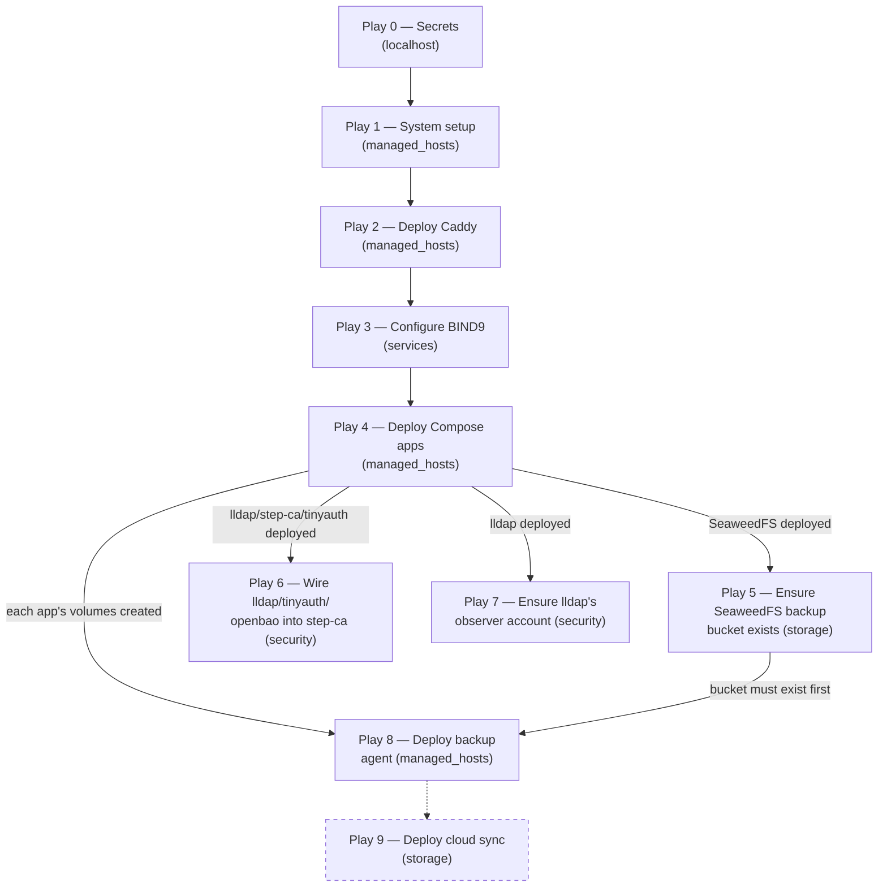

# Deployment Flow

`deploy.yaml` runs as ordered plays: secrets before anything needs
`ansible_host` resolved, DNS and the reverse proxy live before anything
that depends on them starts, and the SeaweedFS backup bucket created
before anything uploads to it.



`p8 -.-> p9` is drawn dashed because it is not a hard dependency: Play 9
resolves every backup host's cloud targets via static `hostvars`, so it does
not need Play 8 to have run. It sits after Play 8 as the next stage of the
backup pipeline; see [Plays](#plays).

## Plays

| Play | Hosts | What it does | Why here |
| :-: | :--- | :--- | :--- |
| 0 | `localhost` | Resolves every value in `secret_catalog.yaml` ([notes](#play-0-notes), [`secrets.md`](../secrets/secrets.md)). | Every host's `ansible_host` resolves through a secret, and Play 1's fact-gathering needs a live connection. |
| 1 | `managed_hosts` | Installs Docker Engine and resolves each host's `compose_apps` against `app_catalog`; no containers start. | Never `all`: that includes `controller`, which must never get Docker or a container. |
| 2 | `managed_hosts` | Renders each host's `Caddyfile`, pulls the custom Caddy image (DigitalOcean DNS plugin, built in CI), starts or restarts it, then installs the certificate-expiry check timer. See [`caddy.md`](../services/caddy.md) and [`telegram-notifications.md`](../monitoring/telegram-notifications.md). | Routing is live before any backend app starts. |
| 3 | `dns` (`services` only) | Scrapes `dns_zones` from every `app_hosts` member, renders zone files, deploys BIND9 and repoints the host's own resolution at it. See [`bind9.md`](../services/bind9.md). | |
| 4 | `managed_hosts` | Provisions directories and configs for, and starts, every app except `caddy`/`bind9` (Plays 2–3) and `openbao`, which deploys itself by a task at the start of this play ([`roles/openbao`](../../../ansible/roles/openbao)). | |
| 5 | `storage` | Creates the `homelab-backups` bucket; SeaweedFS doesn't create one on first `PUT`. See [`backup.md`](../disaster-recovery/backup.md). | After SeaweedFS deploys in Play 4, and before Play 8, or the first upload fails with `NoSuchBucket`. |
| 6 | `security` | Wires lldap, tinyauth and openbao into step-ca: `step_ca_client` caches the root cert, `step_ca_cert` issues lldap's LDAPS cert and installs its renewal timer, `tinyauth_ca_trust` seeds the CA bundle tinyauth needs, and a second `step_ca_cert` instance issues OpenBao's listener cert ([`openbao.md`](../secrets/openbao.md)). `step` runs via the `smallstep/step-cli` image ([`lldap.md`](../services/lldap.md)). | After lldap, step-ca, tinyauth and openbao deploy in Play 4. |
| 7 | `security` | Ensures lldap's `observer` account exists ([`lldap.md`](../services/lldap.md#bootstrapping-the-observer-account)). | After lldap deploys in Play 4; independent of Play 6, since it needs only lldap's web port. |
| 8 | `managed_hosts` | Deploys the backup agent; each host's schedules come from its `backup_plan` ([`backup.md`](../disaster-recovery/backup.md)). | Last among `managed_hosts` plays: it mounts other apps' named volumes as `external: true`, which needs Play 4's volumes and Play 5's bucket. |
| 9 | `storage` | Installs `cloud-sync.timer` and `cloud-sync.service`, which relay SeaweedFS archives to R2/B2/OCI ([`backup.md`](../disaster-recovery/backup.md)). | Not a hard dependency on Play 8: it reads every backup host's `backup_plan` through static `hostvars`. It sits after Play 8 as the next backup stage. |

## Play 0 notes

Play 0 is imported from `bootstrap-secrets.yaml`. Before your first
deploy, run `cd tools && python3 -m openbao_utils.bootstrap` once to
supply the manual secrets.

It targets `hosts: localhost`, not a real host: `include_role` eagerly
resolves `remote_addr` for the *current* play host regardless of a child
task's own `delegate_to`, so the results are then propagated onto every
real host's hostvars (`delegate_to` + `delegate_facts: true`; see
`bootstrap-secrets.yaml`'s own header). Because `localhost` isn't in
`managed_hosts`, `--limit managed_hosts` alone silently skips this play;
always use `--limit managed_hosts,localhost`.

`restore.yaml` can't import this play the same way (its role can't split
across two plays); it takes `bootstrap-secrets.yaml` as a separate file
on the same command line instead.

## Roles

Role-by-role reference lives in [`ansible.md`](ansible.md#roles).

## The App Catalog

`group_vars/all/app_catalog.yaml` defines everything about an app that
doesn't vary per host: directories, named volumes (see
[`volumes.md`](volumes.md)), scripts/config templates, and Caddy
upstream/auth. `no_log: true` on a `configs` entry keeps a real secret
out of `--diff` output (see [`secrets.md`](../secrets/secrets.md)).

Each `host_vars/<host>.yaml` then only lists which apps that host runs
and, for routable apps, the hostname to expose:

```yaml
compose_apps:
  - name: dashy
    routes:
      default:
        host: dashy
```

`resolved_apps` (`group_vars/all/main.yaml`) merges each host's entry
with its `app_catalog` definition through the `resolve_apps` filter
(`ansible/filter_plugins/resolve_apps.py`; dicts merge, lists are
replaced). Every downstream role reads only `resolved_apps`, and any
host's value is readable through `hostvars` without that host's play
having run.

`backup_plan` (also `group_vars/all/main.yaml`) does the same for
backups: the `backup_plan` filter lays each resolved app's `backup:`
block over `backup_defaults` and returns one fully resolved entry per
app with backup volumes. `backup_hosts` lists the hosts whose plan is
non-empty; each gets a path-scoped SeaweedFS identity
(`docker/seaweedfs/configs/s3-identity.json.j2`) and needs its own
`seaweedfs-s3-*-<host>` secret pair, or the deploy fails on the missing
variable. `backup_agent` reads its own host's `backup_plan`;
`cloud_sync` and `restore_discovery` read every backup host's. See
[ADR 0068 (Backup defaults)](../../decisions/0068-where-per-app-backup-settings-get-their-defaults/revision-000.md).

See [`adding-an-app.md`](adding-an-app.md) for a worked example.

## Tags

| Tag | Covers | Skips |
| :--- | :--- | :--- |
| `initial-setup` | Docker Engine + qemu-guest-agent install (Play 1) | Everything else still runs. |
| `images` | Pull/rebuild every app's image and recreate containers whose image changed (Plays 2–9) | Config rendering, directory/volume provisioning, Docker install |
| `infra` | Re-render Caddyfile/`named.conf`/zones, restart only changed containers | Image pulls/rebuilds, directory/volume provisioning, Docker install |

`preinit` (the stacks directory) and the `secrets` role always run regardless
of tags, since everything else reads their output. One-time provisioning (`caddy`/`bind9`
init, `compose_app`'s per-app init) has no tag and only runs on a full,
untagged pass — `images`/`infra` both assume the host is already
provisioned.

Ansible filters dynamic includes per hop, so a tag must be applied at
every level of an include chain, not just the leaf task — and block-level
tags are avoided here since a block's tag runs everything nested inside
it unconditionally, including untagged tasks reached through further
includes. Tasks under `block`/`rescue` are tagged individually instead.
