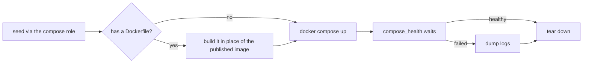

# CI Gates

The regression checks and gates in `.github/workflows/pr-checks.yml` that look at one kind of change: deploy ordering, the secret and app catalogs, Molecule coverage, booting compose apps and Dockerfile builds. Image tags and pinned release checksums have their own pages, [`image-tag-check.md`](image-tag-check.md) and [`release-checksum-check.md`](release-checksum-check.md). How jobs are selected and wired into the pipeline is in [CI: PR Checks](pipeline.md).

## Deploy-ordering-check

Regression coverage for `ansible_host` (`inventory.yaml`) resolving
through a role-generated fact (`secrets_generated`), a chain nothing
else in CI exercises — every other check either bypasses `ansible_host` resolution entirely
or tests the `secrets` role against a synthetic inventory that never
touches the real one.

Runs the **real** `deploy.yaml` (not a copy) against
`inventory/ci-deploy-ordering-inventory.yaml`, a purpose-built inventory
that mirrors `inventory.yaml`'s `ansible_host` → `ddns_domain` →
`main_domain` → `secrets_generated` chain and its
`managed_hosts`/`controller` group split, while staying CI-safe:
`ansible_connection: local` everywhere, and `--tags` matching nothing
real so provisioning never runs — only secrets generation/propagation
and the `ansible_host` resolution it gates.

`ansible/inventory/**` in the trigger list covers `inventory.yaml` itself
plus `group_vars/all/main.yaml`/`secret_catalog.yaml` — deliberately
broad, since either is the shape of change that caused the original
regression. `pyproject.toml`/`uv.lock` are in the trigger list too: this
job runs the real playbooks through the uv-managed `ansible-core`, so an
`ansible-core` bump is exercised here as well as by
[Molecule](change-scoping.md#molecule-watch-sets).

Both runs and the verdict on the second are
[`tools/ci/gates/deploy_ordering.py`](../../../../tools/ci/gates/deploy_ordering.py),
run as `python -m ci.gates.deploy_ordering deploy|restore` from `tools/`;
`tools/tests/ci/gates/` tests the verdict against sample logs and checks
that the expected failure message is still the `restore` role's own.

`restore.yaml` gets a second, separate step: it can't import
`bootstrap-secrets.yaml` as a leading play the way `deploy.yaml` does
(see [`restore.md`](../../disaster-recovery/restore.md)), so this
step is the regression check for that two-file invocation pattern
specifically — not for `restore`'s own validation logic, which
[Molecule](../molecule-testing.md) already covers. It deliberately points
at a nonexistent archive and asserts the failure is the expected
archive-not-found message, not an `ansible_host`/`secrets_generated`
resolution failure (that signature means the regression is back).

Two fixtures run first, both in
[`tools/ci/fixtures/`](../../../../tools/ci/fixtures/) and both read from the real
`secret_catalog.yaml` at run time, so neither can drift from it:

- `preseed_manual_secrets` writes every `source: manual` secret kept in the
  file cache (the entries with `store: controller_file`) as a plain file under
  `ansible/files/secrets/`, mirroring what `openbao_utils/bootstrap.py`
  produces — an empty file for an `allow_blank` entry, `ci-dummy-<key>`
  otherwise. Throwaway CI values, same non-secret status as
  `ci-inventory/group_vars/all/ci_dummy_vars.yaml`. A catalog key that isn't
  a plain file name is refused, since it becomes a path.
- `file_cache_catalog` writes the catalog's `store: controller_file` entries, unchanged,
  to `/tmp/ci-secret-catalog-no-vault.json`, which both playbook runs load
  with `-e @`. This job has no OpenBao or step-ca target, so an entry stored
  in OpenBao would make `vault_login.yaml` run and fail; Vault reachability
  is Molecule's job (`vault_backed`, `rotate_secret`). The ordering chain
  resolves `main-domain` from the file cache and reads no other secret, so
  the file-cache entries are all the job needs, and the fixture fails if
  `main-domain` isn't one of them. The output path is fixed in the workflow
  step and in `deploy_ordering.py`, and a test holds the two equal.

`tools/tests/ci/fixtures/` covers both, including a run over the real
catalog, and checks the job's steps run them before the playbooks.

## Secret catalog rules

`ci.gates.secret_catalog_rules` checks every entry in
`secret_catalog.yaml` against the rules the file's header comment states:
kebab-case names and no unknown keys (so the old `format` and
`vault_scope` fields are refused); `source` one of `hex`, `uuid4` or
`manual`; `store` stated on every entry as `openbao` or `controller_file`;
`length` on `hex` entries and nowhere else; a `scope`, of one of the three
shapes the header names, on every `store: openbao` entry and on no
`controller_file` entry; `store: openbao` on every `hex` and `uuid4` entry; a
`description` on every `manual` entry; and `allow_blank` and `sensitive` only
on `manual` entries, as booleans. Each violation is printed
with the entry and the rule, and any violation fails the check.

It runs as the `check-secret-catalog` pre-commit hook, so `pre-commit-checks`
runs it on every PR, and the hook needs only PyYAML. A wrong combination
would otherwise surface at deploy or rotation time: the `secrets` role skips
a `hex` entry stored anywhere but OpenBao without an error.
`tools/tests/ci/gates/test_secret_catalog_rules.py` has a case for each rule
and runs the check over the real catalog.

## App catalog rules

`ci.gates.app_catalog_rules` checks the invariants of `app_catalog.yaml` that a merge cannot. Every route has an `upstream`. A `backup:` block names at least one volume (an app with nothing to back up leaves the block out), and every name in `backup.volumes` is a volume the app's `volumes` declares. Each backup setting keeps its shape: `cloud_targets` a list of names, `retention_days` a positive integer, `compression` one of `gz`, `zst` or `none`, `stop_during_backup` a boolean, `cron` a non-empty string. A key that is not a backup setting is refused with the nearest valid one (`retention_day` names `retention_days`), because the plan ignores it without a word; this holds for an app's block, for a host's own `backup:` override in `compose_apps` (which keeps the same shapes, and may empty `volumes` to switch an app's backup off on that host) and for `backup_defaults`. A route map under the old `caddy` key and cloud targets under the old `backup.extra_cloud_targets` key are refused, in any of those places, because both are ignored silently otherwise. No app name appears twice (the loader refuses a repeated name instead of keeping the last). A `volumes`, `backup` or route entry of the wrong shape is reported as such, not left to crash the check.

It also checks the catalog against the inventory, read as plain YAML with no value rendered ([ADR 0068 (Backup defaults)](../../../decisions/0068-where-per-app-backup-settings-get-their-defaults/revision-000.md)). `backup_defaults` supplies every setting in its shape. Every cloud target an app or `backup_defaults` names is a key of `cloud_sync_targets` in `host_vars/storage.yaml`. Every managed host that runs a backed-up app (Ansible's `backup_hosts`, derived here from each host's `compose_apps` and the catalog) has its own `seaweedfs-s3-access-key-<host>` and `seaweedfs-s3-secret-key-<host>` in `secret_catalog.yaml`, scoped to `hosts/<host>`, and its own `seaweedfs_s3_access_key` and `seaweedfs_s3_secret_key` host variables taken from them. Without these, a misspelt target or a host's first backed-up app would surface at deploy time as an undefined variable. Each violation is printed with the app or host and the rule, and any violation fails the check.

It runs as the `check-app-catalog` pre-commit hook, so `pre-commit-checks` runs it on every PR; locally the hook runs when the catalog or any inventory file it reads changes, and it needs only PyYAML. `tools/tests/ci/gates/test_app_catalog_rules.py` has a case for each rule and runs the check over the real catalog and inventory. Because the hook cannot import Ansible code, two tests in `ansible/tests/test_backup_plan.py` keep its restatements honest: its list of backup settings equals the `backup_plan` filter's, and the backup hosts it derives equal the `backup_hosts` Ansible derives from the real inventory. `ansible/tests/test_backup_plan_invariants.py` fails if a role, template or playbook reads an app's `backup` block or `backup_defaults` instead of `backup_plan`, or if a variable or key that ADR 0068 retired is used again.

## Molecule coverage gate

Each `molecule` matrix job regenerates that role's task inventory
(`molecule_cov.cli inventory` - its output is gitignored, tied to the
checkout's absolute paths, so not committed) and runs
`molecule_cov.cli report --thresholds-file thresholds.yaml`, both against
the coverage data that role's own `molecule test` run just produced.
Per-role, not one global number, since roles aren't structurally
comparable - see
[`molecule-coverage/README.md`](../../../../ansible/molecule-coverage/README.md)
for what the report actually measures.

A role with no entry in `thresholds.yaml` fails the check (exit 2, not a
silent pass) - a new role needs a deliberate floor, not an inherited
default. Every floor is taken from a real run;
the below-100% floors are legitimate, understood gaps rather than
untested code (see [`thresholds.yaml`](../../../../ansible/molecule-coverage/thresholds.yaml)
for the current values):

- `apt` - the reboot-if-required task is untested by design:
  `/var/run/reboot-required` never appears in the container fixture,
  and a scenario that triggers `ansible.builtin.reboot` would reboot the
  underlying Docker host's kernel (moby/moby#21929). Closing it needs
  isolation Docker-based Molecule doesn't provide, such as a real VM.
- `bind9` - the resolv.conf-upstream task needs a pre-existing
  non-upstream resolv.conf to be worth simulating.
- `restore` - the interactive confirmation prompt is bypassed on
  purpose in every scenario, to test the rest of the role
  non-interactively.
- `secrets` - the Vault CAS re-read-after-losing-a-create-race task
  needs a genuine concurrent write conflict to trigger, which no single
  Molecule scenario can engineer deliberately.

## Compose boot-test

Shared logic lives in `_compose-boot-test.yml` (`workflow_call`), used
by both `pr-checks.yml` (changed apps only) and `boot-test-all.yml`
(every app, `workflow_dispatch` only — a manual "test everything" run).

Per app: seeds it via the real `compose` role
(`ansible/playbooks/ci_boot_test.yaml`, against `ci-inventory/` rather
than the real `inventory.yaml`, since the latter's `all:vars` assumes a
real remote host), builds the app's `Dockerfile` if it has one (see
[Dockerfile changes](#dockerfile-changes)), brings the stack up with
`docker compose`, waits for
a healthy state (or that it stayed running, if no healthcheck is
defined), dumps logs on failure, then tears down. The wait is
[`tools/ci/gates/compose_health.py`](../../../../tools/ci/gates/compose_health.py):
per service, in order, it polls a defined healthcheck (a fixed number of
polls, a fixed interval apart; `unhealthy` fails at once) or, with none, waits a 10s grace period
and requires the container still be running. Every failure prints that
container's logs, and each container of a scaled service is checked.
`tools/tests/ci/gates/` drives it against a fake `docker`.

**Excluded** (`.github/compose-boot-test-exclusions.txt`, shared by both
workflows and `pr-checks.yml`'s `compose-syntax-check` fallback):

| App | Why not boot-tested | Covered by |
| :--- | :--- | :--- |
| `bind9`, `caddy` | Molecule gives stronger real-protocol assertions than a healthcheck poll. | Their own role's scenario. |
| `seaweedfs` | Same. | `seaweedfs_bucket`'s and `backup_agent`'s scenarios (see [`#molecule-watch-sets`](change-scoping.md#molecule-watch-sets)). |
| `tinyauth` | Needs an `lldap` host to resolve, which per-app isolation can't provide. | `tinyauth/molecule/default`: a throwaway lldap target, `lldap_bootstrap` against it (see [`lldap.md`](../../services/lldap.md#bootstrapping-the-observer-account)), then tinyauth reaching a healthy, LDAP-bound state. |
| `molecule-dind` | Not a deployed compose app: a Dockerfile built and pushed to `ghcr.io/wenenhoe/molecule-dind` for Molecule's DinD scenarios (`build-molecule-dind-image.yml`), with no `compose.yaml`/`.j2`. | Nothing to run. |
| `openbao` | Can't boot in isolation (below). | Nothing: no Molecule scenario, and `compose-syntax-check` skips its `compose.yaml.j2`, so CI doesn't check its compose file. |

`openbao` fails in isolation for three reasons, each enough alone. Its data
volume is chowned to the image's non-root user by `roles/openbao` before the
container starts, which boot-test seeding doesn't do, so the server dies
opening `vault.db`. Its listener needs a leaf cert in the `certs` volume, and
the workflow issues one only for `lldap`. And its healthcheck, `bao status`,
exits non-zero while OpenBao is sealed or uninitialized (see the comment on it
in `docker/openbao/compose.yaml.j2`), which a fresh volume always is. It is
also a self-managed app (`compose_self_managed_apps`).

`lldap` is not excluded: `_compose-boot-test.yml` issues it a real cert from a
throwaway `smallstep/step-ca` container (stock `DOCKER_STEPCA_INIT_*`
auto-init) using the same `step ca certificate` call `step_ca_cert` runs; see
[`seed-lldap-ci-cert.sh`](../../../../.github/scripts/seed-lldap-ci-cert.sh).
The CA and its password exist only for the job.

Excluded apps still get `compose-syntax-check`'s weaker
`docker compose config --quiet` validation, so nothing goes fully
unchecked. That job checks each changed `compose*.yaml` under an excluded
app (not the `.j2` templates, which aren't valid compose until rendered),
runs every file even after one fails, and stubs an empty `.env` where an
explicit `env_file:` needs one.

`tools/ci/scope/compose_apps.py` is the only code that reads the exclusion
list, for three callers: `detect-changes` (`changed`, which also produces
the Dockerfile list), `boot-test-all.yml` (`all`) and `compose-syntax-check`
(`syntax-check`). Names are matched exactly, and
`tools/tests/ci/scope/` asserts that every exclusion names a real
`docker/` directory and that every directory is either a compose app or
excluded.

## Dockerfile changes

The images built from `docker/<app>/Dockerfile` are published only after
merge (`build-caddy-image.yml`, `build-wastebin-image.yml`,
`build-molecule-dind-image.yml`), and compose files pin the published
tag. A PR's boot test therefore builds a changed Dockerfile locally,
since the published image would be the old one or not exist yet. The
CodeRabbit review image, built from `tools/coderabbit-review/Dockerfile` and
published by `build-coderabbit-review-image.yml`, is published the same way,
though no compose file pins it. Each of these workflows runs on a push to
`main` that changes its Dockerfile, weekly, and on demand. The push filter is
`on.push.paths`, so a merge that touches no Dockerfile starts no run;
`molecule-dind`'s also lists the `docker` role's tasks file its Dockerfile
mirrors.

Three pieces cover this. All of them are stdlib-only Python that
runs on the runner's own `python3` (a test enforces that), so the jobs
that use them install nothing — notably the `build-*-image.yml` jobs,
which hold a package-write token.

- **The image registry**, `tools/ci/images/registry.py`, is the one place
  each image's published name and tag rule are written down: `caddy` is
  published as `caddy-digitalocean` and tagged with the final stage's
  Caddy version, `wastebin` with the upstream wastebin version,
  `molecule-dind` as `latest`, `coderabbit-review` with its
  `CODERABBIT_VERSION` plus `latest`. The four `build-*-image.yml`
  workflows ask it for their `tags:` (`python3 -m ci.images.registry tags
  <image>`) instead of grepping the Dockerfile themselves. Unlike the
  greps it replaced, it fails unless the Dockerfile has exactly one
  match and the tag looks like a version. `check-pins` (the
  `check-image-pins` pre-commit hook, so it runs in `pre-commit-checks`
  on every PR) fails when a compose file pins a `ghcr.io/wenenhoe` tag
  newer than the one the Dockerfile will publish, a Molecule scenario
  names an unpublished tag, an image has no entry, or a
  `docker/<app>/Dockerfile` has none. A new tag exists only after the
  merge that publishes it, so a Renovate bump to a Dockerfile's version
  merges on its own and the compose pin follows in a second Renovate PR,
  which the docker-compose manager opens once the tag is in `ghcr.io`.
  Until then the pin lags the Dockerfile, which the check allows.
- **`check-molecule-image-vars`** (`ci.images.molecule_vars check`, also a
  pre-commit hook, so it runs in `pre-commit-checks` on every PR) keeps
  Molecule playbooks on the shared image files under
  `ansible/roles/molecule_helpers/vars/images/`. It fails on an image
  literal in a scenario's playbooks (Renovate's ansible manager only reads
  `tasks/`, so that pin would never be bumped), on a play that uses an
  image variable without loading its file or loads one it doesn't use (an
  unused load reruns that role whenever the image is bumped), and on an
  image file no play loads. See
  [`molecule-fixtures.md`](../molecule-fixtures.md#shared-image-pins).
- **`dockerfile-build-check`** (`ci.images.build build-check`, keyed off
  `ci.scope.compose_apps`'s `dockerfiles` output) builds each changed
  Dockerfile with `docker build`, without pushing, tagged
  `local/<app>:pr-check`, then runs
  `.github/image-smoke-tests/<app>.sh <image>`. Every registry image needs
  a smoke test there — a new one without it fails the job — and
  `tools/tests/ci/images/` asserts the two sets match. The smoke test
  checks what the image exists to add: `caddy` the DigitalOcean DNS
  module and `curl`; `molecule-dind` Docker Engine,
  `python3-requests`, `fuse-overlayfs` and its `daemon.json` default;
  `coderabbit-review` that the CLI reports the version the `Dockerfile`
  pins, `git` is present and the default user is UID 1001 — it never
  runs a review, whose findings must stay off this repo's logs;
  `wastebin` only that the build produced an image, since
  `compose-boot-test` boots it for real. This covers the Dockerfiles
  `compose-boot-test` excludes (`caddy`, `molecule-dind`) and
  `coderabbit-review`, which isn't a compose app and is queued from its
  registry entry's path rather than from `docker/`.
- **Shadow-tagging** in `_compose-boot-test.yml`
  (`ci.images.build shadow-tag`, and a `Dockerfile` change queues the
  app): for an app with a `Dockerfile`, it reads the images the deployed
  compose file pins (`docker compose config --images`), builds the
  Dockerfile and tags the result as the `ghcr.io/wenenhoe/<image>`
  references among them, where the image name comes from the registry.
  Compose's default `pull_policy` (`missing`) uses a local image when the
  tag exists, so the boot test runs this checkout's Dockerfile with no
  change to the compose file. An app with no Dockerfile, or a compose
  file pinning none of its image, is left alone; a Dockerfile with no
  registry entry fails. The reusable workflow's `build-dockerfiles` input
  (default on) gates this step, so it's on for a PR. `boot-test-all.yml`
  passes `false`: a full sweep boots the **published** images, which is
  what a deploy pulls, so it also fails when a compose pin's tag was never
  published. That run is manual (`workflow_dispatch`); nothing schedules it.

Not covered: Molecule scenarios that pull a published image
(`caddy`'s scenarios pull `caddy-digitalocean`, and every DinD scenario
pulls `molecule-dind:latest`) still run the published one, so a
Dockerfile change reaches them only after merge and the next build. For
`caddy` that is the compose pin's tag, so the PR that bumps the pin is
the first to run the scenarios on the new version.
`check-pins` reads the Dockerfile and compose text; it doesn't check the
registry itself, so a pin that agrees with a tag that was never pushed
passes it, and a PR can't tell either, since its boot test builds the
Dockerfile locally. Two checks do fail on a tag that isn't in the registry:
the manual `boot-test-all.yml` sweep, which boots the published images, and
the weekly [image tag check](image-tag-check.md), which
asks every registry about every pinned image.
