# CI: PR Checks

`.github/workflows/pr-checks.yml` runs on every PR. Which jobs actually
block a merge is configured in GitHub's branch protection / repository
rulesets (Settings > Branches on GitHub, not anything in this repo) —
see [Requiring checks before merge](#requiring-checks-before-merge)
below for which check names to select. This pipeline isn't a substitute
for [Molecule](../molecule-testing.md): Molecule tests one role in
isolation, this pipeline tests the parts Molecule can't (linting the
whole tree, a real compose stack booting, and the actual
`deploy.yaml`/`restore.yaml` ordering).

The checks it runs are documented by kind, alongside this page: [CI Gates](gates.md) for the regression checks and gates over one kind of change, [CI Doc Checks](doc-checks.md) for index generation, drift and project records, and [CI Scheduled Jobs](scheduled-jobs.md) for the Renovate window and Trivy.

## Where the CI logic lives

Anything with a pass/fail rule or a decision in it is Python under
`tools/`, unit-tested in `tools/tests/`, and workflows and pre-commit only
call it as `python -m <package>.<module>` from `tools/`
([ADR 0064](../../../decisions/0064-where-the-code-behind-ci-and-documentation-checks-lives/revision-000.md)).
`tools/ci/` is what the workflows run:

- `ci.scope` — what a PR's diff needs run: the Molecule watch sets,
  no-op filtering, the compose-app and Dockerfile lists.
- `ci.gates` — checks with their own verdicts: the deploy-ordering
  regression check, the compose health wait, the Renovate window,
  `matrix-jobs-gate`, and the secret-catalog and app-catalog rules checks (see
  [Secret catalog rules](gates.md#secret-catalog-rules) and
  [App catalog rules](gates.md#app-catalog-rules)).
- `ci.images` — the image registry and the CI image builds.
- `ci.scan` — setup for the security scans (the Trivy config).
- `ci.fixtures` — data a job seeds before a real run, derived from the repo
  (the deploy-ordering check's secrets).

`tools/utils/secret_catalog.py` is the one reader of
`secret_catalog.yaml`: the `openbao_utils` tools, the CI fixtures and the
rules check all load it through `load_catalog`, which refuses a repeated
secret name instead of keeping the last. It needs only PyYAML, so a
pre-commit hook can import it. `tools/utils/app_catalog.py` does the same for
`app_catalog.yaml`, and both use the duplicate-refusing loader in
`tools/utils/unique_key_yaml.py`.

`tools/doc_scripts/` is the documentation-workflow checks and generators
of [ADR 0037](../../../decisions/0037-decision-and-project-documentation-workflow/revision-002.md):
`generate_doc_indexes`, `check_doc_drift`, `check_project_scope` and
`check_project_close`, with the helpers they share (`doc_frontmatter`,
`doc_graph`, `doc_scope`, `doc_close`, `doc_git`). The pre-commit hooks run
them as `bash -c 'cd tools && python3 -m doc_scripts.<module>'`, in the
hook's own environment with PyYAML, and the `project-scope` and
`project-close` jobs run them through `uv run`. They read `docs/` from the
repository root, not the working directory.

What stays in workflow YAML or `.github/scripts/` is what needs Actions
(`uses:` steps, caches, registry login) or is a plain command sequence
(`docker` orchestration such as `seed-lldap-ci-cert.sh`, image smoke
tests, `pre-commit`, `pytest`, `molecule test`). `.github/scripts/` holds
no Python, and `tools/tests/ci/test_layout.py` enforces that.

The modules jobs run on the runner's own `python3` (`ci.images.*`, `ci.json5`,
`ci.gates.compose_health`, `ci.gates.renovate_window`,
`ci.gates.matrix_gate`, `ci.scan.*`, `ci.output`, `ci.proc`) are
standard-library only, so those jobs install nothing;
`tools/tests/ci/test_stdlib_only.py` enforces it, including that they still
parse on an older Python than the repo's own. The rest run through
`uv run`.

## Change-scoped, not a full sweep

`detect-changes` diffs the PR's base/head and feeds most other jobs a
scoped input, so a docs-only PR doesn't trigger Molecule or boot-tests.
`pre-commit-checks` is the exception — it runs unconditionally on every
PR regardless of what changed, since its hooks span nearly every file
type in the repo:

- `roles` — each role with a `molecule/` scenario is queued when a
  changed file sits in that role's *watch set*: its own directory, plus
  everything its scenarios read from outside it. Derived from the tree
  on every run, so it can't drift — see
  [`#molecule-watch-sets`](#molecule-watch-sets). A few paths still map
  to *every* role: `ansible/requirements.yml` (a Galaxy collection
  bump), `pyproject.toml`/`uv.lock` (pins the `ansible-core` version every
  role's Molecule run actually executes under), `.config/molecule/`, and
  everything that base config points every scenario at: `molecule_helpers/`'s
  two requirements files, `ansible/ansible.cfg` and the coverage callback
  plugin under `ansible/molecule-coverage/callback_plugins/`. The last
  group is read from the config, not listed (see
  [Molecule watch sets](#molecule-watch-sets)).
- `compose_apps` — any `docker/<app>/compose.yaml` or `compose.yaml.j2`,
  its `Dockerfile`, or any file under `docker/<app>/configs/` or
  `docker/<app>/scripts/`, touched, minus the exclusion list.
  A directory with no compose file isn't an app. All of it is
  [`tools/ci/scope/compose_apps.py`](../../../../tools/ci/scope/compose_apps.py),
  the one reader of the exclusion list (see
  [Compose boot-test](gates.md#compose-boot-test)). The `compose` role renders and stages `configs/` and `scripts/` before
  the stack boots, and `compose-boot-test` builds the `Dockerfile` in
  place of the published image, so a change to any of them alters what
  it actually exercises.
- `dockerfiles` — any `docker/<app>/Dockerfile` touched, excluded apps
  included. See [Dockerfile changes](gates.md#dockerfile-changes).
- `deploy_ordering` — `ansible/inventory/**`, `ansible/playbooks/**`,
  `ansible/roles/secrets/**`, `ansible/roles/restore/**`,
  `tools/ci/gates/deploy_ordering.py`, `tools/ci/fixtures/**`,
  `pyproject.toml`/`uv.lock`.
- `uv_lock` — `pyproject.toml`/`uv.lock` changed.
- `python_unit_tests` — `ansible/scripts/*.py`,
  `tools/cloud_credentials/**`,
  `tools/openbao_utils/**`, `tools/utils/**`, `tools/ci/**`,
  `tools/doc_scripts/**`,
  `ansible/molecule-coverage/molecule_cov/**`,
  `ansible/molecule-coverage/callback_plugins/**`, `ansible/tests/**`,
  `tools/tests/**`, `docker/openbao/watcher/r2_read_watcher.py`,
  `pyproject.toml`/`uv.lock`. This is all plain controller-side Python,
  not Ansible roles, so it's covered by `ansible/tests/`'s and
  `tools/tests/`'s `pytest` suites instead of Molecule — including
  `r2_read_watcher.py`, the one file outside either tree that
  `ansible/tests/` imports directly, through the `pythonpath` in
  `pyproject.toml`'s `[tool.pytest]`.

### Molecule watch sets

`tools/ci/scope/molecule_scope.py` (run by `detect-changes`, tested in
`tools/tests/ci/scope/`) builds each role's watch set from what its
scenarios actually reference, then queues a role when a changed file
falls inside it:

- the role's own directory;
- every role it runs: `include_role`/`import_role` names, play `roles:`
  entries and `meta` dependencies in the scenario's playbooks, the
  role's own tasks/handlers/meta, and each included role's in turn. The
  whole included role's directory is watched, so a change to `compose`
  queues every role whose Molecule run exercises it, not just
  `compose`'s own scenarios. A role with no scenario of its own (like
  `molecule_helpers`, or a shared role nothing tests directly) is
  watched but never queued;
- each filter plugin in `ansible/filter_plugins/` that defines a filter
  named in any of the files this watch set already covers (`| cron_period_hours`,
  or the bare name in `map('...')`), so editing a filter queues the roles
  that call it and not every role. The names are read from the dict literal
  `FilterModule.filters()` returns, without importing the plugin, and must
  stand alone: `compose_app_deploy_plan` is not a use of `app_deploy_plan`;
- each `molecule_helpers` task file a scenario pulls in with
  `include_role: {name: molecule_helpers, tasks_from: ...}`, followed
  through the helper playbooks and task files that include further
  helper task files or roles (`resolve_compose_apps.yaml` runs
  `compose`'s `preinit.yaml`, so its consumers watch `compose` too, and it
  names the `resolve_apps` filter, so they watch that plugin and no other
  scenario does);
- each `${MOLECULE_PROJECT_DIRECTORY}/...` path in a scenario's
  `molecule.yml` (the shared `prepare` playbooks);
- the target of every symlink under `molecule/`. Scenarios link the
  real `docker/<app>/` files and `molecule_helpers/fixtures/` into
  their own `files/`, and git reports the target path, not the link;
- files read by a path built from `playbook_dir`, which is the
  scenario directory under Molecule: `playbook_dir ~ '/../x'`,
  `{{ playbook_dir }}/../x`, and the same through any variable a
  scenario defines as `{{ playbook_dir }}` or
  `{{ (playbook_dir ~ '...') | realpath }}` (`project_root`,
  `repo_root`), whether the path is written in the scenario or in the
  role's own tasks and templates. The target need not exist: deleting a file
  a scenario reads still queues that scenario. A variable used only as a base
  directory (`project_root ~ '/ansible/files/key.asc'`) contributes the files
  it is joined to, not the directory its definition names, so a role that
  defines one doesn't end up watching everything under it. This is how
  `inventory/group_vars/all/app_catalog.yaml`, `ansible/scripts/restore_all.py`,
  `docker/openbao/policies/controller.hcl` and
  `docker/seaweedfs/configs/s3-identity.json.j2` reach the scenarios
  that read them.

### Comments and formatting don't queue Molecule

Before any of that matching, `detect-changes` drops a changed file whose
*parsed* content is identical in base and head
(`tools/ci/scope/semantic_diff.py`). A comment added, edited or
removed, or a reformat (indentation, quoting, blank lines), queues no
role, and doesn't trip the repo-wide or `molecule_helpers` fail-safes
either. The log line says `comments/formatting only -> ignored`.

The same rule gates three of the path-filter outputs
(`tools/ci/scope/effective_changes.py`): `uv_lock`, `deploy_ordering`
and `python_unit_tests` are true only if at least one file the filter
matched changed for real. The filter step lists its matched files
(`list-files: json`), and the `effective` step checks each one. So a
comment in a test, or an edit to `[tool.ruff]`, no longer starts
`python-unit-tests`, `uv-lock` or `deploy-ordering-check`. `ansible_lint`,
`trivy_ansible` and `any_compose` are never gated, and the script
refuses to: ansible-lint honours `# noqa`, Trivy honours
`#trivy:ignore`, and compose files are never a no-op.

It compares what the parser produces, not the text, so a `#` line
inside a YAML block scalar (a script or config written into a file) is
data and counts as a real change. Only files whose parser is the
consumer are eligible:

- YAML that Ansible, `ansible-galaxy` or Molecule loads: a role's
  `tasks/`, `handlers/`, `defaults/`, `vars/`, `meta/`; a scenario's
  own playbooks, `molecule.yml` and `host_vars/`/`group_vars/`;
  `molecule_helpers`' playbooks and requirements files;
  `ansible/requirements.yml`; `ansible/playbooks/`, `inventory/` and
  `ci-inventory/`; `.config/molecule/`. YAML shipped as content (a
  compose fixture, a file copied to a host) is not, since a comment
  there can mean something to whatever reads it (`#cloud-config`).
- Python, compared as its AST plus the shebang and any `coding:` line,
  which the interpreter reads. A docstring is code.
- `pyproject.toml` and `uv.lock`, compared as parsed TOML.
  `pyproject.toml` is compared without `[tool.ruff]`, which only
  configures a linter `pre-commit-checks` runs over every file anyway.
  Every other table counts, including one added later, so an unknown
  table errs toward running the checks.

Anything else (`.j2` templates, shell, compose files), a file added or
deleted, a file that doesn't parse on either side, and a mode-only
change are real changes. Everything not named above keeps its path-based trigger, so
`ansible-lint`, `trivy-scan` and `pre-commit-checks` still see a
comment-only change (a comment can be a `# noqa`, `# yamllint disable`
or `#trivy:ignore`).

`ansible/roles/molecule_helpers/` isn't a normal role — it has no
`molecule/` scenario of its own — so a change there queues only the
roles whose watch set contains that file. Three fail-safes always queue
*more*: a changed file under `molecule_helpers/` that no scenario
references queues every role (a *deleted* one queues nothing: no scenario
names it, or the scan would have failed, and a reference removed in the same
change is in a scenario file that changed with it); a changed file under
`ansible/filter_plugins/` whose filter names can't be read (deleted, a helper
module, a plugin that builds `filters()` any way but a dict literal, or
anything nested or not `.py`) queues every role, since there is no telling who
called it, while a readable plugin no role calls queues nothing; and so does
any repo-wide path: `GLOBAL_PATHS`
plus every path in `.config/molecule/config.yml`, the base config deep-merged
into every scenario, written as `${MOLECULE_PROJECT_DIRECTORY}/...`. Those
are resolved from the config on each run (`base_config_paths`), so pointing
`ANSIBLE_CONFIG` or `ANSIBLE_CALLBACK_PLUGINS` somewhere else moves the
trigger with it. Left out: the roles directory (the per-role watch sets
already cover it) and the gitignored coverage output directory. The
coverage thresholds file and the `molecule_cov` gate package are read after
the scenarios run, by the gate, so they don't queue any role; `pytest` covers
`molecule_cov`. A reference the scanner can't resolve (a templated `include_role` name, a
role that isn't a directory under `ansible/roles/`, a dangling symlink,
a `tasks_from` naming no file) fails `detect-changes` rather than being
skipped. Each queued role's log line in `detect-changes` names the
changed file and why it matched.

Not modelled: paths built any other way (a variable not defined as
above, or a literal continued with `~`), which are ignored, as are
computed paths that leave the repo or are the role's own directory or an
ancestor of it. Roles are watched whole-directory
rather than by `tasks_from`, so a change to any file in an included
role queues its consumers.

Because a scenario that links `docker/seaweedfs/` files is queued when
they change, the `seaweedfs` `compose-boot-test-exclusions.txt` entry
in [Compose boot-test](gates.md#compose-boot-test) stays correct — see there for the SeaweedFS-specific case.

`detect-changes` runs the scanner with `uv run python -m ci.scope.molecule_scope` from `tools/`, so it sets up uv
(no `needs:` on `warm-uv-cache`, and unlocked, for the reasons under
[Cache warming](#cache-warming)).

## Jobs

| Job | Runs when | What it does |
| :--- | :--- | :--- |
| `warm-uv-cache` | always | Populates the shared uv package cache. See [Cache warming](#cache-warming). |
| `warm-galaxy-cache` | always | Populates the shared Ansible Galaxy collections cache. See [Cache warming](#cache-warming). |
| `warm-pre-commit-cache` | always | Populates the shared pre-commit hook-environment cache. See [Cache warming](#cache-warming). |
| `pre-commit-checks` | always | Every commit-stage hook (all of `.config/.pre-commit-config.yaml` except `ansible-lint`) against every file. |
| `project-scope` | always | A PR that touches a project doc stays inside that project's `allowed_paths`, read from the base branch — see [Project scope check](doc-checks.md#project-scope-check). |
| `project-close` | always | A PR that deletes a project doc leaves its `decision:` revision `accepted` or still named by another project — see [Project close check](doc-checks.md#project-close-check). |
| `ansible-lint` | `ansible/**`/`.config/.ansible-lint`/`.config/.pre-commit-config.yaml` changed | The one push-stage hook — always lints the whole `ansible/` tree when it runs, not just what changed, so it's pinned to push time and scoped to this same file set locally too, via `.config/.pre-commit-config.yaml`'s own `files:`/`always_run: false` override (needed since upstream's manifest defaults to `always_run: true`). |
| `uv-lock` | `pyproject.toml`/`uv.lock` changed | `uv sync --locked` — catches an unregenerated lockfile or a resolvable-but-broken dependency combination. |
| `python-unit-tests` | `tools/cloud_credentials/**`/`tools/openbao_utils/**`/`tools/utils/**`/`tools/ci/**`/`tools/doc_scripts/**`/`ansible/molecule-coverage/molecule_cov/**`/`ansible/filter_plugins/**`/`ansible/tests/**`/`tools/tests/**`/`pyproject.toml`/`uv.lock` changed | `pytest` over `ansible/tests/` and `tools/tests/` — every provider HTTP call and `rclone` invocation mocked; `tools/tests/doc_scripts/` covers the doc-index generator and drift checker. |
| `deploy-ordering-check` | inventory/playbooks/secrets/restore/`tools/ci/gates/deploy_ordering.py`/`tools/ci/fixtures/**`/`tools/utils/secret_catalog.py`/`pyproject.toml`/`uv.lock` changed | See below. |
| `molecule` | any role touched | One matrix job per changed role, running `./scripts/molecule-test-all.sh <role>`. Also generates and gates on that role's [coverage report](gates.md#molecule-coverage-gate). See [`molecule-testing.md`](../molecule-testing.md). |
| `compose-boot-test` | any non-excluded compose file, `Dockerfile`, `configs/` or `scripts/` touched | Seeds and boots each changed app for real, running this checkout's `Dockerfile` where the app has one. See below. |
| `dockerfile-build-check` | any `docker/<app>/Dockerfile` touched | One matrix job per changed Dockerfile: builds it without pushing and runs that image's smoke test. See [Dockerfile changes](gates.md#dockerfile-changes). |
| `compose-syntax-check` | any compose file touched, fallback | `docker compose config --quiet` on whatever `compose-boot-test` excludes. |
| `matrix-jobs-gate` | always | Aggregates `molecule`/`compose-boot-test`/`dockerfile-build-check`'s results, and requires `detect-changes` and the cache-warming jobs to succeed, into one fixed check name — see below. |

```mermaid
flowchart TD
    detect["detect-changes<br/>(always runs first)"]
    warmuv["warm-uv-cache<br/>(always)"]
    warmgalaxy["warm-galaxy-cache<br/>(always)"]
    warmprecommit["warm-pre-commit-cache<br/>(always)"]
    precommit["pre-commit-checks<br/>(always)"]
    scope["project-scope<br/>(always)"]
    close["project-close<br/>(always)"]
    trivy["trivy-scan<br/>(always — internally<br/>gates its own Ansible check)"]
    lint["ansible-lint<br/>(ansible/** or lint config changed)"]
    uvlock["uv-lock<br/>(pyproject.toml/uv.lock changed)"]
    pytest["python-unit-tests<br/>(controller-side Python changed)"]
    deployorder["deploy-ordering-check<br/>(inventory/playbooks/secrets/restore changed)"]
    molecule["molecule<br/>(any role touched — matrix)"]
    boottest["compose-boot-test<br/>(non-excluded compose file touched)"]
    synchk["compose-syntax-check<br/>(any compose file touched, fallback)"]
    dockerbuild["dockerfile-build-check<br/>(any Dockerfile touched — matrix)"]
    gate["matrix-jobs-gate<br/>(always)"]

    detect --> lint & uvlock & pytest & deployorder & molecule & boottest & synchk & dockerbuild
    detect --> trivy
    warmuv --> precommit & scope & close & lint & uvlock & pytest & deployorder & molecule & boottest
    warmgalaxy --> deployorder & molecule & boottest
    warmprecommit --> precommit & lint
    molecule --> gate
    boottest --> gate
    dockerbuild --> gate

    style precommit stroke-dasharray: 5 5
    style scope stroke-dasharray: 5 5
    style close stroke-dasharray: 5 5
    style trivy stroke-dasharray: 5 5
    style warmuv stroke-dasharray: 5 5
    style warmgalaxy stroke-dasharray: 5 5
    style warmprecommit stroke-dasharray: 5 5
```

`pre-commit-checks`, `project-scope`, and `project-close` run unconditionally and independently of
`detect-changes` (dashed above) — its hooks span nearly every file
type in the repo, so scoping it would defeat the point. `trivy-scan`
also always runs as a job, but reads `detect-changes`' output to decide
internally whether to run its Ansible-misconfig sub-check — see
[security-scanning.md](../security-scanning.md). `warm-uv-cache`,
`warm-galaxy-cache`, and `warm-pre-commit-cache` are dashed for the
same reason: unconditional, independent of `detect-changes`, so a cold
or evicted cache self-heals on any PR rather than only ones the diff
happens to flag. See [Cache warming](#cache-warming).

## Cache warming

`warm-uv-cache`, `warm-galaxy-cache`, and `warm-pre-commit-cache` exist
to give each of the three shared caches below exactly one job that's
allowed to write to it, no matter how many other jobs in the run need
what it holds.

All three caches are keyed on a hash of whatever file determines what
needs installing (`uv.lock`/`pyproject.toml` for uv's own cache, inside
`astral-sh/setup-uv`; `ansible/requirements.yml` +
`ansible/roles/molecule_helpers/role-requirements.yml` for the Ansible
Galaxy collections cache; `.config/.pre-commit-config.yaml` — which
pins every hook's own version — for pre-commit's hook-environment
cache; the latter two inside `setup-uv-ansible`) — so the key already
changes correctly whenever a dependency changes, Renovate bump or not.
That was never the gap. The gap is that on a run where the key *is*
new — most often a Renovate PR, since bumping a dependency (or, for
pre-commit's cache, a hook version — Renovate's `pre-commit` manager
bumps exactly this file) is the whole point of one — every job that
consumes that cache misses at the same time and, before this, every
one of them then tried to save the same new entry. `actions/cache`
treats a losing save as a soft warning (cache key already exists), not
a job failure, so this was never a correctness bug; it was a burst of
simultaneous writers against GitHub's cache API, worst on exactly the
PRs Renovate opens several of at once, and occasionally surfaced as
connection resets rather than the expected warning.

`setup-uv-ansible`'s `save-uv-cache`/`save-galaxy-cache`/
`save-precommit-cache` inputs (all default `"false"`) gate saving
only — every job still restores a cache that exists, regardless of
these flags, so nothing here weakens the cache for jobs that don't
populate it. Within `pr-checks.yml`, only `warm-uv-cache` sets
`save-uv-cache: "true"`, only `warm-galaxy-cache` sets
`save-galaxy-cache: "true"`, and only `warm-pre-commit-cache` sets
`save-precommit-cache: "true"` ([Base-branch
warming](#base-branch-warming) covers the one other writer, on
`main`); every other cache-consuming job below depends on the
relevant warm job(s)
(`needs:`) and leaves all three at their default, so it only ever
restores.

All three warm jobs run unconditionally — no `if:`, no dependency on
`detect-changes` — so a cold or evicted cache self-heals on any PR,
not only ones a diff happens to flag as touching the dependency files.
They run independently of each other, too: neither `warm-galaxy-cache`
nor `warm-pre-commit-cache`'s own `uv sync` waits on `warm-uv-cache`
finishing, so on a fully cold run all three may resolve uv's packages
in parallel rather than serializing behind one another — a little
redundant work, once, is cheaper than adding a hop to the critical
path every PR pays. `warm-pre-commit-cache` only runs `pre-commit
install-hooks`, never `pre-commit run` — building every hook's
environment is the entire point, and it needs nothing (Docker
included) that actually running a hook would.

`warm-uv-cache` deliberately runs an unlocked `uv sync` (`locked` left
at its default `"false"`), not `--locked`. This job exists only to
populate the shared package cache — lockfile strictness is `uv-lock`'s
job, separately, and needs to keep failing (or not) on its own merits.
If `warm-uv-cache` used `--locked`, a genuinely stale lockfile would
fail *this* job instead, and every job below it (`needs:
warm-uv-cache`) would report `skipped` rather than run — burying
`uv-lock`'s specific diagnostic under a wall of unrelated skips on the
exact PRs (lockfile changes) where it matters most.

### Base-branch warming

The three warm jobs above run on `pull_request`, and GitHub scopes a
cache saved by a pull-request run to that PR's merge ref
(`refs/pull/<n>/merge`): only re-runs of the same PR can restore it.
A second PR — even with byte-identical dependency files — never sees
it, misses, and rebuilds all three caches from scratch. A run can
restore entries saved on the PR's base branch, so `main` has to hold
them ([GitHub's cache access
rules](https://docs.github.com/en/actions/reference/workflows-and-actions/dependency-caching#restrictions-for-accessing-a-cache)).

`.github/workflows/warm-caches.yml` runs `setup-uv-ansible` with all
three save flags on `main`, in one job (the three keys are distinct,
so there is no same-key race to split writers over). Its triggers:

- `push` to `main` — a merge that changes a cache key (a Renovate
  bump) writes the new entry immediately. No `paths:` filter: the key
  inputs already live in `setup-uv-ansible`'s `hashFiles(...)` calls,
  and a second copy of that list here could drift from it. On a hit
  the run restores and does no-op installs.
- `schedule` (Sunday and Wednesday, 20:00 UTC) — GitHub evicts entries
  not accessed in 7 days, and the longest gap between runs is 4 days.
  A restore hit counts as access, so the run keeps entries alive
  without re-saving them.
- `workflow_dispatch` — rebuild by hand after an eviction.

The PR-side warm jobs stay: a PR that changes a key is still the first
writer of that entry and its own jobs need it before merge. The entry
is visible to that PR alone until the merge re-warms it on `main`.

## Requiring checks before merge

Not configured in this repo — GitHub only blocks merges via branch
protection rules or repository rulesets (Settings > Branches), which
reference jobs by their check-run name (`<workflow name> / <job name>`,
e.g. `PR checks / pre-commit-checks`).

`warm-uv-cache`, `warm-galaxy-cache`, `warm-pre-commit-cache`,
`pre-commit-checks`, `project-scope`, `project-close`,
`ansible-lint`, `uv-lock`, `python-unit-tests`,
`deploy-ordering-check`, and `compose-syntax-check` are all safe to
mark required directly: each
is gated by a job-level `if:` inside a workflow that always triggers on
`pull_request`, not by a path filter on the trigger itself — a required
check accepts a `skipped` conclusion, so an unrelated PR (e.g.
docs-only) won't get stuck waiting on a `deploy-ordering-check` run that
never needed to happen. The unsafe pattern (never used here) would be
`paths-ignore`/`paths:` on the workflow's own `on:` trigger, which
leaves the check permanently "Pending" instead of reporting `skipped`.

**`molecule`, `compose-boot-test` and `dockerfile-build-check` are the
exception** — don't require them directly. All three use a matrix (one
entry per changed role/app/Dockerfile), and
when the matrix actually runs, each entry posts its own check name (e.g.
`molecule (apt)`), which varies by PR. There's no single name that's
guaranteed to post for every PR: the base job name (`molecule`) only
appears when the job is skipped entirely, never when it actually ran.
Require `matrix-jobs-gate` instead — it depends on all three, runs
regardless of whether they were skipped (`if: always()`), and fails
if any genuinely failed (not skipped). It also depends on
`detect-changes`, `warm-uv-cache` and `warm-galaxy-cache` and requires
each to succeed: a failure there makes the matrix jobs report
`skipped`, which would otherwise pass. One fixed name, correct for every
PR shape.

The verdict is [`tools/ci/gates/matrix_gate.py`](../../../../tools/ci/gates/matrix_gate.py),
given the whole `needs` context (`toJSON(needs)`) and the matrix jobs'
names (`MATRIX_JOBS`). Matrix jobs pass on `success` or `skipped`; every
other job in `needs` must be exactly `success`; any other value, including
one the check has never seen, fails. It lists every failing job by name
rather than stopping at the first, and a matrix job named but missing from
`needs` is an error. `tools/tests/ci/gates/` parses the real workflow to
keep the two lists honest: every job that uses a matrix (directly, or
through a reusable workflow that does) must be in the gate's `needs` and in
`MATRIX_JOBS`, and nothing else may be in `MATRIX_JOBS`. So adding a matrix
job means adding it to both, and forgetting fails a test rather than
weakening the gate.

The gate job checks out only `tools/ci` (`sparse-checkout`) and runs the
module on the runner's `python3`, so it needs no uv and no dependencies. A
checkout that fails fails the gate, and the merge stays blocked. Like every
job in this workflow it runs the PR's own code; a PR that edits the gate
also edits what checks it.
