# CI: PR Checks

`.github/workflows/pr-checks.yml` runs on every PR. Which jobs actually
block a merge is configured in GitHub's branch protection / repository
rulesets (Settings > Branches on GitHub, not anything in this repo) —
see [Requiring checks before merge](#requiring-checks-before-merge)
below for which check names to select. This pipeline isn't a substitute
for [Molecule](../molecule-testing.md): Molecule tests one role in
isolation, this pipeline tests the parts Molecule can't (linting the
whole tree, a real compose stack booting, and the actual
`deploy.yaml`/`restore.yaml` ordering).

How a change picks which jobs run is in [CI Change Scoping](change-scoping.md); the checks it runs are documented by kind, alongside this page: [CI Gates](gates.md) for the regression checks and gates over one kind of change, [CI Doc Checks](doc-checks.md) for index generation, drift and project records, and [CI Scheduled Jobs](scheduled-jobs.md) for the Renovate window and Trivy.

## Where the CI logic lives

Anything with a pass/fail rule or a decision in it is Python under
`tools/`, unit-tested in `tools/tests/`, and workflows and pre-commit only
call it as `python -m <package>.<module>` from `tools/`
([ADR 0064 (CI and doc check code)](../../../decisions/0064-where-the-code-behind-ci-and-documentation-checks-lives/revision-000.md)).
`tools/ci/` is what the workflows run:

- `ci.scope` — what a PR's diff needs run: the Molecule watch sets,
  the legs those roles split into, no-op filtering, the compose-app and
  Dockerfile lists.
- `ci.gates` — checks with their own verdicts: the deploy-ordering
  regression check, the compose health wait, the Renovate window,
  `matrix-jobs-gate`, and the secret-catalog and app-catalog rules checks (see
  [Secret catalog rules](gates.md#secret-catalog-rules) and
  [App catalog rules](gates.md#app-catalog-rules)).
- `ci.images` — the image registry and the CI image builds.
- `ci.scan` — setup for the security scans (the Trivy config, and the gitleaks run over a PR's commits).
- `ci.fixtures` — data a job seeds before a real run, derived from the repo
  (the deploy-ordering check's secrets).

`tools/utils/secret_catalog.py` is the one reader of
`secret_catalog.yaml`: the `openbao_utils` tools, the CI fixtures and the
rules check all load it through `load_catalog`, which refuses a repeated
secret name instead of keeping the last. It needs only PyYAML, so a
pre-commit hook can import it. `tools/utils/app_catalog.py` does the same for
`app_catalog.yaml`, and both use the duplicate-refusing loader in
`tools/utils/unique_key_yaml.py`.

`tools/doc_scripts/` is the documentation-workflow checks and generators
of [ADR 0037 (Decision and project workflow)](../../../decisions/0037-decision-and-project-documentation-workflow/revision-002.md):
`generate_doc_indexes`, `check_doc_drift`, `check_project_scope` and
`check_project_close`, with the helpers they share (`doc_frontmatter`,
`doc_graph`, `doc_scope`, `doc_close`, `doc_git`). The pre-commit hooks run
them as `bash -c 'cd tools && python3 -m doc_scripts.<module>'`, in the
hook's own environment with PyYAML, and the `project-checks` job runs
them through `uv run`. They read `docs/` from the
repository root, not the working directory. `check_mermaid`, the
[Mermaid render check](doc-checks.md#mermaid-render-check) of
[ADR 0078 (Diagram render check)](../../../decisions/0078-checking-that-diagrams-in-docs-render/revision-000.md),
has no hook: the `mermaid-check` job runs it on the runner's own `python3`.

What stays in workflow YAML or `.github/scripts/` is what needs Actions
(`uses:` steps, caches, registry login) or is a plain command sequence
(`docker` orchestration such as `seed-lldap-ci-cert.sh`, image smoke
tests, `pre-commit`, `pytest`, `molecule test`). `.github/scripts/` holds
no Python, and `tools/tests/ci/test_layout.py` enforces that.

The modules jobs run on the runner's own `python3` (`ci.images.*`, `ci.json5`,
`ci.gates.compose_health`, `ci.gates.renovate_window`,
`ci.gates.matrix_gate`, `ci.checksums.*`, `ci.scan.*`, `ci.output`, `ci.proc`, and
`doc_scripts.check_mermaid`) are
standard-library only, so those jobs install nothing;
`tools/tests/ci/test_stdlib_only.py` enforces it, including that they still
parse on an older Python than the repo's own. The rest run through
`uv run`.

## Jobs

| Job | Runs when | What it does |
| :--- | :--- | :--- |
| `warm-uv-cache` | always | Populates the shared uv package cache. See [Cache warming](#cache-warming). |
| `warm-galaxy-cache` | always | Populates the shared Ansible Galaxy collections cache. See [Cache warming](#cache-warming). |
| `warm-pre-commit-cache` | always | Populates the shared pre-commit hook-environment cache. See [Cache warming](#cache-warming). |
| `pre-commit-checks` | always | Every commit-stage hook (all of `.config/.pre-commit-config.yaml` except `ansible-lint`) against every file, then gitleaks over the PR's commits (the hook itself is skipped here: it only scans staged changes). |
| `project-checks` | always | Two steps over the PR's merge-base diff. A PR that works a project doc (its frontmatter or a stage status, not a prose edit) stays inside that project's `allowed_paths`, read from the base branch — see [Project scope check](doc-checks.md#project-scope-check). A PR that deletes a project doc leaves its `decision:` revision `accepted` or still named by another project — see [Project close check](doc-checks.md#project-close-check). |
| `ansible-lint` | `ansible/**`/`.config/.ansible-lint`/`.config/.pre-commit-config.yaml` changed | The one push-stage hook — always lints the whole `ansible/` tree when it runs, not just what changed, so it's pinned to push time and scoped to this same file set locally too, via `.config/.pre-commit-config.yaml`'s own `files:`/`always_run: false` override (needed since upstream's manifest defaults to `always_run: true`). |
| `uv-lock` | `pyproject.toml`/`uv.lock` changed | `uv sync --locked` — catches an unregenerated lockfile or a resolvable-but-broken dependency combination. |
| `python-unit-tests` | controller-side Python changed (the `python_unit_tests` output in [Change scoping](change-scoping.md#change-scoped-not-a-full-sweep)) | `pytest` over `ansible/tests/` and `tools/tests/` — every provider HTTP call and `rclone` invocation mocked; `tools/tests/doc_scripts/` covers the doc-index generator and drift checker. |
| `deploy-ordering-check` | deploy inputs changed (the `deploy_ordering` output in [Change scoping](change-scoping.md#change-scoped-not-a-full-sweep)) | Runs the real `deploy.yaml` and `restore.yaml` against a CI inventory and checks the `ansible_host` resolution chain. See [Deploy-ordering-check](gates.md#deploy-ordering-check). |
| `molecule` | any role touched | One matrix job per changed role, or per shard for the roles `.github/molecule-shards.yml` splits (see [Sharded roles](#sharded-roles)), running `./scripts/molecule-test-all.sh <role> [-s <scenario>...]`. Uploads the leg's coverage data and writes each scenario's run time to the job summary. See [`molecule-testing.md`](../molecule-testing.md). |
| `molecule-coverage` | always | Merges every `molecule` leg's coverage data and gates each tested role's [coverage report](gates.md#molecule-coverage-gate) against its floor. Its steps do nothing when no role was tested. |
| `release-checksums` | `tools/ci/checksums/**`, or a file holding a pinned release hash (`cd_agent`'s and `openbao_cli`'s `defaults/main.yaml`, `tools/coderabbit-review/Dockerfile`), changed | Each pinned release checksum is the one its publisher signed, attested or lists — see [Release checksum check](release-checksum-check.md). |
| `mermaid-check` | a markdown file, or `tools/doc_scripts/check_mermaid.py`, changed | Every Mermaid block in the repo's markdown renders under the pinned mermaid-cli image — see [Mermaid render check](doc-checks.md#mermaid-render-check). |
| `compose-boot-test` | any non-excluded compose file, `Dockerfile`, `configs/` or `scripts/` touched | Seeds and boots each changed app for real, running this checkout's `Dockerfile` where the app has one. See [Compose boot-test](gates.md#compose-boot-test). |
| `dockerfile-build-check` | any `docker/<app>/Dockerfile` touched | One matrix job per changed Dockerfile: builds it without pushing and runs that image's smoke test. See [Dockerfile changes](gates.md#dockerfile-changes). |
| `compose-syntax-check` | an excluded app's `compose*.yaml` touched (the `excluded_compose` output in [Change scoping](change-scoping.md#change-scoped-not-a-full-sweep)), fallback | `docker compose config --quiet` on whatever `compose-boot-test` excludes. |
| `matrix-jobs-gate` | always | Aggregates `molecule`/`compose-boot-test`/`dockerfile-build-check`'s results, and requires `detect-changes`, the cache-warming jobs and `molecule-coverage` to succeed, into one fixed check name — see below. |

Every job that runs steps sets `timeout-minutes`, so a hung step frees its
runner after minutes instead of GitHub's six-hour default. A job that calls a
reusable workflow can't set one; the called workflow's jobs carry theirs.
[`test_workflow_timeouts.py`](../../../../tools/tests/ci/test_workflow_timeouts.py)
fails a job that has none.

```mermaid
flowchart TD
    detect["detect-changes<br/>(always runs first)"]
    warmuv["warm-uv-cache<br/>(always)"]
    warmgalaxy["warm-galaxy-cache<br/>(always)"]
    warmprecommit["warm-pre-commit-cache<br/>(always)"]
    precommit["pre-commit-checks<br/>(always)"]
    projectchecks["project-checks<br/>(always)"]
    trivy["trivy-scan<br/>(always — internally<br/>gates its own Ansible check)"]
    lint["ansible-lint<br/>(ansible/** or lint config changed)"]
    uvlock["uv-lock<br/>(pyproject.toml/uv.lock changed)"]
    pytest["python-unit-tests<br/>(controller-side Python changed)"]
    deployorder["deploy-ordering-check<br/>(inventory/playbooks/secrets/restore changed)"]
    relchk["release-checksums<br/>(pinned release hash or its checker changed)"]
    mermaid["mermaid-check<br/>(markdown or its check changed)"]
    molecule["molecule<br/>(any role touched — matrix)"]
    molcov["molecule-coverage<br/>(always)"]
    boottest["compose-boot-test<br/>(non-excluded compose file touched)"]
    synchk["compose-syntax-check<br/>(excluded app's compose file touched, fallback)"]
    dockerbuild["dockerfile-build-check<br/>(any Dockerfile touched — matrix)"]
    gate["matrix-jobs-gate<br/>(always)"]

    detect --> lint & uvlock & pytest & deployorder & relchk & mermaid & molecule & boottest & synchk & dockerbuild
    detect --> trivy
    warmuv --> precommit & projectchecks & lint & uvlock & pytest & deployorder & molecule & boottest
    warmgalaxy --> deployorder & molecule & boottest
    warmprecommit --> precommit & lint
    detect --> molcov
    warmuv --> molcov
    molecule --> molcov
    molecule --> gate
    molcov --> gate
    boottest --> gate
    dockerbuild --> gate

    style precommit stroke-dasharray: 5 5
    style projectchecks stroke-dasharray: 5 5
    style molcov stroke-dasharray: 5 5
    style trivy stroke-dasharray: 5 5
    style warmuv stroke-dasharray: 5 5
    style warmgalaxy stroke-dasharray: 5 5
    style warmprecommit stroke-dasharray: 5 5
```

`pre-commit-checks` and `project-checks` run unconditionally and independently of
`detect-changes` (dashed above) — its hooks span nearly every file
type in the repo, so scoping it would defeat the point. `trivy-scan`
also always runs as a job, but reads `detect-changes`' output to decide
internally whether to run its Ansible-misconfig sub-check — see
[security-scanning.md](../security-scanning.md). `warm-uv-cache`,
`warm-galaxy-cache`, and `warm-pre-commit-cache` are dashed for the
same reason: unconditional, independent of `detect-changes`, so a cold
or evicted cache self-heals on any PR rather than only ones the diff
happens to flag. See [Cache warming](#cache-warming).

## Sharded roles

A run takes as long as its slowest `molecule` leg, and a few roles have many
or slow scenarios. [`.github/molecule-shards.yml`](../../../../.github/molecule-shards.yml)
splits those roles into shards, each a list of scenarios, and `detect-changes`
turns the queued roles into legs with
[`ci.scope.molecule_shards`](../../../../tools/ci/scope/molecule_shards.py): a
split role becomes one leg per shard (`secrets-1`, `secrets-2`, ...), any other
role one leg running every scenario. Split roles come first, so their long
legs are the first to start when more legs are queued than the plan's
concurrent-job limit allows.

The table must cover each scenario of a split role exactly once. A scenario in
no shard would never run, so `detect-changes` fails the run when a queued split
role disagrees with the scenarios on disk, and
`tools/tests/ci/scope/test_molecule_shards.py` checks the real table, which
`python_unit_tests` runs when the table changes. Adding a scenario to a split
role therefore means adding it to a shard in the same PR.

Shards were balanced on measured scenario times, longest first. A role is worth
splitting when its leg is the longest in a typical run and its scenarios are
spread evenly enough for the split to shorten it: a role dominated by one
scenario can't get faster than that scenario. Each extra leg costs about 15
seconds of checkout and setup. Coverage still gates per role: every leg uploads
its data, and `molecule-coverage` merges it (see
[Molecule coverage gate](gates.md#molecule-coverage-gate)).

## Cache warming

`warm-uv-cache`, `warm-galaxy-cache`, and `warm-pre-commit-cache` exist
to give each of the three shared caches below exactly one job that's
allowed to write to it, no matter how many other jobs in the run need
what it holds.

All three caches are keyed on a hash of whatever file determines what
needs installing (`uv.lock`/`pyproject.toml` for uv's own cache, inside
`astral-sh/setup-uv`; `ansible/requirements.yml` and both
`ansible/roles/molecule_helpers/` requirements files for the Ansible
Galaxy collections cache; `.config/.pre-commit-config.yaml` — which
pins every hook's own version — for pre-commit's hook-environment
cache; the latter two inside `setup-uv-ansible`) — so the key already
changes correctly whenever a dependency changes, Renovate bump or not.
That was never the gap. The gap is that on a run where the key *is*
new — most often a Renovate PR, since bumping a dependency (or, for
pre-commit's cache, a hook version — Renovate's `pre-commit` manager
bumps exactly this file) is the whole point of one — every job that
consumes that cache misses at the same time and, before this, every
one of them then tried to save the same new entry. `actions/cache`
treats a losing save as a soft warning (cache key already exists), not
a job failure, so this was never a correctness bug; it was a burst of
simultaneous writers against GitHub's cache API, worst on exactly the
PRs Renovate opens several of at once, and occasionally surfaced as
connection resets rather than the expected warning.

`setup-uv-ansible`'s `save-uv-cache`/`save-galaxy-cache`/
`save-precommit-cache` inputs (all default `"false"`) gate saving
only — every job still restores a cache that exists, regardless of
these flags, so nothing here weakens the cache for jobs that don't
populate it. Within `pr-checks.yml`, only `warm-uv-cache` sets
`save-uv-cache: "true"`, only `warm-galaxy-cache` sets
`save-galaxy-cache: "true"`, and only `warm-pre-commit-cache` sets
`save-precommit-cache: "true"` ([Base-branch
warming](#base-branch-warming) covers the one other writer, on
`main`); every other cache-consuming job below depends on the
relevant warm job(s)
(`needs:`) and leaves all three at their default, so it only ever
restores.

All three warm jobs run unconditionally — no `if:`, no dependency on
`detect-changes` — so a cold or evicted cache self-heals on any PR,
not only ones a diff happens to flag as touching the dependency files.
They run independently of each other, too: neither `warm-galaxy-cache`
nor `warm-pre-commit-cache`'s own `uv sync` waits on `warm-uv-cache`
finishing, so on a fully cold run all three may resolve uv's packages
in parallel rather than serializing behind one another — a little
redundant work, once, is cheaper than adding a hop to the critical
path every PR pays. `warm-pre-commit-cache` only runs `pre-commit
install-hooks`, never `pre-commit run` — building every hook's
environment is the entire point, and it needs nothing (Docker
included) that actually running a hook would.

`warm-uv-cache` runs an unlocked `uv sync` (`locked` left at its default
`"false"`): it only populates the shared cache. A stale lockfile would
otherwise fail this job and skip everything that `needs:` it, burying
`uv-lock`'s own diagnostic.

### Base-branch warming

The three warm jobs above run on `pull_request`, and GitHub scopes a
cache saved by a pull-request run to that PR's merge ref
(`refs/pull/<n>/merge`): only re-runs of the same PR can restore it.
A second PR — even with byte-identical dependency files — never sees
it, misses, and rebuilds all three caches from scratch. A run can
restore entries saved on the PR's base branch, so `main` has to hold
them ([GitHub's cache access
rules](https://docs.github.com/en/actions/reference/workflows-and-actions/dependency-caching#restrictions-for-accessing-a-cache)).

`.github/workflows/warm-caches.yml` runs `setup-uv-ansible` with all
three save flags on `main`, in one job (the three keys are distinct,
so there is no same-key race to split writers over). Its triggers:

- `push` to `main` — a merge that changes a cache key (a Renovate
  bump) writes the new entry immediately. No `paths:` filter: the key
  inputs already live in `setup-uv-ansible`'s `hashFiles(...)` calls,
  and a second copy of that list here could drift from it. On a hit
  the run restores and does no-op installs.
- `schedule` (Sunday and Wednesday) — GitHub evicts entries
  not accessed in 7 days, and the longest gap between runs is 4 days.
  A restore hit counts as access, so the run keeps entries alive
  without re-saving them.
- `workflow_dispatch` — rebuild by hand after an eviction.

The PR-side warm jobs stay: a PR that changes a key is still the first
writer of that entry and its own jobs need it before merge. The entry
is visible to that PR alone until the merge re-warms it on `main`.

## Requiring checks before merge

Not configured in this repo — GitHub only blocks merges via branch
protection rules or repository rulesets (Settings > Branches), which
reference jobs by their check-run name (`<workflow name> / <job name>`,
e.g. `PR checks / pre-commit-checks`).

`warm-uv-cache`, `warm-galaxy-cache`, `warm-pre-commit-cache`,
`pre-commit-checks`, `project-checks`,
`ansible-lint`, `uv-lock`, `python-unit-tests`,
`deploy-ordering-check`, `release-checksums`, `mermaid-check` and `compose-syntax-check` are all safe to
mark required directly: each
is gated by a job-level `if:` inside a workflow that always triggers on
`pull_request`, not by a path filter on the trigger itself — a required
check accepts a `skipped` conclusion, so an unrelated PR (e.g.
docs-only) won't get stuck waiting on a `deploy-ordering-check` run that
never needed to happen. The unsafe pattern (never used here) would be
`paths-ignore`/`paths:` on the workflow's own `on:` trigger, which
leaves the check permanently "Pending" instead of reporting `skipped`.

**`molecule`, `compose-boot-test` and `dockerfile-build-check` are the
exception** — don't require them directly. All three use a matrix (one
entry per changed role/app/Dockerfile), and
when the matrix actually runs, each entry posts its own check name (e.g.
`molecule (apt)` or `molecule (secrets-1)`), which varies by PR. There's no single name that's
guaranteed to post for every PR: the base job name (`molecule`) only
appears when the job is skipped entirely, never when it actually ran.
Require `matrix-jobs-gate` instead — it depends on all three, runs
regardless of whether they were skipped (`if: always()`), and fails
if any genuinely failed (not skipped). It also depends on
`detect-changes`, `warm-uv-cache` and `warm-galaxy-cache` and requires
each to succeed: a failure there makes the matrix jobs report
`skipped`, which would otherwise pass. One fixed name, correct for every
PR shape.

The verdict is [`tools/ci/gates/matrix_gate.py`](../../../../tools/ci/gates/matrix_gate.py),
given the whole `needs` context (`toJSON(needs)`) and the matrix jobs'
names (`MATRIX_JOBS`). Matrix jobs pass on `success` or `skipped`; every
other job in `needs` must be exactly `success`; any other value, including
one the check has never seen, fails. It lists every failing job by name
rather than stopping at the first, and a matrix job named but missing from
`needs` is an error. `tools/tests/ci/gates/` parses the real workflow to
keep the two lists honest: every job that uses a matrix (directly, or
through a reusable workflow that does) must be in the gate's `needs` and in
`MATRIX_JOBS`, and nothing else may be in `MATRIX_JOBS`. So adding a matrix
job means adding it to both, and forgetting fails a test rather than
weakening the gate.

The gate job checks out only `tools/ci` (`sparse-checkout`) and runs the
module on the runner's `python3`, so it needs no uv and no dependencies. A
checkout that fails fails the gate, and the merge stays blocked. Like every
job in this workflow it runs the PR's own code; a PR that edits the gate
also edits what checks it.
